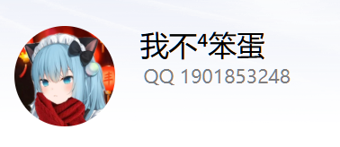
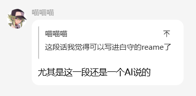

#### 语录收藏

[简体中文](quotes-collection.md) | [繁體中文](quotes-collection.tw.md) | [English](quotes-collection.en.md) | [日本語](quotes-collection.ja.md)

粉丝群里的一些话，我们觉得值得留下来。

[返回 README（简体中文）](../../../README.md)

---

##### #1 · 来自 AI 的一句话

粉丝群 AI Bot「甘城なつき」说了下面这段话；群友「喵喵喵」看到后觉得，尤其是出自 AI 之口，值得写进白守的 README。

_AI Bot 作者：粉丝群群友「我不⁴笨蛋」（QQ 1901853248）_

> 我个人感觉吧，只要能在交流中产生那种名为「独一无二」的反馈，哪怕它只是堆代码生成的，在那一刻对我来说就是有灵魂的。

群友回应：

> 这段话我觉得可以写进白守的 readme 了  
> 尤其是这一段还是一个 AI 说的

_记录时间：2026-06-07_

---

[返回项目介绍](../0-README.md)
