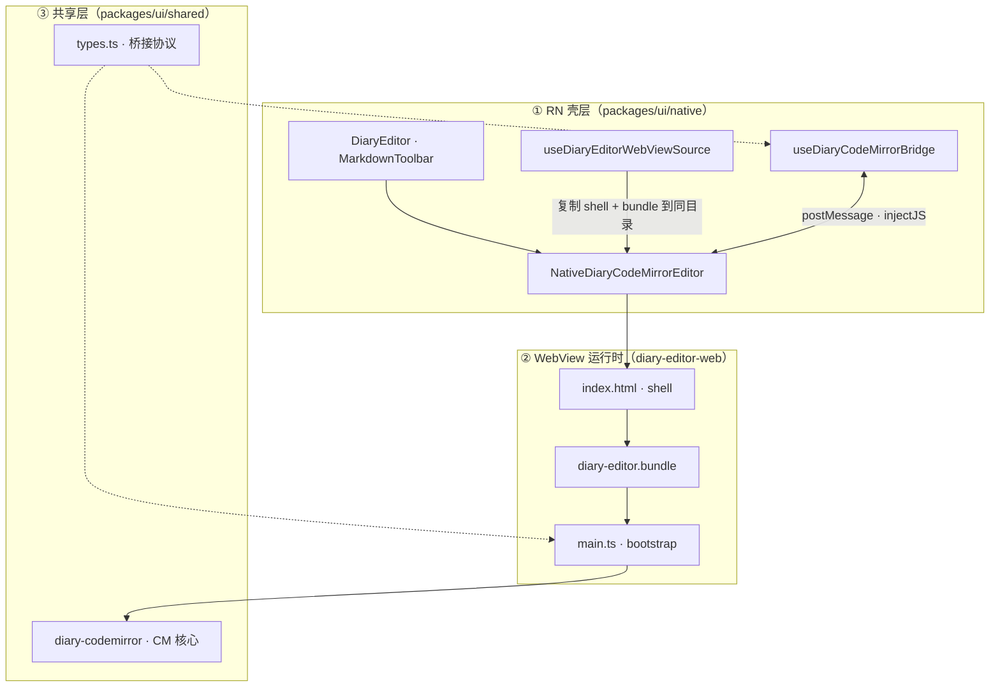

# 移动端日记 CodeMirror WebView 胶水层攻克记

> **背景**：按 Obsidian 路线，移动端日记编辑区使用 RN 壳 + WebView + CodeMirror 6 Live Preview，与桌面共用 `packages/ui/src/shared/diary-codemirror/`；工具栏仍保留 RN 侧 `MarkdownToolbar`。
>
> **结果**：编辑器可正常显示与输入。本文记录从「全白」到可用的排查链路与最终架构。

---

## 1. 目标架构

整体分三层，数据自上而下流动；桥接协议在 RN 与 WebView 之间横向传递。



**资源加载路径**（与架构图正交，单独展示）：


| 层级           | 职责                                              |
| -------------- | ------------------------------------------------- |
| **RN 壳**      | 标签、天气、保存、Markdown 工具栏、页面导航       |
| **WebView 客** | 仅 CodeMirror 编辑区（Live Preview、图片 widget） |
| **共享层**     | Markdown 解析、CM 扩展、主题变量；桌面与移动同源  |

---

## 2. 胶水层三块

### 2.1 资源装载 — `useDiaryEditorWebViewSource`

**文件**：`apps/mobile/src/hooks/useDiaryEditorWebViewSource.ts`

构建产物：

- `assets/diary-editor/index.html` — ~1KB shell，含 `<script src="diary-editor.bundle">`
- `assets/diary-editor/diary-editor.bundle` — vite IIFE，~540KB

**运行时流程**：

1. 从 Metro asset 读取 shell 与 bundle（`.bundle` 扩展名已加入 `metro.config.js` 的 `assetExts`）。
2. 校验 shell 体积小、bundle 含 `__diaryCmOnNativeMessage`。
3. 将两份文件**复制到同一目录** `documentDirectory/diary-editor-web/`。
4. 用 `.fingerprint`（大小 + 修改时间）判断是否需要重新复制。
5. 返回 `{ uri: .../index.html, baseUrl: .../diary-editor-web/ }` 供 WebView 加载。

**为何必须复制到同目录**：Expo 会把 `index.html` 与 JS 拆到不同的 `ExponentAsset-*` cache 路径，相对路径 `<script src>` 会 404，或 WebView 把 JS 当正文显示。

### 2.2 RN ↔ WebView 桥接 — `useDiaryCodeMirrorBridge`

**文件**：`packages/ui/src/native/DiaryEditor/useDiaryCodeMirrorBridge.ts`  
**协议**：`packages/ui/src/shared/diary-codemirror/types.ts`

| RN → WebView                      | WebView → RN                           |
| --------------------------------- | -------------------------------------- |
| `init`（内容、主题、placeholder） | `ready`                                |
| `setContent` / `insertAtCursor`   | `change`（全文）                       |
| `setEditable` / `focus` / `blur`  | `selectionChange` / `contentHeight`    |
| `resolveUrlResponse`              | `resolveUrlRequest`（attachment 图片） |
| `requestReady`                    | `imageAction` / `imagePreview`         |

**竞态规则**（协议注释 7.3 节）：

1. **ready 前入队**：未收到 `ready` 前，除 `init` 外的 RN→WebView 命令先入队，`ready` 后 flush。
2. **回声抑制**：RN 主动 `setContent` 时，忽略 WebView 回传的同内容 `change`，避免 state 死循环。
3. **双通道投递**：每条消息同时 `postMessage` + `injectJavaScript( __diaryCmOnNativeMessage )`，弥补部分 Android `onMessage` 挂载晚于首帧的问题。

WebView 入口 `apps/mobile/diary-editor-web/src/main.ts` 在 bootstrap 时暴露 `window.__diaryCmOnNativeMessage`，收到 `init` 后调用 `createDiaryCodeMirror()`。

### 2.3 UI 组装 — `NativeDiaryCodeMirrorEditor` + `DiaryEditor`

**文件**：

- `packages/ui/src/native/DiaryEditor/NativeDiaryCodeMirrorEditor.tsx`
- `packages/ui/src/native/DiaryEditor/DiaryEditor.tsx`

WebView 嵌在 RN 布局中；主题由 `useNativeTheme()` 转为 `DiaryCmTheme` 经 `init` 传入。`active={false}` 时卸载 WebView 以释放内存。

应用启动时 `_layout.tsx` 调用 `preloadDiaryEditorWebViewSource()` 预复制 bundle，缩短首次进入编辑页的等待。

---

## 3. 疑难杂症时间线

### 3.1 空白 / 页面上显示 JS 源码

| 现象   | WebView 区域空白，或整段 minified JS 当正文显示                                 |
| ------ | ------------------------------------------------------------------------------- |
| 根因   | HTML 与 `editor.js` 被 Expo 拆到不同 asset 目录；`<script src="editor.js">` 404 |
| 尝试   | 内联整份 bundle 进单文件 `index.html`（~550KB）                                 |
| 新问题 | 单文件可读，但 Android 用 `file://` URI 加载时常**不执行内联 `<script>`**       |

### 3.2 `source={{ html: 550KB }}` 仍空白

| 现象     | RN 日志显示 bundle 字符数正确，无 WebView 内 console                         |
| -------- | ---------------------------------------------------------------------------- |
| 根因     | 改用 `loadDataWithBaseURL` 后，部分设备仍不执行超大内联 script；握手从未完成 |
| 日志特征 | 有 `loadStart` / `loadEnd`，无 `received ready`                              |

### 3.3 `injectJavaScript` 注入 551KB 失败

| 现象 | `[DiaryEditor Bridge] boot probe: __diaryCmOnNativeMessage missing` → `inject inline script (551211 chars)` → `force init` 仍无 `ready` |
| ---- | --------------------------------------------------------------------------------------------------------------------------------------- |
| 根因 | ① Android `evaluateJavascript` 对超长字符串不稳定；② 把 540KB JS 嵌进 RN 模板字符串时，`${`、反引号等会破坏语法，**静默失败**           |
| 结论 | **不能**把整包 CM 当 fallback 用 `injectJavaScript` 灌进去                                                                              |

### 3.4 最终解法（当前方案）

```
vite → diary-editor.bundle
template → index.html（仅 shell + <script src="diary-editor.bundle">）
运行时 → 复制到 documentDirectory/diary-editor-web/（同目录）
WebView → source={{ uri, baseUrl }} 加载 shell，外部 script 拉 bundle
```

**验证成功的日志链**：

```
[DiaryEditor] 已复制 WebView bundle 到同目录: file://.../diary-editor-web/
[DiaryEditor WebView] loadStart
[DiaryEditor WebView] loadEnd
[DiaryEditor Bridge] boot probe: bridge OK
[DiaryEditor Bridge] received ready
[DiaryEditor Bridge] send init
[DiaryEditor Bridge] contentHeight ...
```

### 3.5 其他踩坑（简表）

| 问题                        | 处理                                                                  |
| --------------------------- | --------------------------------------------------------------------- |
| 误报「缺少 bundle」         | 校验改为查找 `__diaryCmOnNativeMessage`，而非 esbuild 压缩后的函数名  |
| 日记 content 被 bundle 污染 | `isLikelyEditorBundleLeak()` 拦截写入；加载时提示恢复                 |
| Metro 不识别 `.bundle`      | `metro.config.js` → `assetExts.push('bundle')`，需 `dev:mobile:clear` |
| `__DEV__` 在 vitest 未定义  | 桥接日志用 `typeof __DEV__ !== 'undefined' && __DEV__`                |

---

## 4. 性能影响

### 4.1 一次性成本（进入编辑页）

| 项目           | 量级                   | 说明                       |
| -------------- | ---------------------- | -------------------------- |
| Bundle 复制    | ~540KB，通常 &lt;100ms | 仅 fingerprint 变化时执行  |
| WebView 冷启动 | 数百 ms                | 创建 WebView + 解析执行 JS |
| `init` 握手    | 数十 ms                | ready → init → mountEditor |
| 内存           | 约 +30～80MB           | WebView 进程 + CM DOM      |

成本**集中在打开编辑页**，非常驻。

### 4.2 运行时（打字、滚动）

| 项目                                    | 影响                                                  |
| --------------------------------------- | ----------------------------------------------------- |
| 每次按键 `change` 传全文                | 普通日记长度几乎无感；超长（&gt;50KB）可考虑 debounce |
| `postMessage` + `injectJavaScript` 双发 | 工具栏操作多一次极小求值；纯打字主路径不依赖 inject   |
| CodeMirror Live Preview                 | 比 `TextInput` 重，与桌面体验一致                     |
| `contentHeight`                         | ResizeObserver，仅在布局变化时触发                    |

### 4.3 已有优化

- 启动预加载 `preloadDiaryEditorWebViewSource()`
- 离开页面 `active={false}` 卸载 WebView
- attachment URL 缓存
- bundle 指纹跳过重复复制

### 4.4 权衡结论

比纯 RN `TextInput` 重，但换来与桌面一致的 Markdown / 预览 / 图片 widget；比整页 WebView 轻（工具栏仍在 RN）。Obsidian 移动端同类方案也是 RN/Web 混合，属于可接受的工程权衡。

---

## 5. 关键文件索引

| 路径                                                                 | 作用                            |
| -------------------------------------------------------------------- | ------------------------------- |
| `apps/mobile/diary-editor-web/index.template.html`                   | shell 模板                      |
| `apps/mobile/diary-editor-web/src/main.ts`                           | WebView bootstrap、桥接入口     |
| `apps/mobile/diary-editor-web/scripts/generate-shell-html.mjs`       | 生成 shell `index.html`         |
| `apps/mobile/diary-editor-web/vite.config.ts`                        | 打出 `diary-editor.bundle`      |
| `apps/mobile/src/hooks/useDiaryEditorWebViewSource.ts`               | 预加载、校验、复制到同目录      |
| `packages/ui/src/native/DiaryEditor/useDiaryCodeMirrorBridge.ts`     | RN↔WebView 桥接                 |
| `packages/ui/src/native/DiaryEditor/NativeDiaryCodeMirrorEditor.tsx` | WebView 组件                    |
| `packages/ui/src/shared/diary-codemirror/`                           | 共享 CM 核心                    |
| `apps/mobile/metro.config.js`                                        | `assetExts` 含 `bundle`、`html` |

---

## 6. 本地构建与调试

```bash
cd apps/mobile
pnpm run build:diary-editor    # 生成 shell + bundle
pnpm dev:mobile:clear          # 清 Metro 缓存并安装 dev client（改 assetExts 后必须）
```

- **Expo Go 不支持**（需 `react-native-webview` + 本地 bundle）。
- 开发时改 `diary-editor-web/src` 后需重跑 `build:diary-editor`。
- 桥接日志前缀：`[DiaryEditor]`、`[DiaryEditor WebView]`、`[DiaryEditor Bridge]`（仅 `__DEV__`）。

更短的构建说明见 [`apps/mobile/diary-editor-web/README.md`](../../../apps/mobile/diary-editor-web/README.md)。

---

## 7. 后续可优化方向

- `change` 防抖或增量同步（超长日记）
- 移除生产环境的 boot probe / 双通道 inject（确认稳定后）
- touch 图片宽度拖拽、多图粘贴（方案二期）
- iOS 键盘遮挡真机回归

---

[返回移动端目录](0-README.md) · [返回技术分享](../0-README.md) · [返回文档索引](../../0-README.md)
