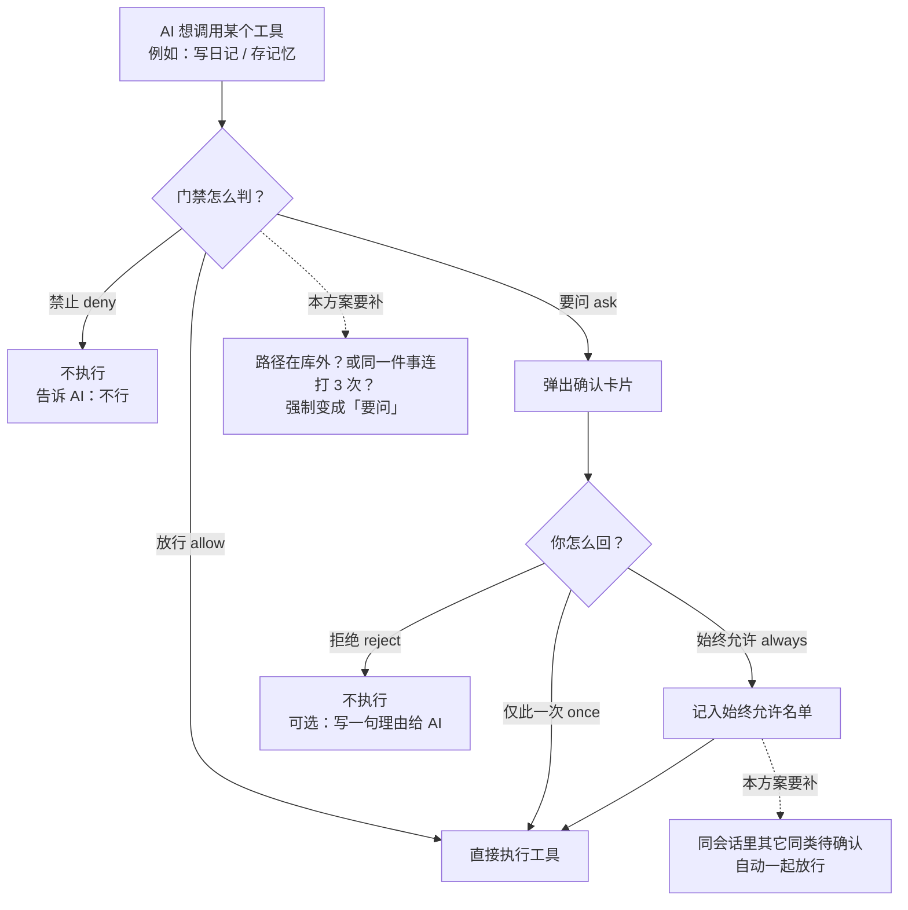
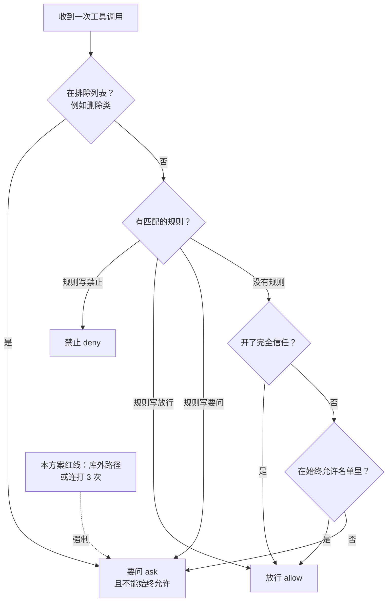
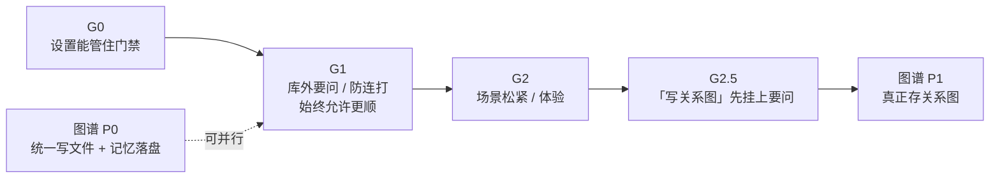

# 白守 Agent Gate 权限系统补全方案

> 版本：v0.4  
> 日期：2026-07-17  
> 一句话：把门禁补可靠，再去做「聊天写入关系图」。  
> 相关：[记忆图谱与知识库设计方案.md](./记忆图谱与知识库设计方案.md)  
> **实现进度：** G0–G3 已落地（含 allowlist pattern、exclusion/规则/阈值设置 UI、指纹展示、`workspace_run` + 命令前缀匹配；移动端不注册 `workspace_run`）。图谱 P0+P1 已接上，`graph_upsert` Ask 通过后真写 Graph JSONL。

---

## 用语说明（先看这个）

门禁相关英文/黑话，一律按下面理解。正文里再出现时，意思不变。

### 这套东西叫什么

| 说法                                | 白话                                                          |
| ----------------------------------- | ------------------------------------------------------------- |
| **Agent Gate / Gate / 门禁 / 门控** | AI 要动手（改日记、写记忆、动文件）之前，拦一下问你的那套系统 |
| **工具（tool）**                    | AI 能调用的一项能力，比如「写日记」「存记忆」                 |
| **action**                          | 这项能力在门禁里的名字，如 `memory_store`                     |
| **卡片 / 确认条**                   | 弹出来让你点「允许 / 拒绝」的 UI                              |

### 系统怎么判（三态）

| 代码      | 白话     | 用户感知         |
| --------- | -------- | ---------------- |
| **allow** | 直接放行 | 不问你，AI 做了  |
| **ask**   | 要问你   | 弹出确认         |
| **deny**  | 直接禁止 | 不做，通常也不问 |

### 你怎么回（三按钮）

| 代码       | 界面宜用文案 | 白话                            |
| ---------- | ------------ | ------------------------------- |
| **once**   | 仅此一次     | 这次可以，下次还问              |
| **always** | 始终允许     | 以后这类都不用再问（会记下来）  |
| **reject** | 拒绝         | 这次不行；可顺带写一句理由给 AI |

### 信任与名单

| 说法                          | 白话                                                   |
| ----------------------------- | ------------------------------------------------------ |
| **Manual（手动确认）**        | 默认模式：敏感操作都要问                               |
| **FullTrust（完全信任）**     | 少问一点；但**出库外路径等红线仍要问**（本方案要钉死） |
| **allowlist（始终允许名单）** | 你点过「始终允许」后记下的工具名单                     |
| **exclusionList（排除列表）** | 永远不能「始终允许」的工具（如删日记），每次仍要问     |
| **forceExclusion**            | 这个工具强制算进排除：禁止「始终允许」                 |

### 风险档（给工具贴标签）

| 代码            | 白话           | 例子           |
| --------------- | -------------- | -------------- |
| **safe**        | 只读、几乎无害 | 搜索、读取     |
| **mutating**    | 会改数据       | 写日记、存记忆 |
| **destructive** | 会删/破坏      | 删日记、删文件 |

### 会话与排队

| 说法                | 白话                                                                         |
| ------------------- | ---------------------------------------------------------------------------- |
| **session / 会话**  | 你和 AI 的这一轮聊天（一个对话窗口）                                         |
| **pending**         | 已经弹出、还在等你点的确认                                                   |
| **级联**            | 你点一次，连带处理同会话里其它待确认（拒绝全取消，或始终允许后自动放行同类） |
| **指纹 / 重复调用** | 用来判断「是不是同一件事又来一遍」（工具名 + 关键参数）                      |

### 路径与场景

| 说法                       | 白话                                                 |
| -------------------------- | ---------------------------------------------------- |
| **vault**                  | 你的日记库根目录（白守管理的那棵文件夹）             |
| **工作区（workspace）**    | AI 编程/改文件时划定的项目目录                       |
| **外路径 / external_path** | 落到 vault/工作区**外面**的路径 → 更危险，要再问     |
| **profile（场景）**        | 不同用法的默认松紧：日记闲聊 vs 工作区改代码         |
| **metadata（元数据）**     | 确认卡片上要展示的摘要信息（改哪天日记、记忆预览等） |
| **persist / 持久化**       | 记进设置，关掉 App 还在                              |

### 和「图谱文档」交叉的代号

| 代号             | 白话                                                       |
| ---------------- | ---------------------------------------------------------- |
| **G0 / G1 / G2** | 本方案的施工阶段：先稳住设置 → 再补安全 → 再补体验         |
| **图谱 P0**      | 统一文件写入 + 记忆落盘（可与门禁一起做）                  |
| **图谱 P1**      | 真正做关系图存储（**门禁 G2 做完再开**）                   |
| **graph_upsert** | 暂定的「写入关系图」工具名；先只管「要问你」，图库以后再接 |

### 读文档时可以忽略的实现名

下面这些是代码类名，**不影响理解产品设计**；实现时再对：

`BaishouAgentGatePolicyService`、`wrapVercelToolExecuteWithAgentGate`、`AgentGateCorrectedError`、`permissionRules`、`BAISHOU_AGENT_GATE_CONFIG_KEY` 等。

---

## 总览图（先看图）

### 图 1：AI 动手时，门禁怎么拦



### 图 2：系统内部怎么判（从上到下，命中就停）



### 图 3：和「关系图」谁先谁后



---

## 〇、优先级（先做什么）

| 顺序             | 做什么                                | 白话                                        |
| ---------------- | ------------------------------------- | ------------------------------------------- |
| **先**           | 本方案 **G0 → G1 → G2**               | 把门禁补可靠                                |
| **后**           | 记忆图谱 **P1 及之后**                | 再真正存关系图                              |
| **可一起做**     | 记忆图谱 **P0**                       | 统一写文件、记忆落盘；别抢门禁 G0–G1 的精力 |
| **门禁里先登记** | 「写关系图」工具默认 **要问你**（§7） | 只做确认卡片，**不做**图数据库              |

**原则：** 伙伴已经能改日记、写记忆、动文件；在让它「写关系网」之前，先确认、防刷、防写到库外。

---

## 一、背景与定位

门禁代码已在用（`baishou-agent-gate`），不是空设计。已经具备：

- 三种系统判断：放行 / 要问 / 禁止
- 三种你的回复：仅此一次 / 始终允许 / 拒绝
- 手动确认 vs 完全信任
- 风险档：安全 / 会改数据 / 会破坏
- 排除列表（不能「始终允许」的危险操作）
- 所有带门禁的工具统一先过问再执行
- 「始终允许」能写入设置
- 拒绝时可附带一句话给 AI；拒绝时可关掉同会话其它待确认

**本方案不是推倒重来**，只补缺口：出库外要问、别连打刷屏、始终允许后同会话更顺、日记/工作区默认松紧可不同、进图先挂确认。

---

## 二、现状盘点（已有，别重做）

| 已有能力        | 白话                                                     | 还缺什么                                               |
| --------------- | -------------------------------------------------------- | ------------------------------------------------------ |
| 策略怎么判      | 先看排除 → 再看规则 → 完全信任 → 始终允许名单 → 否则要问 | 新规则别打乱这个顺序                                   |
| 路径类型        | 已能标记「外路径」，但**默认不会因此多问**               | 要补：出界必须问（§4.1）                               |
| 始终允许 → 名单 | 点始终允许会记住并保存                                   | 名单只按「整个工具」，还不能「只允许这个路径」（§4.4） |
| 拒绝 + 一句话   | 内核能把话传回 AI                                        | 界面要保证能填这句话（§5.1）                           |
| 拒绝连带取消    | 拒绝一条，同会话其它待确认也取消                         | **始终允许**还不会连带放行其它待确认（§4.3）           |
| 工具登记表      | 日记 / 记忆 / 工作区写改删已挂上门禁                     | 还没有「写关系图」                                     |
| 设置保存        | 门禁配置进 Settings                                      | 确认桌面/手机一致、设置页能管（G0）                    |

---

## 三、补全后怎样算合格

1. **库外要问**：读写跑出日记库/工作区 → 必须问（开了完全信任也不能偷偷写，除非你单独设了允许规则）。
2. **防连打**：同一聊天里，同一件事连来 3 次 → 再问一次（即使已在始终允许名单）。
3. **始终允许更省事**：你点了始终允许后，同聊天里已弹出的同类确认自动过，不用一条条点。
4. **场景松紧不同**：日记闲聊 vs 工作区改代码，默认问的多少可以不同（仍是同一套门禁）。
5. **禁止的工具别塞给 AI**：已经永久禁止的能力，尽量别出现在 AI 可选工具里（少费口舌）。
6. **进图先问、后存库**：先登记「写关系图」默认要问；真正存进图库等图谱 P1。
7. **人能看懂**：设置和说明里能讲清「手动确认 / 完全信任 / 排除 / 始终允许」。

---

## 四、设计：安全厚度（G1 核心）

### 4.1 Vault / 工作区外路径二次门禁

**问题：** `external_path` 资源类型已存在，但评估链路没有「出界 → 强制 Ask」的默认策略。

**决策：**

```
若 resources 中存在 kind === 'external_path'
  → 默认 Effect = Ask（覆盖 FullTrust 与 action 级 allowlist）
  → 仅当 permissionRules 中存在匹配该 path 的显式 Allow 时放行
```

**实现要点：**

- 工作区工具在 `buildResources` 中：路径解析后，若在 vault/workspace 根外，打 `external_path`，否则 `workspace_path`。
- 日记/记忆工具不走外路径；勿误标。
- FullTrust **不能**静默写外盘；外盘永远「显式规则或当场确认」。
- 设置页可选：「允许的外路径前缀」→ 写入 `permissionRules`（Allow + pattern），而不是偷偷改 FullTrust 语义。

### 4.2 重复调用强制确认（防刷写）

**问题：** 模型对同一写工具连打（记忆、未来进图、工作区写）会刷确认或在 Always 后刷写。

**决策：**

| 项   | 值                                                                            |
| ---- | ----------------------------------------------------------------------------- |
| 窗口 | **同一 `sessionId`**                                                          |
| 指纹 | `action` + 规范化后的关键入参（见下）                                         |
| 阈值 | 连续相同指纹 **≥ 3** 次成功进入 `assert`（含 Allow 放行）→ 第 3 次起强制 Ask  |
| 重置 | 指纹变化、会话结束、用户 Reject、或用户 Once/Always 处理完该次 Ask 后计数清零 |

**指纹规范化（最低集）：**

| action 族      | 参与指纹的字段                                  |
| -------------- | ----------------------------------------------- |
| `memory_store` | `content` 的 trim + 截断哈希（如前 256 字 MD5） |
| `diary_*`      | `date` + `mode`（若有）                         |
| `workspace_*`  | 规范化 path（及 rename 的 `new_path`）          |
| `graph_upsert` | 提案摘要哈希（实体 id 集合排序后拼接）          |

计数器放在 Gate 会话缓冲（可挂现有 `baishou-agent-gate-session-buffer`），**不落盘**。

**与 exclusionList 关系：** 强制 Ask 仍遵守 `forceExclusion`（不可 Always）；用户可 Once 放行单次。

### 4.3 Always 会话内级联放行

**问题：** Reject 已级联；Always 只写 allowlist，同会话其它已弹出的同类 pending 仍堵着。

**决策：**

```
reply(Always) 成功后：
  1. 写入 allowlist 并 persist（现状）
  2. 扫描同 sessionId 的 pending
  3. 若 pending.action === 刚 Always 的 action
     且（无 pattern 维度 或 resources 可被当前规则放行）
     → 自动 resolve(Once 等价放行)，不再弹卡
```

第一期 **仅按 action 匹配**（与现行 allowlist 一致）。带 pattern 的 Always（§4.4）落地后再收紧匹配。

### 4.4 Allowlist 从「仅 action」到「可选 pattern」（G2 可选增强）

**现状：** `AgentGateAllowlistEntry` 只有 `action`。

**决策（分期）：**

- **G1：** 保持 action 级；先做 §4.1–4.3。
- **G2：** 扩展可选字段 `pattern?` + `resourceKind?`；Always 时可选择「仅此路径」vs「整个 action」。
- UI：默认「整个工具」；高级：「仅当前资源」。

破坏性：旧配置无 pattern 视为「整 action」，兼容。

---

## 五、设计：模型与场景体验（G2）

### 5.1 Reject 反馈通路产品化

内核已支持 `CorrectedError`。补全项：

| 层              | 要求                                                                                 |
| --------------- | ------------------------------------------------------------------------------------ |
| 桌面 / 移动卡片 | Reject 时可选填「告诉伙伴」；空则普通 Reject                                         |
| 拦截器          | 继续把 `error.message` 作为工具结果返回（现状）                                      |
| 文案            | 反馈前缀统一，便于模型识别，例如：`[用户纠正] …`（具体字符串锁定实现时定，全端一致） |
| 级联 Reject     | 级联项是否带同一 feedback：默认 **带**，避免模型只理解第一条                         |

### 5.2 对模型隐藏全量 Deny 工具

**决策：**

- 组装工具列表时：若某 `action` 经策略评估对「无具体 resources 的探测输入」恒为 `Deny`，则**不注入**该工具 schema。
- `Ask` / `Allow` 仍注入；由拦截器运行时门控。
- `toolDisabled` 与设置关闭某工具：同等隐藏。
- 开关：`BaishouAgentGateConfig.hideDeniedTools` 默认 `true`。

### 5.3 场景 Profile（默认规则矩阵）

**问题：** 全局一套 config，日记闲聊与工作区改代码松紧应不同。

**决策：** 引入轻量 `GateProfileId`（名称可再定），**不是**多套 Gate 服务：

```ts
type GateProfileId = 'companion' | 'workspace'
// 评估时：baseConfig + profileOverrides.permissionRules / actionRules
```

| Profile     | 典型默认                                                         |
| ----------- | ---------------------------------------------------------------- |
| `companion` | 日记读多写 Ask；`memory_store` Ask；无 shell                     |
| `workspace` | 工作区内读可更松；写/改 Ask；外路径强制 Ask；未来 shell 默认 Ask |

会话创建时绑定 profile（伙伴会话 → companion；工作区 Agent → workspace）。用户设置里的 trustMode / allowlist **全局生效**，profile 只叠默认规则，不覆盖 exclusionList。

### 5.4 设置页与文档

- 设置：信任模式、排除列表、allowlist 管理、（G2）隐藏 Deny 工具、外路径前缀规则入口。
- 文档：本文件为设计源；实现稳定后可在 `docs/1-AI-Code` 或设置页帮助中摘一页「用户可读说明」。

---

## 六、设计：工作区加深（G3，可后于图谱开工）

> G3 **不阻塞** 记忆图谱 P1；但若工作区 shell 工具上线，必须先完成 G3.1。

### 6.1 Shell 命令结构化匹配

当存在 `shell` / 终端类工具时：

- `resources` 使用 `shell_command`。
- Always 规则用**安全前缀 / 元数匹配**（解析 argv 或等价结构化），禁止纯子串误匹配（如 `rm` 匹配到 `harmless`）。
- 默认：一切 shell → Ask；危险子命令（删库、递归删等）→ `forceExclusion` 或 Deny。

具体命令表实现时另附；本方案只钉「结构化优先于 glob」。

### 6.2 只读工具默认 Allow

工作区内只读（list/read/stat）可在 workspace profile 默认 Allow，仍受 §4.1 外路径约束。

---

## 七、图写入工具的门控预埋（本方案内，图库外）

在图谱 P1 之前，只做 Gate 侧，**禁止**静默写图：

| 项             | 约定                                                                                 |
| -------------- | ------------------------------------------------------------------------------------ |
| 暂定 action    | `graph_upsert`（实现时可改名，但须单一 action 名贯串 metadata / 排除列表）           |
| riskLevel      | `mutating`                                                                           |
| 默认           | **Ask**（写入 `AGENT_GATE_TOOL_METADATA`；不要进 FullTrust 静默路径除非用户 Always） |
| forceExclusion | 否（允许 Always）；若产品改为「进图永远确认」则改 `true`                             |
| metadata 预览  | 实体/边摘要、来源日记或 memory id、条数；卡片用                                      |
| 工具 execute   | P1 前可返回「图谱尚未启用」类明确错误；**仍须先过 Gate**，避免半截实现绕过确认       |

聊天进图产品路径：**AI 提案 → Gate Ask → 用户 Once/Always →（P1 后）经 GraphRawManager 落盘**。与记忆图谱方案中「禁止无源写入」一致。

---

## 八、配置模型增量（草案）

在现有 `BaishouAgentGateConfig` 上增量（字段名实现时可微调，语义锁定）：

```ts
interface BaishouAgentGateConfig {
  trustMode: AgentGateTrustMode
  exclusionList: string[]
  allowlist: AgentGateAllowlistEntry[] // G2 可含 optional pattern
  actionRules?: Partial<Record<string, AgentGateEffect>>
  permissionRules?: AgentGatePermissionRule[]
  /** 新增：对模型隐藏恒 Deny 的工具，默认 true */
  hideDeniedTools?: boolean
  /** 新增：重复调用阈值，默认 3；设 0 关闭 */
  repeatAssertAskThreshold?: number
  /** 新增：外路径默认强制 Ask，默认 true */
  forceAskExternalPath?: boolean
}
```

会话级（不落盘）：

```ts
interface AgentGateSessionState {
  profileId: GateProfileId
  recentAssertFingerprints: Array<{ fingerprint: string; at: number }>
}
```

---

## 九、分阶段路线图

| 阶段     | 内容                                                                                                          | 验收                                                             | 与图谱关系                                                                       |
| -------- | ------------------------------------------------------------------------------------------------------------- | ---------------------------------------------------------------- | -------------------------------------------------------------------------------- |
| **G0**   | 现状加固：设置页可管 trust/allowlist/exclusion；桌面/移动 persist 一致；补内部说明；修已知 Always/Reject 边角 | 用户可从设置撤销 Always；双端同配置键                            | 可与图谱 P0 并行                                                                 |
| **G1**   | §4.1 外路径强制 Ask；§4.2 重复调用；§4.3 Always 级联放行；单元测试                                            | 测例外路径 / 三连同参 / Always 后 pending 清空                   | **本阶段完成前不开图谱 P1**                                                      |
| **G2**   | §5 反馈文案统一、hideDeniedTools、companion/workspace profile；可选 allowlist pattern                         | 伙伴与工作区默认松紧可区分                                       | G2 完成后允许开图谱 P1                                                           |
| **G2.5** | §7 `graph_upsert` metadata + 占位工具 + Ask 卡片                                                              | 聊天可弹出「拟写入关系」确认，点允许后得到「尚未启用」或 P1 真写 | 可紧贴 P1 前夕                                                                   |
| **G3**   | §6 Shell 结构化匹配、只读默认                                                                                 | shell 工具上线前必达                                             | **已落地**：`workspace_run` + `shell_command` 前缀匹配；workspace 只读默认 Allow |

推荐节奏：

```
G0 ──▶ G1 ──▶ G2 ──▶ G2.5 ──▶（图谱 P1…）
                │
                └── 图谱 P0（Manager/Memory）可并行，但 G1 未完不进 P1
```

---

## 十、实施开工清单（摘要）

### 10.1 G0

| #   | 项                                                       | 类型  |
| --- | -------------------------------------------------------- | ----- |
| 1   | 核对 desktop/mobile 读写 `BAISHOU_AGENT_GATE_CONFIG_KEY` | 核    |
| 2   | 设置 UI：trustMode、allowlist 删除、exclusion 展示       | 改/补 |
| 3   | 补测试：Always 禁用于 exclusion；CorrectedError 文案回传 | 测    |

### 10.2 G1

| #   | 项                                          | 文件方向                                             |
| --- | ------------------------------------------- | ---------------------------------------------------- |
| 1   | `evaluate` 增加 external_path / repeat 钩子 | `baishou-agent-gate-policy.service.ts` + shared util |
| 2   | 工作区工具 `buildResources` 出界标记        | workspace 工具 + metadata                            |
| 3   | 会话指纹缓冲                                | `baishou-agent-gate-session-buffer` 或邻接模块       |
| 4   | `reply(Always)` 后级联 resolve              | `baishou-agent-gate.service.ts`                      |
| 5   | 单测覆盖 §4.1–4.3                           | `__tests__`                                          |

### 10.3 G2

| #   | 项                               | 文件方向                            |
| --- | -------------------------------- | ----------------------------------- |
| 1   | `hideDeniedTools` 接入组工具列表 | companion / workspace chat 组工具处 |
| 2   | `GateProfileId` + 默认规则表     | shared defaults + 会话创建          |
| 3   | 卡片 Reject 反馈输入             | Dock/Card 桌面+移动                 |
| 4   | （可选）allowlist pattern        | types + store + UI                  |

### 10.4 G2.5

| #   | 项                                      | 文件方向                      |
| --- | --------------------------------------- | ----------------------------- |
| 1   | `AGENT_GATE_TOOL_METADATA.graph_upsert` | `agent-gate-tool-metadata.ts` |
| 2   | 占位 tool + 拦截器挂载                  | `packages/ai` tools           |
| 3   | 卡片 preview 字段                       | metadata + UI                 |

### 10.5 G3

| #   | 项                        | 说明                |
| --- | ------------------------- | ------------------- |
| 1   | shell resource 解析与规则 | 有 shell 工具时再开 |
| 2   | workspace 只读默认 Allow  | profile 规则        |

---

## 十一、非目标（本期不做）

- 不引入第二套权限框架或重命名整个 Gate。
- 不做跨 vault 共享 allowlist（按 vault 配置隔离，保持现状）。
- 不做图存储、抽取、管理页（归记忆图谱方案）。
- 不做完整「向用户问卷」独立通道；复杂问卷仍用 Gate options / 自定义输入覆盖。
- 不在文档或代码中对齐外部示例项目的产品名与同名 API。

---

## 十二、决策记录

| 日期       | 决策                                                                                                                                                                       |
| ---------- | -------------------------------------------------------------------------------------------------------------------------------------------------------------------------- |
| 2026-07-17 | 新建本方案；**G0–G2 优先于图谱 P1**                                                                                                                                        |
| 2026-07-17 | 外路径默认强制 Ask，且不受 FullTrust / action allowlist 静默绕过                                                                                                           |
| 2026-07-17 | 同会话同指纹连续 ≥3 次 assert → 强制 Ask                                                                                                                                   |
| 2026-07-17 | Always 增加同会话 pending 级联放行；Reject 级联保持                                                                                                                        |
| 2026-07-17 | 场景用 profile 叠规则，不拆多套 Gate                                                                                                                                       |
| 2026-07-17 | `graph_upsert` 先挂 Gate Ask，图库随图谱 P1                                                                                                                                |
| 2026-07-17 | 内核已有 CorrectedError / Reject 级联 / Settings allowlist——补全以产品化与护栏为主                                                                                         |
| 2026-07-17 | **G0/G1 已实现**：`forceAskExternalPath`、`repeatAssertAskThreshold`、Always 同 action 级联、工作区路径分类、Windows 跨盘符沙箱修复                                        |
| 2026-07-17 | **G2/G2.5 已实现**：`[用户纠正]` 前缀、Reject 级联带反馈、工具 Reject 可填理由、`hideDeniedTools`、companion/workspace profile、`graph_upsert`+Ask；G3 无 shell 工具故跳过 |
| 2026-07-17 | **审查修复**：Always 级联前再 `evaluate`（外路径/Deny 不放行）；persist 失败仍 settle assert；system-prompt 组工具可注入 gate                                              |
| 2026-07-17 | **图谱 P1 衔接**：`graph_upsert` 确认后经 RawDataSourceManager 真写 Graph JSONL（`reviewStatus=pending`），不再返回「尚未启用」占位                                        |

---

## 十三、与记忆图谱方案的衔接

| 图谱侧             | Gate 侧                                                  |
| ------------------ | -------------------------------------------------------- |
| 聊天 → 记忆 → 图   | 记忆已有 `memory_store`；图用 `graph_upsert` + Ask       |
| 禁止无源写入       | Gate 卡片 metadata 必须带 source 预览；无预览可 Deny/Ask |
| P0 Manager/Memory  | 与 G0–G1 可并行                                          |
| P1 GraphRawManager | **要求 G2（建议含 G2.5）完成**                           |

图谱方案路线图应标注本依赖；细节以本文 §〇、§九 为准。
