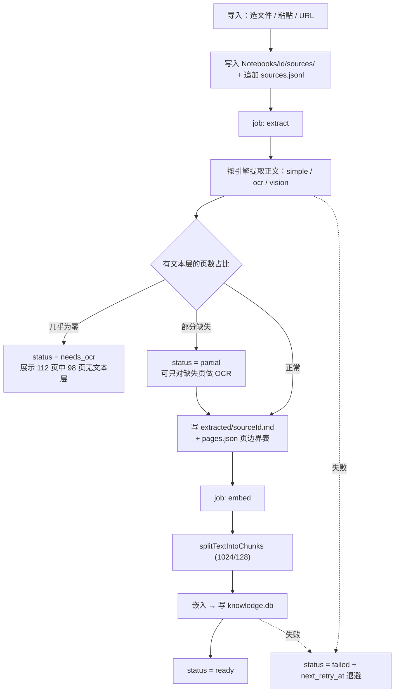
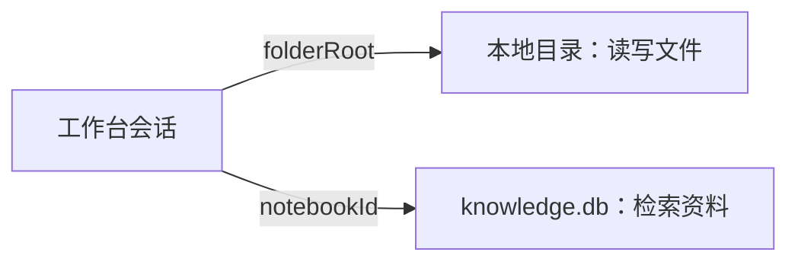
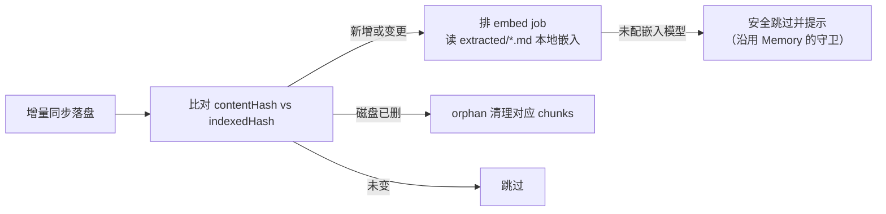

# 知识库 K1：向量笔记本方案

> 版本：v0.3.1（**K1.0–K1.5 已落地**，未发布）
> 日期：2026-08-04
> 一句话：知识库 = 主题隔离的**向量笔记本**（Notebook / Source / Ask），落独立 `knowledge.db`，与伙伴记忆彻底分家。
> 前置：[记忆图谱与知识库设计方案.md](./记忆图谱与知识库设计方案.md) §十 / §13.7（K1 预留，本文是它的展开）
>
> **v0.3 相对 v0.1 的重大修订**：曾计划把向量写进同步文件（索引层 JSONL），评估后**否决**并恢复「文件禁止向量」铁律，改为各端本地嵌入、复用现成的 pending-index 机制（D9）。同步的是 `extracted/*.md`——要省的是重新 OCR，不是重新嵌入。另新增 D10 扫描件引擎、D11 对称同步与流量提示、D12 引用分层。
>
> **落地进度**：K1.0 地基 → K1.1 摄入 → K1.2 Ask/UI → K1.3 挂载工具 → K1.4 同步与移动消费 → **K1.5** OCR 三档 / Notes / Chat 精读 / 多子查询（简化 2）/ 移动写入 / 移动 knowledgeReader。L3 bbox 高亮本轮跳过。

---

## 一、为什么要做，以及必须先澄清的概念

### 1.1 白守会同时存在三种「检索」，不能混为一谈

| 名称 | 数据来源 | 派生库 | 服务对象 |
| --- | --- | --- | --- |
| **伙伴记忆**（今天设置页里的「RAG 记忆」） | 日记、聊天沉淀记忆、手动记忆 | `baishou_agent.db` → `memory_embeddings` | 伙伴回忆「我这个人」 |
| **关系图谱** | 日记抽取、`graph_upsert` | `baishou_agent.db` → `graph_nodes` / `graph_edges` | 人/事/地关系推理 |
| **知识库**（本方案） | 用户主动导入的资料（PDF / Markdown / 网页 / 粘贴文本） | **`knowledge.db`（新增）** | 主题研究与资料问答 |

现状的两个问题：

1. 工作台 `/agent-workspace/knowledge` 只是占位页（`WorkbenchPlaceholderPage`，「即将上线」）。
2. 部分文案把「RAG 记忆」也叫知识库，用户会以为二者是同一个东西。

**本方案第一条产品动作就是正名**：「知识库」专指本方案；设置页里的向量记忆统一叫**伙伴记忆**。

### 1.2 知识库的产品模型

白守知识库采用三层容器：

```
Notebook（主题容器，隔离上下文）
 ├─ Sources（不可变原材料：PDF / URL / 文本）→ 提取 → 分块 → 嵌入
 └─ Notes（可变合成：手写、提炼、问答结论；v1 仅「保存问答结论」）

Ask  = 自动向量 + 全文检索后综合（真 RAG，回答带引用）
Chat = 用户手选材料、全文进上下文（不检索；K1.5 再做）
```

第一版必须守住的原则：

- 容器隔离（Notebook 之间检索互不串味）
- Source 不可变 / Note 可变的分工
- 摄入异步化（提取、嵌入进队列，可重试、可重建）
- Ask 带引用（回答要能指回具体片段）
- 本地栈继续用 SQLite + sqlite-vec，不另起一套向量库
- v1 先做 Ask，不做 Chat 全量上下文档位（见 D5）
- 不做播客、音视频转写、批量「提炼模板」等旁路能力

### 1.3 我们已经有的底座（可直接复用）

| 能力 | 现有实现 | 复用方式 |
| --- | --- | --- |
| 嵌入服务 | `packages/ai/src/rag/embedding.service.ts` | 换 `IEmbeddingStorage` 指向 `knowledge.db` |
| 分块 | `packages/ai/src/rag/embedding-chunk.ts`（tiktoken，1024 token / 128 overlap） | 直接调用 `splitTextIntoChunks` |
| 并发与重试 | `withEmbeddingSlot`（全局 6）+ `limitExecute` + `retryEmbed` | 原样复用 |
| 欠账队列范式 | `diary_embed_jobs` + `diary-embed-jobs-consumer.service.ts` | 克隆为 `knowledge_ingest_jobs` |
| 向量检索降级链 | `hybrid-search.repository.vector-search.ts`（`vec_distance_cosine` → `vector_top_k` → JS 余弦） | 参数化表名后复用 |
| 第二个库的先例 | `shadow_index_v2.db` + `ShadowIndexConnectionManager` | 照搬连接管理骨架 |
| PDF 文本抽取 | 桌面 `readPdfTextFromPath`（`pdf-parse`）、移动 `mobile-pdf.util.ts` | 从「附件即时读」升格为入库管线的一步 |
| 二进制文件同步 | 增量同步按路径 + MD5 传输，日记附件已实证 | `Notebooks/` 天然被扫描 |

**缺的是**：独立库与连接管理、笔记本/资料的领域模型、摄入产品管线、检索工具与 UI。

---

## 二、目标与非目标

### 目标

1. 用户能创建**笔记本**，往里导入资料，系统自动提取 → 分块 → 嵌入。
2. 用户能在笔记本内**提问并得到带引用的回答**（Ask）。
3. 知识库可被**工作台 Agent 挂载**，让 Agent 一边查资料一边改文件。
4. 知识库与伙伴记忆**物理隔离**：独立库、独立生命周期、独立清空与重建。

### 非目标

- 不做多用户 / 服务端；仍是本地优先。
- 不做播客、音视频转写（第一版连音视频摄入都不做）。
- 不做 Notes 全功能编辑器（v1 只落「保存问答结论」这一档，见 K1.5）。
- 不把知识库塞进关系图谱（文档 RAG 与图谱正交，设计文档 §10.1 已定）。
- 不另起一套向量数据库；继续复用现有 SQLite + sqlite-vec 栈。

---

## 三、核心决策

### D1：独立 `knowledge.db`，且**必须**加载 sqlite-vec

沿用设计文档 §5.1 / §10.2 的结论：知识库向量进独立库，按 `notebook_id` 分区。理由是生命周期干净（删库不碰伙伴记忆）、规模隔离（资料库可以远大于日记）、语义隔离（主题文档不该和闲聊挤在同一个向量空间）。

仓库已有双库先例，但两者能力不同，**不能盲抄影子库**：

| | `baishou_agent.db` | `shadow_index_v2.db` | **`knowledge.db`（新）** |
| --- | --- | --- | --- |
| 桌面驱动 | better-sqlite3 | libsql | **better-sqlite3**（为了 vec） |
| 移动驱动 | expo-sqlite | expo-sqlite | expo-sqlite |
| sqlite-vec | 是 | **否** | **是（连接时显式加载）** |
| schema 演进 | `MigrationService` + `_ensure*` | `ensureShadowIndexSchema` | **`ensureKnowledgeSchema`（独立）** |
| 连接管理 | `connectionManager` | `shadowConnectionManager` | `knowledgeConnectionManager` |

**明确不做**：不把 knowledge 表加进 `drizzle.config.ts` 的 `agent-db.ts` 入口，也不进 `MigrationService`——避免与 Agent 库迁移互相绑架。

**库文件位置**：与 Agent 库同解析规则——存储根已设则 `{BaiShou_Root}/knowledge.db`，否则 `userData/knowledge.db`。这样「切换存储根」「归档导出」「损坏隔离」三条既有路径可以顺带覆盖它。

### D2：原始资料落 `<vault>/Notebooks/`，分结构层 / 提取正文 / 原文层

```
<vault>/Notebooks/
  notebooks.jsonl                    # 结构层：笔记本清单，行级 LWW by notebookId
  <notebookId>/
    sources.jsonl                    # 结构层：资料清单，行级 LWW by sourceId
    extracted/<sourceId>.md          # 提取正文（含 OCR 结果）
    extracted/<sourceId>.pages.json  # 页边界偏移表，供页码引用（D12）
    sources/report.pdf               # 原文层：原始二进制
```

**向量不落文件**，与 Memory / Graph 保持一致：各端从 `extracted/*.md` 本地嵌入，复用现成的 pending-index 机制（D9）。体积基准取「100 页中文 PDF，约 8 万汉字」：

| 层 | 体积 | 说明 |
| --- | --- | --- |
| 结构层 | 极小 | 复用现有 record-collection 的行级 LWW |
| 提取正文 + 页边界表 | 约 240 KB | **同步**，理由见下 |
| 原文层 | 文本型 2 MB / 扫描型 20 MB | 全设备对称同步，见 D11 |
| 向量 | — | **不进文件**，各端本地生成进 `knowledge.db` |

目录**非 `.` 开头**，增量同步默认扫描，无需改扫描白名单。派生的 `knowledge.db` **不同步**。

**为什么提取正文必须同步（这条与向量无关，独立成立）：**

一是**跨端解析结果不一致**。PDF 提取在桌面和移动端可能用不同解析器，开没开 OCR 也会得到不同正文。各端自己解析会导致同一份资料在不同设备上正文不同，引用偏移和页码全部对不上。

二是**OCR 结果不能重跑**——这才是真正贵的东西。重新嵌入一份 100 页文档不到 1 分钱、几秒钟；重新 OCR 一份扫描件是十分钟起步，走视觉模型还要按 token 计费。所以**要省的是重新 OCR，不是重新嵌入**。

md/txt 这类本身就是纯文本的资料不需要单独存提取正文，直接指回原文即可。

**关键坑**：现有 `WholeFileRawManager` 会把内容当 UTF-8 字符串写盘（`contentToString` → `writeFile(..., 'utf8')`），**PDF 会被写坏**。因此 `NotebookRawManager` 必须走 `copyFile` 或 base64 写入路径，不能直接复用整文件 Manager 的写实现。

**`.versions` 策略**：原文层与提取正文默认 `skipVersion: true`（每次覆盖全量拷贝会让磁盘爆炸），只有结构层这类小文本进版本快照。

### D3：摄入异步化，分 `extract` 与 `embed` 两段

```
导入（选文件 / 粘贴 / URL）
  → 复制进 Notebooks/<id>/sources/ + 建 source 记录（status=pending）
  → job(extract): 提取正文 → 写 extracted_text_hash
  → job(embed):   分块 → 嵌入 → 写 knowledge_chunks
  → status=ready
```

沿用 `diary_embed_jobs` 的成熟范式：`pending | running | failed` + `attempts` + `next_retry_at` 指数退避 + 成功即删行。区别是知识库有两段，用 `UNIQUE(source_id, stage)` 区分。

理由：提取（PDF 解析）和嵌入（网络 API）都可能慢或失败，UI 只跟进度，失败可单条重试，不阻塞其他资料。

### D4：检索用「向量 + 真 FTS5 + RRF」，回答必须带引用

现有 `memory_embeddings` 的所谓 FTS 其实是 `chunk_text LIKE '%...%'`（见 `hybrid-search.repository.vector-search.ts`）。文档规模下 LIKE 既慢又不准，**知识库直接上真 FTS5**（参考 `agent_messages_fts` / `journals_fts` 的 external-content + 触发器写法）。

融合仍用现成的 `HybridSearchUtils.mergeRRF`。检索结果**必须携带** `source_id` / `chunk_index` / 原文片段，Ask 的回答要能指回具体资料。

### D5：v1 只做 Ask，不做 Chat 的上下文档位

用户手选材料、全文进上下文（Chat）体验很好，但依赖成熟的材料选择 UI 与 token 预算裁剪。**v1 先把 Ask 闭环跑通**（问 → 检索 → 带引用回答），Chat 与档位放 K1.5。

Ask 第一版是**单查询**：问题 → 向量 + FTS 召回 → 融合 → 回答。「策略模型拆多个子查询再并行检索」放到 K1.5，避免第一版就把成本和延迟拉满。

### D6：复用全局嵌入模型，异构时提示重建而非自动迁移

知识库不引入第二套嵌入配置，直接用 `global_models` 里的 `globalEmbeddingProviderId / ModelId / Dimension`。

`knowledge_chunks` 逐行记录 `model_id` 与 `dimension`。检测到异构向量（用户换了模型）时，UI 提示**重建该笔记本索引**，不做 `memory_embeddings` 那套在线迁移。

因为向量不进同步文件（D9），重建是**纯本地操作**：读 `extracted/*.md` 重新分块嵌入，不产生任何同步流量，其他设备各自按需重建。这是不存向量带来的直接好处之一。

**移动端的正确性守卫**：如果本机当前嵌入模型与库内向量所用模型不一致，查询向量和存储向量不在同一空间，检索会给出看似合理实则错误的结果。必须在提问入口**硬拦截并提示**，不能静默降级。

### D7：知识库工具是只读的，不需要 Gate metadata，但要过工作台白名单

只读工具不必登记 `AGENT_GATE_TOOL_METADATA`——拦截器对无 metadata 的工具直接放行（`baishou-agent-gate-tool.interceptor.ts`）。

**但有个硬门槛**：工作台会话在 `tool-registry.ts` 里被硬过滤，只放行 `workspace_*` + `companion_ask` + `current_time`：

```62:70:packages/ai/src/tools/tool-registry.ts
function isToolEnabledForContext(name: string, tool: AgentTool, context: ToolContext): boolean {
  const isWorkspaceSession = context.workspace?.sessionKind === 'workspace'
  if (
    isWorkspaceSession &&
    !WORKSPACE_ONLY_TOOL_IDS.has(name) &&
    !WORKSPACE_SESSION_UTILITY_TOOL_IDS.has(name)
  ) {
    return false
  }
```

不加白名单，`knowledge_search` 在工作台里永远不会出现。新增 `KNOWLEDGE_TOOL_IDS` 并在该函数放行。

### D8：移动端是知识库的消费端，不是完整知识库

移动端**不上工作台**，知识库也只做消费侧：浏览笔记本、看资料、提问。**不导入、不解析 PDF、不做批量嵌入、不做 OCR。**

手机上确实要跑一次批量嵌入（同步下来的 `extracted/*.md` → 本地向量），但这件事**移动端已经在为 Memory 做了**（`MemorySyncService.syncPendingIndex()`），知识库只是复用同一条路径。成本也远低于直觉：一份 100 页文档约 7 秒，且可按笔记本粒度、打开哪个才嵌哪个。

移动端的完整代码面只有：expo 侧 `knowledge.db` 连接（含 sqlite-vec）、复用 pending-index 做本地嵌入、检索、一个页面。「粘贴文本 / 分享链接入库」放 K1.5，那时再补移动端写入能力。

### D9：向量不落文件，各端本地嵌入，复用现成的 pending-index 机制

维持 [记忆图谱与知识库设计方案.md](./记忆图谱与知识库设计方案.md) §2.1 与附录 B 的既有铁律：**文件不存向量**。知识库不破例。

同步的是源数据（原文 + 提取正文 + 结构），落盘后各端检测变化、本地嵌入、写进自己的 `knowledge.db`。**这正是 Memory 和 Graph 现在的做法，我们已经有一整套跑通的机制可以复用。**

**现状确认**（说明这条路不需要新造轮子）：

| 已有能力 | 位置 |
| --- | --- |
| `Memory/` 参与增量同步并分类 | `incremental-sync-path-classify.util.ts` 的 `memory` 字段 |
| 变更检测（`contentHash` vs `indexedHash`） | `MonthlyJsonlStore` + `DerivedFreshnessService` |
| **移动端**同步后本地重嵌 | `mobile-raw-data-source.runtime.ts` 调 `MemorySyncService.syncPendingIndex()` |
| 未配嵌入模型时安全跳过 | 同处的 `if (embeddingAdapter?.isConfigured)` 守卫 |

知识库要做的只是把 `MonthlyJsonlStore` 的分片键从月份换成 `sourceId`，其余照搬。

**曾经考虑过把向量写进同步文件，评估后否决。** 记录否决理由，避免重复讨论：

早期担心「移动端重嵌太重」。重算之后这个前提不成立——一份 100 页中文 PDF（约 8 万字、89 块）重新嵌入**不到 1 分钱、约 7 秒**；五年累积 200 份（约 1.8 万块）也只要 0.3–2 元，批量嵌入（20 条/请求）约 1 分钟、逐条也就十几分钟。

「省掉手机的嵌入模型配置」同样不成立：**查询本身就需要嵌入模型**，手机无论如何都得配。存向量只省掉批量嵌入那一次，省不掉配置依赖。

否决的收益是实打实的：

- 换嵌入模型不再触发笔记本索引的全量重写与重传
- vault 里不存在跟着模型版本走的数据
- 少一个「索引与正文不一致」的失败模式（这类问题极难排查）
- 不需要写索引层 store、float16 编解码、灌库路径——**复用比新建便宜得多**

**真正贵的是 OCR，不是嵌入。** 重新嵌入一份文档几秒钱几分钱；重新 OCR 一份扫描件十分钟起步，走视觉模型还要按 token 计费。所以要固化同步的是 `extracted/*.md`（D2），不是向量。这两件事经常被混为一谈。

**顺带澄清一个容易误读的点**：同步的粒度分两层——传输层是文件粒度（追加一条就整片重传，这是现状），合并层始终是按 `id` 的行级 LWW（`mergeJsonlRecordSides`）。**行级判断能力一直都在**，只是发生在下载之后而非之前。存不存向量都不改变这一点，向量只会放大传输字节数。

**为什么 Memory / Graph 更不能存向量**，两个叠加的原因：

| | 重嵌成本 | 分片重写频率 | 内容可变性 |
| --- | --- | --- | --- |
| RAG 记忆 | 极低（几 KB 短文本） | 极高（当月分片天天重写） | **可变**：会被编辑、合并、调重要度 |
| 关系图谱 | 极低 | 极高 | 可变 |

内容可变性是比「追加型」更根本的判据：记忆内容一被编辑，向量就必须重算，**即便为它设计不可变分片也救不回来**。

**Memory 的格式维持 JSONL，不改 Markdown。** Markdown 更适合人读手改，但会丢掉已经实现的行级合并——两端各追加一段记忆，整文件冲突就只能选边，另一边直接丢失。要在 Markdown 上恢复这个能力，就得定义 id、`updatedAt`、删除标记的结构化格式再写一套解析合并，等于把 JSONL 重做一遍。若诉求是「可读可编辑」，正确的解法是做记忆管理界面，不是改底层格式。

### D10：扫描件走可插拔提取引擎，空提取必须硬失败

`pdf-parse` 提取的是 PDF 的文本层。带 OCR 文本层的扫描件能提取，纯图像 PDF 提取结果是空的——**同步过去也无法检索，只是一堆图片**。所以「支持扫描件」的真实成本在 OCR，不在同步。

采用三档可插拔引擎：

| 引擎 | 实现 | 质量 | 成本 | 默认 |
| --- | --- | --- | --- | --- |
| `simple` | `pdf-parse` 取文本层 | 覆盖绝大多数电子版 PDF | 零 | **是** |
| `ocr` | `tesseract.js`（WASM） | 中文一般 | 免费离线，慢；语言包约 15 MB 需下载 | 否 |
| `vision` | 复用现有多模态模型逐页识别 | 最好，表格尤其强 | 按 token 计费，慢，需联网 | 否 |

`vision` 档是复用而非新增依赖——`VISION_MODELS_SNAPSHOT` 与 `isVisionModel` 已在仓库中，用户本来就配了多模态模型。

**OCR 链路只替换 extract 阶段，下游完全复用**——这正是引擎要做成可插拔的理由：

```
PDF 页 → 渲染位图（pdfjs-dist，200–300 DPI）→ OCR → 每页文本
      → 拼成 extracted/<sourceId>.md + 页边界偏移表
      → 正常分块 → 正常嵌入 → 写 knowledge.db
```

DPI 不能省，低于 200 识别率明显下降。耗时量级：`tesseract.js` 每页 2–5 秒（可多 worker 并行），112 页约 4–9 分钟；视觉模型并发下约 2–5 分钟，代价是约 15 万输入 token。因此 OCR 必须是**异步 job + 有进度 + 可中断**，且重试粒度按页而非按整份。

**OCR 结果必须固化进 `extracted/` 并参与同步**，否则换端要重跑一遍 OCR——比重嵌贵得多。这是 D2「提取正文必须同步」的最强论据。

**三个必须实现的机制：**

**扫描件检测要按页，且分三态。** 不能用「全文字符数 ÷ 总页数」这种全局平均——一份前 10 页有文本层、后 190 页是扫描图的混合文档，平均值可能刚好过阈值，于是 95% 的内容悄悄丢失。正确做法是统计**有文本层的页数占比**，并分三态：

| 状态 | 判定 | 处理 |
| --- | --- | --- |
| `ok` | 绝大多数页有文本 | 正常摄入 |
| `partial` | 部分页缺文本 | 只对缺失页做 OCR，不整份重跑 |
| `needs_ocr` | 几乎全缺 | 提示开启 OCR |

已知的判定盲区，实现时要留意：扫描件常带页眉页脚水印，每页能提出 20–50 字符卡在阈值附近；中文每页约 1000 字符而英文约 3000，阈值需随文种调整；幻灯片类 PDF 本来就每页几十字，会被误判。**最麻烦的是乱码**——缺 ToUnicode 映射的 PDF 会提取出 CID 乱码，字符数足够但内容全是垃圾，字符数这个信号对它完全失效。因此详情页必须能查看提取正文预览，让用户自己发现这类问题。

**证据要摆给用户，不做静默判定。** 界面上写「112 页中有 98 页没有文本层」，远比一个 `needs_ocr` 标记有用。**绝不能存个空正文然后标记成功**——资料显示"已完成"却永远搜不到，用户无从定位。

**降级要响。** 引擎选择持久化在设置里，但可用性是运行时属性（语言包可能没下载、多模态模型可能没配）。每次使用前探测，不可用就降级到 `simple` 并明确告知原因，不静默失败。

音视频转写与 Office 格式明确不做。

### D11：原文全设备对称同步，用流量提示而非选择性同步来控风险

原始 PDF 全部进 vault、全设备同步，**不做按设备的选择性同步**。

**为什么不做选择性同步**：现有排除规则是全设备对称语义——被排除的路径若出现在云端会被判成 `delete-remote`。所以「桌面同步、手机排除」会导致手机把云端文件删掉。要做真正的按设备选择，得在三向合并里引入第三种状态（云端有、本机故意没有、既不下载也不删除），且这些路径不能写进 shadow，否则下次误判为本地删除。这是同步里最危险的地方，为知识库单独造不划算。

**容量到底够不够**（每份含约 0.24 MB 提取正文，向量不落盘不占 vault）：

| 手机端预算 | 文本型 PDF（2.24 MB/份） | 扫描型 PDF（20.24 MB/份） |
| --- | --- | --- |
| 500 MB | 约 220 份 | 约 24 份 |
| 1 GB | 约 450 份 | 约 50 份 |
| 2 GB | 约 910 份 | 约 100 份 |

文本型 PDF 一个 GB 装四百多份，大概率超过真实使用量。而且先撞墙的多半不是知识库——按每篇日记配一张图算，5 年的日记附件就接近 1 GB，这个约束本来就存在，不是知识库引入的。

**代之以流量护栏**：同步前聚合本次传输字节，在移动数据下超过阈值时弹确认，Wi-Fi 永不提示。

这条护栏**已拆为独立方案**，因为它是通用能力——日记附件与聊天附件同样受益，且先撞墙的多半不是知识库。详见 [同步流量护栏S1-移动数据提示方案.md](./同步流量护栏S1-移动数据提示方案.md)。**K1.4 依赖 S1.0（字节统计）与 S1.1（网络类型感知）先落地。**

知识库这边只需配套一个透明度措施：知识库页显示「本笔记本占用 X MB，其中原文 Y MB」，让用户对存储有感知，而不是等手机爆了才发现。

### D12：引用分三层，页边界表必须在 extract 阶段产出

「带引用的回答」要拆成三个层次，因为它们的成本和实现时机差别很大：

| 层 | 能力 | 依赖 | 阶段 |
| --- | --- | --- | --- |
| L1 | 定位到提取正文的字符偏移，打开并高亮 | chunk 的 `offset` / `len`（`knowledge_chunks` 已有） | K1.2 |
| L2 | 定位到**页码**，点击跳转 PDF 对应页 | **页边界偏移表** | **K1.1 产出，K1.2 使用** |
| L3 | 在 PDF 原图上画高亮框 | 每个词的 bbox 坐标 | K1.5，可选 |

**L2 的页边界表必须在 K1.1 的 extract 阶段就产出**，哪怕 UI 要到 K1.2 才用：事后补要重新解析全部文档，扫描件更是要重跑一遍 OCR 的钱和时间。产出成本几乎为零——解析时顺手记录每页对应的字符区间即可。

落盘在 `extracted/<sourceId>.pages.json`：

```json
{"pages":[{"page":1,"start":0,"end":1240},{"page":2,"start":1240,"end":2560}]}
```

chunk 的 `offset` 反查此表即得页码。L3 需要的词级 bbox 体积大得多（文本层 PDF 从 `getTextContent()` 取，OCR 从 tesseract 的 word bbox 取），只在精读场景值得，不进 K1。

---

## 四、数据模型

### 4.1 `knowledge.db` 表结构

```sql
-- 笔记本：主题容器
CREATE TABLE IF NOT EXISTS notebooks (
  id            TEXT PRIMARY KEY,
  name          TEXT NOT NULL,
  description   TEXT NOT NULL DEFAULT '',
  archived      INTEGER NOT NULL DEFAULT 0,
  created_at    INTEGER NOT NULL,
  updated_at    INTEGER NOT NULL
);

-- 资料：不可变原材料
CREATE TABLE IF NOT EXISTS knowledge_sources (
  id                  TEXT PRIMARY KEY,
  notebook_id         TEXT NOT NULL,
  title               TEXT NOT NULL,
  source_kind         TEXT NOT NULL,               -- file | url | text
  relative_path       TEXT,                        -- Notebooks/<id>/sources/xxx.pdf
  origin_url          TEXT,
  content_hash        TEXT NOT NULL,               -- 原始字节 MD5，驱动差集重建
  extracted_text_hash TEXT,
  extract_engine      TEXT NOT NULL DEFAULT 'simple', -- simple | ocr | vision
  page_count          INTEGER,                     -- 总页数
  text_page_count     INTEGER,                     -- 有文本层的页数；与 page_count 之比驱动扫描件判定
  status              TEXT NOT NULL,               -- pending|extracting|needs_ocr|partial|embedding|ready|failed
  error_message       TEXT,
  byte_size           INTEGER NOT NULL DEFAULT 0,
  created_at          INTEGER NOT NULL,
  updated_at          INTEGER NOT NULL
);
CREATE INDEX IF NOT EXISTS idx_knowledge_sources_notebook ON knowledge_sources(notebook_id);

-- 分块向量
CREATE TABLE IF NOT EXISTS knowledge_chunks (
  id            INTEGER PRIMARY KEY AUTOINCREMENT,
  chunk_id      TEXT NOT NULL UNIQUE,
  notebook_id   TEXT NOT NULL,
  source_id     TEXT NOT NULL,
  chunk_index   INTEGER NOT NULL,
  chunk_text    TEXT NOT NULL,
  metadata_json TEXT NOT NULL DEFAULT '{}',
  embedding     BLOB NOT NULL,                     -- Float32，与 memory_embeddings 同编码
  dimension     INTEGER NOT NULL,
  model_id      TEXT NOT NULL DEFAULT '',
  created_at    INTEGER NOT NULL
);
CREATE INDEX IF NOT EXISTS idx_knowledge_chunks_notebook ON knowledge_chunks(notebook_id);
CREATE INDEX IF NOT EXISTS idx_knowledge_chunks_source   ON knowledge_chunks(source_id);

-- 真 FTS5（external content，跟随 knowledge_chunks）
CREATE VIRTUAL TABLE IF NOT EXISTS knowledge_chunks_fts USING fts5(
  chunk_text, content='knowledge_chunks', content_rowid='id'
);
-- + insert/delete/update 三个同步触发器（写法参考 agent_messages_fts）

-- 摄入欠账
CREATE TABLE IF NOT EXISTS knowledge_ingest_jobs (
  id            INTEGER PRIMARY KEY AUTOINCREMENT,
  notebook_id   TEXT NOT NULL,
  source_id     TEXT NOT NULL,
  stage         TEXT NOT NULL,                     -- extract | embed
  status        TEXT NOT NULL,                     -- pending | running | failed
  attempts      INTEGER NOT NULL DEFAULT 0,
  last_error    TEXT,
  next_retry_at INTEGER,
  created_at    INTEGER NOT NULL,
  updated_at    INTEGER NOT NULL,
  UNIQUE(source_id, stage)
);
```

向量 ANN 索引名沿用现有约定：`idx_knowledge_chunks_vec`（libsql `vector_top_k` 路径用）。

### 4.2 磁盘上的原始数据层

**磁盘即真相**：`knowledge.db` 丢了、损坏了、或换存储根，都能从下面这些文件全量重建，且**不需要联网、不需要重新嵌入**。

**`Notebooks/notebooks.jsonl`** —— 笔记本清单，一行一个，按 `id` 行级 LWW：

```json
{"id":"nb_xxx","name":"AI 安全研究","description":"对齐与可解释性","createdAt":1754200000000,"updatedAt":1754200000000,"deletedAt":null}
```

**`Notebooks/<notebookId>/sources.jsonl`** —— 资料清单，按 `id` 行级 LWW：

```json
{"id":"src_xxx","title":"report.pdf","kind":"file","path":"sources/report.pdf","contentHash":"...","extractEngine":"simple","pageCount":112,"createdAt":...,"updatedAt":...,"deletedAt":null}
```

**`Notebooks/<notebookId>/extracted/<sourceId>.md`** —— 提取正文（含 OCR 结果），检索与引用的参照物。

**`Notebooks/<notebookId>/extracted/<sourceId>.pages.json`** —— 页边界偏移表，供页码引用（D12）：

```json
{"pages":[{"page":1,"start":0,"end":1240},{"page":2,"start":1240,"end":2560}]}
```

**磁盘上没有向量。** 分块与向量在 `knowledge.db` 里，由各端从 `extracted/*.md` 本地生成（D9）。分块算法带版本号 `chunker`，切分逻辑变更时用它整体失效重建。

---

## 五、摄入管线



写入顺序与 Memory / Graph 一致：**磁盘文件先落定，再灌库**。库永远是可丢弃的派生物，删掉 `knowledge.db` 能完全从 `extracted/` 重建（需要嵌入模型，但不需要重新解析或 OCR）。

**第一版支持的 `source_kind`**：

| kind | 提取方式 | 阶段 |
| --- | --- | --- |
| `file`（.md / .txt） | 直接读文本 | K1.1 |
| `file`（.pdf，有文本层） | `readPdfTextFromPath`（`pdf-parse`） | K1.1 |
| `text`（粘贴） | 无需提取 | K1.1 |
| `url` | 复用 `url-read` 的 `html-to-markdown` 链路 | K1.2 |
| `file`（.pdf，扫描件） | `tesseract.js` 或视觉模型（见 D10） | K1.5 |
| 音视频 / Office | **不做** | — |

扫描件在 K1.1 就要能**正确识别并提示**（标 `needs_ocr`），只是实际的 OCR 能力放到 K1.5。这样用户不会遇到"导入成功但搜不到"的困惑。

**并发**：沿用 `withEmbeddingSlot`（全局 6 in-flight）；笔记本级批处理并发复用 `resolveBatchEmbedConcurrency` 的 clamp 思路，避免「多资料并发 × 分块并发」叠乘。

---

## 六、检索与问答

### 6.1 检索

```
query
  → embedQuery（复用 EmbeddingService）
  → 向量召回：vec_distance_cosine → vector_top_k → JS 余弦（三级降级）
  → FTS5 召回：knowledge_chunks_fts MATCH
  → mergeRRF 融合（沿用 RRF_K=60，权重可配）
  → 按 notebook_id 强制过滤
```

### 6.2 Ask

v1 单查询：检索 top-K 片段 → 拼进 prompt → 模型作答 → **回答附引用列表**（资料标题 + 片段序号，可点开定位）。

多子查询策略放 K1.5。

---

## 七、UI 结构

### 7.1 知识库首页（替换现有占位）

路由沿用 `/agent-workspace/knowledge`，把 [WorkbenchPlaceholderPage](apps/desktop/src/renderer/src/features/agent-workspace/workbench/home/WorkbenchPlaceholderPage.tsx) 换成笔记本列表：

```
知识库                                          [+ 新建笔记本]

┌──────────────────────────────┐  ┌──────────────────────────────┐
│ AI 安全研究                   │  │ 产品调研                      │
│ 12 份资料 · 340 片段          │  │ 3 份资料 · 索引中 1           │
└──────────────────────────────┘  └──────────────────────────────┘
```

### 7.2 笔记本详情（v1 两栏）

```
← AI 安全研究                                   [导入资料] [重建索引]

┌─ 资料 ─────────────────────┐ ┌─ 提问 ───────────────────────────┐
│ report.pdf         ready   │ │ 问：这几篇里对齐的主要分歧是什么？  │
│ notes.md           ready   │ │                                    │
│ paper.pdf          索引中… │ │ 答：……                              │
│ scan.pdf   98/112 页无文本 │ │ 引用：report.pdf 第 42 页 · notes.md│
│ bad.pdf            失败 ↻  │ │                                    │
└────────────────────────────┘ └────────────────────────────────────┘
```

- 资料条目展示状态与错误，失败可单条重试。
- **扫描件把证据写清楚**（「112 页中 98 页无文本层」），而不是只给一个 `needs_ocr` 标记（D10）。
- **每条资料可查看提取正文预览**——这是发现 CID 乱码的唯一手段（风险 11 的缓解措施，没有自动检测能替代它）。
- 引用显示到**页码**并可跳转（D12 的 L2）。
- 「重建索引」= 清该笔记本 chunks + 重排 embed job（D6 的异构处理入口）；因为向量不进同步文件，这是**纯本地操作，不产生同步流量**。

### 7.3 与设置页的关系

设置里的向量记忆页改称**伙伴记忆**，与知识库互不引用，避免用户以为是同一个库。

---

## 八、挂载到工作台与伙伴

### 8.1 工作台挂载笔记本

「挂载」= 给工作台会话绑一个 `notebookId`，**不是**把笔记本当 `folderRoot`。工作台仍然打开真实本地目录做文件读写与补丁编辑，两者正交叠加：



落点：`WorkspaceSessionBinding` 增加 `notebookId?`（`apps/desktop/src/main/services/agent-workspace-session.store.ts`，当前只有 `folderRoot` / `folderDisplayName` / checkpoints / selection）。

典型场景：挂上「产品调研」笔记本，让 Agent 参照资料改本地文稿。

### 8.2 工具与注入

沿用 `graphReader` 那条只读链路（shared 定契约 → ai 写 adapter + tool → host 注入）：

| 层 | 新增 | 参考现有 |
| --- | --- | --- |
| 契约 | `ToolKnowledgeReader` | `packages/shared/src/raw-data/graph-reader.types.ts` |
| 适配器 | `KnowledgeReaderAdapter` | `packages/ai/src/tools/adapters/graph.adapter.ts` |
| 工具 | `knowledge_search` | `packages/ai/src/tools/recall-relations.tool.ts` |
| 上下文 | `ToolContext.knowledgeReader` | `ToolContext.graphReader` |
| 桌面注入（伙伴） | `AgentChatService.runStreamChat` | 同处已注入 `graphReader` |
| 桌面注入（工作台） | `agent-workspace-chat.service.ts` | 该处目前**未**注入 graphReader，知识库要显式加 |
| 移动注入 | `start-agent-chat.ts` | 同款 adapter |

`knowledge_search` 参数：`query`、可选 `notebookId`（缺省取会话挂载的那个）、`limit`。返回结构化片段 + 来源标题，便于模型引用。

伙伴侧同样可用：work 类型助手（`WORK_ASSISTANT_DISABLED_TOOL_IDS` 未禁 knowledge）天然适合挂知识库。

---

## 九、同步与派生重建

### 9.1 各层的同步策略

| 项 | 处理 |
| --- | --- |
| `notebooks.jsonl` / `sources.jsonl` | 同步；复用 record-collection 的**行级 LWW**（两端可能同时建笔记本/加资料） |
| `extracted/*.md`、`*.pages.json` | 同步；**整文件选边**即可，一次写入后不可变，实际不会冲突 |
| `sources/*`（原文） | 同步；全设备对称（D11） |
| `knowledge.db`（含全部向量） | **不同步**，派生层，各端本地重建 |
| 分类钩子 | `classifyIncrementalSyncPaths` 增加 `notebooks` 分类（现只认 Journals/Summaries/Sessions/Assistants/Memory/Graph/settings） |
| 同步后重建 | 桌面 `incremental-sync.ipc.ts` 的 post-sync 分支增加 knowledge hydration；移动端加进 `mobile-raw-data-source.runtime.ts` 现有的 hydration 流程 |

### 9.2 换端重建：本地嵌入，与 Memory 同一条路径



差集机制沿用 `MonthlyJsonlStore` 的 `contentHash` / `indexedHash` + pending-index + orphan sweep，只是**分片键从月份换成 `sourceId`**。`MonthlyJsonlStore` 目前是月份专用的，需要把「一组分片 + manifest」这个内核抽出来让命名策略可替换。

**换端不需要重新解析或 OCR**——那些结果已经随 `extracted/*.md` 同步过来了，只需重新嵌入（一份 100 页文档约 7 秒）。这就是 D2 坚持同步提取正文的价值所在。

### 9.3 同步流量提示

这块能力**不在本方案范围内**，已拆为通用方案：[同步流量护栏S1-移动数据提示方案.md](./同步流量护栏S1-移动数据提示方案.md)。

知识库只是它的受益方之一，且不是最先撞墙的那个——按每篇日记配一张图算，5 年的日记附件就接近 1 GB。K1.4 直接复用 S1 的成果即可。

---

## 十、施工分期

| 阶段 | 内容 | 验收 | 可独立发布 |
| --- | --- | --- | --- |
| **K1.0** | 地基：`knowledge.db` 连接管理（桌面 better-sqlite3 + sqlite-vec）、`ensureKnowledgeSchema`、`getNotebooksBaseDirectory()`、`NotebookRawManager`（二进制安全）、**按 `sourceId` 分片的 manifest + 差集**（复用 `MonthlyJsonlStore` 内核） | 建库成功、`vec_version()` 可用、PDF 写入读回字节级一致、差集能正确识别新增/变更/删除 | 是（无 UI） |
| **K1.1** | 摄入：笔记本 CRUD、导入 md/txt/pdf 与粘贴文本、extract/embed 两段 job、**按页**扫描件检测、**产出页边界表** | 导入 3 份资料后能检索；删掉 `knowledge.db` 能从 `extracted/` 重建且无需重新解析 | 是 |
| **K1.2** | 检索问答：向量 + FTS5 + RRF、Ask 带引用、知识库 UI 替换占位、URL 导入、伙伴记忆正名 | 在笔记本里提问能答到点并指出来源 | 是（**知识库 MVP 发布点**） |
| **K1.3** | 挂载：`knowledge_search` 工具 + 工作台白名单 + `notebookId` 绑定 + 伙伴可用 | 工作台挂载笔记本后，Agent 能引用资料改本地文件 | 是 |
| **K1.4** | 同步与移动端：`Notebooks/` 分类、换端本地重嵌（复用 pending-index）、移动数据流量提示、移动端消费端页面 | 换端后无需重新解析或 OCR 即可检索；移动数据下大流量会提示 | 是 |
| **K1.5** | 加深：OCR 三档引擎、Notes 沉淀、Chat 精读档位、多子查询 Ask、移动端入库 | — | 是 |

**顺序约束**：K1.0 必须先行。K1.2 的检索层可与 K1.1 并行，但 Ask 依赖 K1.1 产出的分块。K1.4 的移动端依赖 K1.2 的检索实现稳定。

**K1.1 有两件「现在不做以后很贵」的事**，UI 可以晚做但数据必须早存：**页边界偏移表**（D12，事后补要重新解析全部文档，扫描件还要重跑 OCR）和 **`extracted/*.md` 的固化**（D2）。

**K1.3 与 K1.4 可互换**：两者互不依赖，按当时的优先级决定先做工作台挂载还是先上移动端。

---

## 十一、施工清单（按文件）

> 每期结束跑 `pnpm -w lint && pnpm -w test`，桌面与移动端都要过。

### K1.0 地基

| # | 文件 | 动作 |
| --- | --- | --- |
| 1 | `packages/database/src/schema/knowledge.ts` **（新建）** | 四张表 + FTS5 定义；**不进** `agent-db.ts` drizzle 入口 |
| 2 | `packages/database/src/knowledge-schema.shared.ts` **（新建）** | `KNOWLEDGE_DB_FILENAME`、`ensureKnowledgeSchema()`、`PRAGMA user_version`；仿 `ensureShadowIndexSchema` |
| 3 | `packages/database/src/knowledge.connection.manager.ts` **（新建）** | 仿 `shadow-index.connection.manager.ts`，但**打开时 `sqliteVec.load`** |
| 4 | `packages/database/src/repositories/knowledge.repository.ts` **（新建）** | notebooks / sources / chunks / jobs 的读写 |
| 5 | `packages/database/src/index.shared.ts` / `index.desktop.ts` / `expo.ts` | 导出新 schema、manager、repo |
| 6 | `packages/core/src/vault/storage-path.types.ts` | 加 `getNotebooksBaseDirectory()` |
| 7 | `apps/desktop/src/main/services/path.service.ts`、`vault-scoped-path.service.ts`、`apps/mobile/src/services/path.service.ts`、`packages/core/src/migration/migration-target-path.service.ts` | 四处实现 `Notebooks/`（顺带统一 `attachments` 大小写不一致的历史问题） |
| 8 | `packages/core/src/raw-data/managers/notebook.raw-manager.ts` **（新建）** | 二进制安全写入（`copyFile` / base64），原文与提取正文 `skipVersion` |
| 9 | `packages/core/src/raw-data/create-raw-data-source.manager.ts` | 注册 notebook manager；`WholeFileKind` 扩展或独立分支 |
| 10 | `packages/core/src/raw-data/stores/monthly-jsonl.store.ts` | 把「一组分片 + manifest」内核抽出，分片命名策略可替换（月份 / `sourceId`） |
| 11 | `apps/desktop/src/main/services/desktop-storage-directory.service.ts` | 切存储根时 disconnect/reconnect knowledge 连接 |

### K1.1 摄入

| # | 文件 | 动作 |
| --- | --- | --- |
| 1 | `packages/core/src/knowledge/knowledge-ingest.service.ts` **（新建）** | extract / embed 两段编排、状态机、退避重试；**磁盘文件先落定再灌库** |
| 2 | `packages/core/src/knowledge/knowledge-extract.ts` **（新建）** | md/txt 直读；pdf 走平台注入的抽取函数；**按页统计文本层**→ `ok`/`partial`/`needs_ocr`；**产出页边界偏移表** `extracted/<id>.pages.json`（D12 L2，此时不做 UI 但必须先存） |
| 3 | `packages/ai/src/rag/knowledge-embedding.storage.ts` **（新建）** | `IEmbeddingStorage` 实现，写 `knowledge_chunks` |
| 4 | `apps/desktop/src/main/ipc/knowledge.ipc.ts` **（新建）** | `knowledge:create-notebook` / `list-notebooks` / `import-source` / `retry-source` / `rebuild-index` / `get-stats` |
| 5 | `apps/desktop/src/preload/knowledge.api.ts` **（新建）** + `preload/index.ts` | `api.knowledge.*` |
| 6 | `apps/desktop/src/main/services/knowledge-ingest-jobs.consumer.ts` **（新建）** | 仿 `diary-embed-jobs-consumer.service.ts`：单飞、limit、退避 |
| 7 | `apps/desktop/src/main/index.ts` | 冷启动连接 knowledge 库 + 挂消费者 |

### K1.2 检索问答 + UI

| # | 文件 | 动作 |
| --- | --- | --- |
| 1 | `packages/core/src/knowledge/knowledge-search.service.ts` **（新建）** | 向量 + FTS5 + `mergeRRF`，强制 `notebook_id` 过滤 |
| 2 | `packages/core/src/knowledge/knowledge-ask.service.ts` **（新建）** | 单查询 Ask + 引用组装 |
| 3 | `apps/desktop/src/renderer/src/features/knowledge/` **（新建）** | 笔记本列表页、详情页（资料栏 + 提问栏） |
| 4 | `apps/desktop/src/renderer/src/features/agent-workspace/workbench/home/WorkbenchHomeSidebar.tsx` | 「知识库」入口指向真实页面 |
| 5 | `AgentWorkspaceCachedPage.tsx` | 移除 `knowledge` 占位路由分支 |
| 6 | `packages/shared/src/i18n/*.i18n.json` | 知识库文案；同时把「RAG 记忆」正名为「伙伴记忆」 |
| 7 | `packages/ai/src/tools/url-read.tool.ts` 相关抽取工具 | 抽出可复用的 URL → markdown helper 供摄入调用 |

### K1.3 挂载与工具

| # | 文件 | 动作 |
| --- | --- | --- |
| 1 | `packages/shared/src/knowledge/knowledge-reader.types.ts` **（新建）** | `ToolKnowledgeReader` 契约 |
| 2 | `packages/ai/src/tools/adapters/knowledge.adapter.ts` **（新建）** | `KnowledgeReaderAdapter` |
| 3 | `packages/ai/src/tools/knowledge-search.tool.ts` **（新建）** | 只读工具，无 Gate metadata |
| 4 | `packages/ai/src/tools/agent.tool.ts` | `ToolContext.knowledgeReader?`、`workspace.notebookId?` |
| 5 | `packages/ai/src/tools/tool-registry.ts` | 注册工具 + `KNOWLEDGE_TOOL_IDS` 加入工作台放行集合 |
| 6 | `packages/ai/src/agent/agent-session.types.ts` / `agent-session.service.ts` / `agent-chat-core.service.ts` | 透传 `knowledgeReader` |
| 7 | `apps/desktop/src/main/services/agent-workspace-session.store.ts` | binding 增加 `notebookId?` |
| 8 | `apps/desktop/src/main/ipc/agent-workspace.ipc.ts` + `preload/agent-workspace.api.ts` | `agent-workspace:attach-notebook` |
| 9 | `apps/desktop/src/main/services/agent-workspace-chat.service.ts` | 注入 `knowledgeReader` + 读 binding 的 notebookId |
| 10 | `apps/desktop/src/main/ipc/AgentChatService.ts` | 伙伴侧注入 `knowledgeReader` |
| 11 | 工作台 UI（`WorkbenchRail` 或首页） | 「挂载知识库笔记本」入口与当前挂载指示 |

### K1.4 同步与移动端

| # | 文件 | 动作 |
| --- | --- | --- |
| 1 | `packages/shared/src/sync/incremental-sync-path-classify.util.ts` | 增加 `notebooks` 分类 |
| 2 | `apps/desktop/src/main/ipc/incremental-sync.ipc.ts` | post-sync 触发 knowledge 差集重建 |
| 3 | `packages/core/src/knowledge/knowledge-hydration.service.ts` **（新建）** | 差集排 embed job（仿 `MemorySyncService.syncPendingIndex`）+ orphan 清理；未配嵌入模型时安全跳过 |
| 4 | 知识库笔记本页 | 存储占用展示：「本笔记本 X MB，其中原文 Y MB」 |
| 5 | `packages/database/src/expo-knowledge.connection.manager.ts` **（新建）** | expo-sqlite + `loadExpoSqliteVecExtension`（第二连接必须单独加载） |
| 6 | `apps/mobile/src/providers/baishou-provider/bootstrap-mobile-baishou-core.ts` | 连接 knowledge 库并挂 runtime |
| 7 | `apps/mobile/src/screens/KnowledgeScreen/` **（新建）** | 笔记本列表 + 资料列表 + 提问；**模型不一致时硬拦截提示** |
| 8 | 归档 / 恢复相关服务 | 导出包含 `knowledge.db`，损坏时隔离重建 |

> **前置依赖**：本期的流量提示能力来自 [同步流量护栏 S1](./同步流量护栏S1-移动数据提示方案.md)，需 S1.0（字节统计）与 S1.1（网络类型感知）先落地，此处不重复施工。

### K1.5 加深

| # | 文件 | 动作 |
| --- | --- | --- |
| 1 | `packages/core/src/knowledge/extract-engines/` **（新建）** | `simple` / `ocr`（tesseract.js）/ `vision`（复用多模态模型）三档引擎 + 统一契约 |
| 2 | `packages/core/src/knowledge/extract-engine-capabilities.ts` **（新建）** | 运行时能力探测（语言包是否就绪、多模态模型是否配好），不可用时降级到 `simple` 并**明确告知** |
| 3 | 桌面 PDF 渲染适配 | `pdfjs-dist` 逐页渲染位图（200–300 DPI）供 OCR 使用 |
| 4 | 知识库设置区 | 引擎选择、OCR 语言包下载与状态、`partial` 资料的「只 OCR 缺失页」入口 |
| 5 | L3 引用高亮（可选） | 词级 bbox 落盘 + PDF 预览层绘制 |
| 6 | Notes / Chat 档位 / 多子查询 Ask | 见 D5 与「未解决的权衡」 |
| 7 | 移动端写入能力 | 粘贴文本 / 分享链接入库 |

---

## 十二、风险与权衡

**风险 1：做成第二个伙伴记忆。**
缓解：物理独立库 + 独立入口 + 文案正名（K1.2 一并做）。任何「把知识库 chunks 塞进 `memory_embeddings`」的捷径都要拒绝。

**风险 2：二进制写坏。**
`WholeFileRawManager` 的 UTF-8 写盘是已知地雷。K1.0 的验收里必须包含「写入 PDF 后字节级比对一致」。

**风险 3：`.versions` 撑爆磁盘。**
原文与提取正文默认跳过版本快照；只对结构层 JSONL 打快照。

**风险 4：摄入链吞掉整个季度。**
第一刀只做本地 md/txt/pdf + 粘贴文本，URL 放 K1.2，OCR 放 K1.5，音视频与 Office 明确不做。

**风险 5：sqlite-vec 在第二个连接上没加载。**
影子库是纯 libsql、不加载扩展；照抄会导致向量函数缺失后静默退化到 JS 全表余弦。K1.0 需要显式 `vec_version()` 探测并在日志里报明。

**风险 6：工作台工具白名单遗漏。**
不改 `isToolEnabledForContext` 的话，工具注册了也不会出现在工作台，容易排查半天。K1.3 第一件事就是白名单 + 一个 stub reader 打通可见性，再接真实检索。

**风险 7：扫描件静默存成空正文。**
提取失败或无文本层时若不报错，资料会显示"已完成"但永远搜不到，用户很难自己定位。必须走 `needs_ocr` 状态并在 UI 明说，K1.1 就要有。

**风险 8：提取出 CID 乱码，任何字符数指标都测不出来。**
缺 ToUnicode 映射的 PDF 会提取出字符数充足但内容全是垃圾的文本，扫描件检测对它完全失效，向量还会被正常嵌入，最终污染检索结果。没有可靠的自动判定，缓解手段是**详情页必须能预览提取正文**，让用户自己发现并改用 `vision` 引擎重跑。

**风险 9：页边界表漏在 K1.1 之外。**
页码引用（D12 L2）的数据必须在 extract 时顺手产出，事后补要重新解析全部文档；扫描件更是要重跑一遍 OCR 的钱和时间。UI 可以晚做，**数据不能晚存**。

**风险 10：把「重新嵌入」和「重新 OCR」混为一谈。**
两者成本差三个数量级——重嵌一份 100 页文档不到 1 分钱、约 7 秒；重新 OCR 是十分钟起步且可能收费。设计取舍时必须分开算，否则会得出「向量要同步」这种错误结论（本方案早期就犯过）。要固化同步的是 `extracted/*.md`，不是向量。

**风险 11：手机端模型不一致导致答案错得很像样。**
查询向量与存储向量不在同一空间时，检索仍会返回结果，只是全错。必须在提问入口硬拦截，这类错误比报错难发现得多。

**风险 12：移动端首次同步吃掉大量蜂窝流量。**
风险窗口只有「新设备首次接入」这一次，靠 D11 的流量提示兜住。要注意提示必须发生在**实际传输之前**，即计划阶段。

**未解决的权衡：Chat 精读要不要提前。**
「用户选材料 + 全文进上下文」在小材料集上往往比纯检索更准。若 K1.2 上线后反馈「Ask 召回不准」，K1.5 的 Chat 档位可以提前。当前判断是先把 Ask 做扎实，因为它对大库是唯一可行路径。

**已关闭的议题：日记要不要同步向量。**
既然知识库都不存向量，日记更没有理由存——日记正文本身就是同步的源数据，重嵌几 KB 短文本的成本可以忽略。日记维持现状不动。

**未解决的权衡：按设备的选择性同步。**
D11 决定不做，用流量提示替代。如果将来真有用户因手机存储受限而抱怨，再作为**通用能力**立项——它应该一次解决日记视频、聊天附件、知识库原文三件事，而不是挂在知识库下面。届时的核心难点是在三向合并里引入「云端有、本机故意没有」的第三种状态，且不能写进 shadow。

---

## 十三、决策记录

| 日期 | 决策 |
| --- | --- |
| 2026-08-03 | 知识库定位为**向量笔记本**（Notebook / Source / Ask），不是「可编辑文件夹」；与伙伴记忆、关系图谱三者并列且互不复用 |
| 2026-08-03 | 方案文档只描述白守自身模型与栈，不引用外部产品或仓库名 |
| 2026-08-03 | 向量落**独立 `knowledge.db`**，按 `notebook_id` 分区；与 Agent 库同解析规则的路径，不进 `MigrationService` |
| 2026-08-03 | 桌面 knowledge 连接走 better-sqlite3 并显式加载 sqlite-vec；不照抄影子库的纯 libsql 连接 |
| 2026-08-03 | 原始资料落 `<vault>/Notebooks/`，分结构层 / 提取正文 / 原文层三类文件；磁盘即真相 |
| 2026-08-03 | 摄入分 `extract` / `embed` 两段异步 job，沿用 `diary_embed_jobs` 的退避与单飞范式；**磁盘文件先落定再灌库** |
| 2026-08-03 | 知识库检索用**真 FTS5**，不沿用 `memory_embeddings` 的 LIKE 伪全文 |
| 2026-08-03 | v1 只做 Ask（单查询 + 引用）；Chat 上下文档位与多子查询 Ask 放 K1.5 |
| 2026-08-03 | 复用全局嵌入模型；异构向量提示**重建**而非在线迁移；重建是纯本地操作，不产生同步流量 |
| 2026-08-03 | 「挂载笔记本」= 给会话绑检索作用域，工作台仍以真实 `folderRoot` 做文件编辑，两者叠加 |
| 2026-08-03 | 知识库工具只读、免 Gate metadata，但必须加入工作台工具白名单 |
| 2026-08-03 | ~~向量写入索引层 JSONL 并参与同步~~ **已否决**（当日推翻）：重嵌成本被高估（一份 100 页文档不到 1 分钱、约 7 秒），且查询本身就需嵌入模型，存向量省不掉配置依赖 |
| 2026-08-03 | **维持「文件禁止向量」铁律**，知识库不破例；各端从 `extracted/*.md` 本地嵌入，复用现成的 pending-index 机制（移动端 `MemorySyncService.syncPendingIndex` 已跑通） |
| 2026-08-03 | 需要固化同步的是 **`extracted/*.md`**（跨端解析结果不一致 + OCR 不可重跑），**不是向量**；这两件事成本差三个数量级，不能混为一谈 |
| 2026-08-03 | Memory 维持 **JSONL** 不改 Markdown：Markdown 会丢掉已实现的行级 LWW 合并，两端并发写会丢记忆；「可读可编辑」应由管理界面解决 |
| 2026-08-03 | 移动端是知识库的**消费端**：不导入、不解析 PDF、不做 OCR；批量嵌入复用移动端已有的 pending-index 路径 |
| 2026-08-03 | 扫描件走三档可插拔提取引擎（`simple` / `ocr` / `vision`）；**空提取必须硬失败**标 `needs_ocr`，绝不静默存空 |
| 2026-08-03 | 扫描件判定**按页统计文本层占比**，不用全文平均（混合文档会被平均值掩盖）；分 `ok`/`partial`/`needs_ocr` 三态，`partial` 只补 OCR 缺失页 |
| 2026-08-03 | OCR 只替换 extract 阶段，分块与嵌入链路完全复用；OCR 结果固化进 `extracted/` 并同步，避免换端重跑 |
| 2026-08-03 | 引用分三层：L1 偏移高亮（K1.2）、L2 页码跳转（K1.2 用，**K1.1 必须先产出页边界表**）、L3 原图 bbox 高亮（K1.5 可选） |
| 2026-08-03 | 重嵌成本基准（供后续取舍参考）：100 页中文 PDF 约 8 万字、89 块，费用不到 1 分钱、约 7 秒；5 年 200 份约 1.8 万块，0.3–2 元、批处理约 1 分钟 |
| 2026-08-03 | 原文全设备**对称同步**，不做按设备选择性同步（排除规则是对称语义，非对称会删云端文件）；改用移动数据流量提示控风险 |
| 2026-08-03 | 明确不做：音视频摄入、播客、批量提炼模板全家桶、另起一套向量数据库、按设备选择性同步 |
