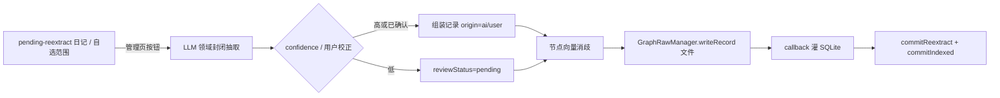

# 白守记忆图谱与知识库设计方案

> 版本：v0.14.2（已定稿原则；实现按 P0–P5 分期）
> 日期：2026-07-17
> 范围：总/子 RawDataSourceManager、整文件轻量版本、集合类行级合并、落盘字段（附录 B）、记忆图谱、开工清单；知识库为**未来规划**（§十）
> **前置依赖：** [Agent Gate 权限系统补全方案](./Agent-Gate权限系统补全方案.md) 的 **G0–G2 完成前，不开工本方案 P1**（图 schema / GraphRawManager）。P0 可与 Gate 并行。
> **实现进度：** **P0–P5 已落地**（含 P5c 时钟安全阀、`nodes.idmap.json`、同步 delete/orphan、LWW 经 Manager、移动端 WebView 力导向图）；K1 知识库未开工。

---

## 一、背景与定位

白守已具备成熟的本地记忆能力：向量检索（`memory_embeddings` + sqlite-vec）、全文检索（FTS5）、层级化总结。本方案在此之上引入**记忆图谱**，并顺带厘清**向量记忆的跨端同步缺口**与**知识库的存储策略**。

术语约定：全文使用**原始数据源**（可同步的文件层）与**派生索引**（本地 SQLite，可重建）。**不使用「真相 / 权威源」等说法**，避免语义绑架；关系就是「原始数据源可同步、可丢失库后重建派生；派生永不单独充当跨端数据」。

### 1.1 图谱要解决什么（先钉死边界）

调研结论表明：图对"检索准确率"提升有限，甚至在单一事实检索、纯多跳整合上会拖累纯文本记忆。但图在**时序推理**上有明显优势，且能提供纯向量无法给出的**可视化**与**可解释性**。因此：

| 维度 | 决策 |
| --- | --- |
| 图**不做** | 提升单一事实检索；替代现有向量 / FTS；多跳问答整合 |
| 图**专攻** | ① 关系随时间的演变 ② 关系网络可视化与管理 ③ 伙伴的可解释叙事 |
| 与现有记忆的关系 | **叠加层**，不替代。向量 / FTS 负责"找内容"，图负责"看关系" |

白守是日记 / 人生记录应用，数据天然带时间戳、天然以"人 / 地 / 事 / 情绪"为中心，这正是图能发光的少数场景。

### 1.2 产品入口：图管理页（一等公民）

图谱不是埋在设置里的附属能力，而是**专门页面**：

- 一眼看到整库关系网（全局力导向图）
- 搜索实体、按类型过滤、点进局部聚焦 / 时间线
- 管理抽取：待重抽日记、批量 LLM 抽取、待确认队列、手动校正

桌面端独立路由；移动端独立 Screen（WebView 力导向或等价方案，见 §13.4）。

---

## 二、核心架构原则（贯穿全文的主线）

> **派生索引（向量 / FTS / 图 SQLite）本地可重建、不跨端同步。凡需跨端一致或可重建的内容，必须先落在「原始数据源」文件层。用统一的原始数据源管理系统登记、写入、分片与新鲜度，而不是各业务私自双写。**

### 2.1 统一文件写入总管（总 Manager + 分类型 Manager）

**定位：白名单内原始数据源文件的唯一写入入口**（不是 vault 里任意文件的上帝类；Settings/Attachments 等不在本期白名单）。

```
RawDataSourceManager                 // 总管：register、按 kind 路由、铁律、freshness
 ├─ JournalRawManager                // 日 md：writeFile + 轻量版本
 ├─ SummaryRawManager                // 总结 md：writeFile + 轻量版本
 ├─ SessionRawManager                // 会话 JSON：writeFile + 轻量版本（热路径见下）
 ├─ MemoryRawManager                 // 月 JSONL：writeRecord + pending-index
 ├─ GraphRawManager                  // nodes/edges/extract-state：writeRecord + collection
 └─ NotebookRawManager               // 未来
```

```ts
type RawSourceKind = 'journal' | 'summary' | 'session' | 'memory' | 'graph' | 'notebook'
type GraphCollection = 'nodes' | 'edges' | 'extract-state'
/** 整文件类 vs 集合类——同步冲突与版本策略不同，见 §2.5 */
type RawSourceShape = 'whole-file' | 'record-collection'

interface RawDataSourceManager {
  register(kind: RawSourceKind, impl: RawSourceKindManager): void
  writeRecord(
    kind: 'memory' | 'graph',
    record: unknown,
    opts?: { collection?: GraphCollection } & WriteOpts
  ): Promise<{ shardPath: string; contentHash: string }>
  writeFile(
    kind: 'journal' | 'summary' | 'session' | 'notebook',
    relativePath: string,
    content: string | Uint8Array
  ): Promise<{ contentHash: string }>
  tombstone(kind: 'memory' | 'graph', id: string, opts: WriteOpts): Promise<void>
  listShards(kind: RawSourceKind): Promise<Array<{ path: string; contentHash: string }>>
  freshness: DerivedFreshnessService
}
```

**编排（按 kind）**

| kind | 形态 | 热路径写序 | 派生灌库 |
| --- | --- | --- | --- |
| `journal` / `summary` | 整文件 | 业务 → Manager.writeFile（可先版本快照）→ callback 灌派生 | 文件领先 |
| `memory` / `graph` | 集合 | 业务 → Manager.writeRecord → pending-index → 灌库 | 文件领先 |
| `session` | 整文件 | **先 SQLite →** SessionRawManager.writeFile（写盘前可快照） | 库可短暂领先；入站 file→DB |

session **不**翻成「先文件再灌库」，但落盘必须经 Manager。

**已登记源与接入节奏**

| kind | 根目录 | 形态 | 接入 |
| --- | --- | --- | --- |
| `journal` | `Journals/` | 整文件 | P0：经 Manager；挂轻量版本 |
| `summary` | `Summaries/` | 整文件 | P0/随总结写路径：经 Manager + 轻量版本 |
| `session` | `Sessions/` | 整文件 | P0：落盘经 Manager；热路径仍先库 + 轻量版本 |
| `memory` | `Memory/` | 集合 | **P0** 完整接入 |
| `graph` | `Graph/` | 集合 | **P1** 完整接入 |
| `notebook` | `Notebooks/` | 整文件/目录 | K1 |

落盘字段见 **附录 B**。图三种写入：① user 手动 ② ai 从日记抽 ③ 聊天先 memory 再 graph。改日记不改 graph，仅可能 **pending-reextract**（§2.6）。

**写入铁律：** 白名单只经总/子 Manager；整文件/集合策略见 §2.5；文件禁止向量；新集合记录 id = **uuid**；禁止绕过 Manager 的仅库写入（session 热路径库写入除外）。

### 2.2 时间与分片键

对齐现有 `date.utils` 哲学：

| 概念 | 规则 |
| --- | --- |
| **日历日 / 分片月** | 设备**本地日历**（`formatLocalDate` / 由瞬时戳推本地 `YYYY-MM`）。日记路径、Memory/Graph 月分片均如此。不做时区前缀（避免动存量 Journals）。 |
| **`createdAt` / `updatedAt` / `deletedAt` 等时刻** | 存 **Unix 毫秒**（UTC 纪元瞬时，时区无关）。展示时再格式化为本地。不是「UTC 日历日」。 |
| 旅行换时区 | 已有文件名不变；「今天」随设备本地日变化——与现有日记行为一致，本期不另做旅行纠正。 |

内容指纹（manifest / shadow / extract-state）统一 **MD5 hex**（完整性 / 变更检测，非加密用途）。

### 2.3 按月分片（选定存储粒度）

**选定：按月分片 JSONL + pending-index 定点更新**（否决整库单文件与一记录一文件）。

| 数据 | 路径 | 分片键 |
| --- | --- | --- |
| 伙伴记忆 | `Memory/YYYY-MM.jsonl` | `createdAt` → 本地日历月 |
| 图边 | `Graph/edges/YYYY-MM.jsonl` | 日记日期月，否则 `validFrom`/写入月 |
| 图节点 | `Graph/nodes/YYYY-MM.jsonl` | `firstSeenAt` 本地月；更新仍写回归属月 |

旁路：`Memory|Graph/shards.manifest.json`（MD5）；`Graph/nodes.idmap.json`（nodeId → shardMonth）。

重抽某月日记：主要改写该月 edges；节点 `mentionCount`/`aliases` 更新会触达归属月 nodes 分片（承认可能脏历史月）。

### 2.4 重建与补齐（差集，分片范围）

```
对每个 pending-index 分片 S：
  待补齐 = S 内 id − DB 中已有 id
  待清理 = DB 中属 S 的 id − S 内 id   // 边表需 shard_month 列，见 §4.2
```

触发：启动、同步后、手动重建。记录 id 为稳定 uuid。

### 2.5 两类原始数据源：整文件 vs 集合（核心分层）

> **整文件类（journal / summary / session）= 全文替换 + 轻量版本快照。**  
> **集合类（memory / graph）= pending-index（脏分片）+ 行级 LWW 检查/合并。**  
> **不上 Git** 做日记/会话版本；在现有 `VersionManager`（`.versions/`）上扩展即可。

#### 2.5.1 整文件类：全文替换 + 轻量版本

| 项 | 约定 |
| --- | --- |
| 主文件 | 仍是可同步的原始数据源（一篇日记一个 md、一个会话一个 json…） |
| 写入 | `writeFile` **整文件覆盖**；内容 MD5 未变可跳过 |
| 版本 | 覆盖前（或 hash 变化时）打快照到 `.versions/<相对路径>/<timestamp>.*` + 元数据 json |
| 实现基线 | 已有 `packages/core/src/sync/version-manager.service.ts`；增量同步**排除** `.versions`（本机历史，默认不跨端） |
| 同步冲突 | v1 维持文件级三向（选一侧）；输的一侧若有本地版本快照可找回 |
| 不做 | Git 仓库、分支、commit；不为整文件做行级 diff3（可后期可选） |

**快照策略（产品规则）**

1. **触发**：Manager `writeFile` 且新内容 MD5 ≠ 旧文件时备份；同步即将覆盖本地前必备份。  
2. **保留**：每文件最多 N 份（建议默认 20）或按天清理；超出删最旧。  
3. **跨端**：版本目录**默认不同步**（现状）；若将来要同步历史，单独立项（体积大）。  
4. **挂点**：Journal / Summary / Session 子 Manager 写盘前调用同一 `IVersionManager`（移动端与桌面抽象对齐，避免仅 `conflict-*.md`）。

主文件仍是「同步用的原始数据源」；`.versions` 是**旁路保险**，不替代主文件，也不进派生索引。

#### 2.5.2 集合类：脏分片 + 行级检查 / 合并

| 项 | 约定 |
| --- | --- |
| 主文件 | 月分片 JSONL（§2.3） |
| 本地派生 | `pending-index`：分片 MD5 ≠ 已索引 → 差集灌库（§2.4 / §2.6） |
| 跨端冲突 | v1 文件级；**P5** 对可合并路径做**行级 LWW**（§2.5.3） |
| 版本 | **不靠**整文件 `.versions` 当主策略；靠记录 `id` + `updatedAt` + `deletedAt` tombstone |
| 不做 | 对 JSONL 做 markdown 式 diff3（易拼坏结构化行） |

#### 2.5.3 行级合并（P5，已设计后置实现）

**何时跑：** 三向决策本将 `conflict-resolved` 的路径属于：

```
Memory/YYYY-MM.jsonl
Graph/nodes|edges|extract-state/YYYY-MM.jsonl
```

`shards.manifest.json` / `nodes.idmap.json` 不参与行合并——JSONL 写回后由 Manager 重算 MD5。

**算法（无需 ancestor 文件内容）：** 对 local/remote 各 fold 成 `Map<id, record>`（同 id 取最大 `updatedAt`），再并集 LWW；`updatedAt` 相同则 tombstone 优先，再比 canonical JSON 字典序。输出建议**每 id 一行**（顺带 compact）。

**衔接：** 合并结果经 Memory/GraphRawManager 原子写回 → `pending-index` 灌库 → **upload 合并结果**使两端收敛。分片写锁与 Manager 共用。

**分期：** P5a Memory → P5b Graph 各 collection → P5c 非法行降级/时钟安全阀。  
（对比 Remotely Save：其 PRO 是小 md 的文本 diff3，**不照搬**到 JSONL。）

### 2.6 图抽取与新鲜度（`pending-reextract` / `pending-index`）

图抽取走 LLM，保存日记**不**自动抽。

| 状态名 | 含义 | 触发 | 处理 |
| --- | --- | --- | --- |
| **`pending-index`**（原 index-dirty） | 原始数据源分片文件已变，派生 SQLite 未跟上 | Manager 写入、同步下载 | **通常自动**差集灌库 |
| **`pending-reextract`**（取代 extract-stale） | 某篇日记正文 hash ≠ 上次成功抽图时记录的 hash；**原料变了，图尚未按新正文重抽** | journal `isChanged` | **仅手动**（管理页批量抽取） |

命名说明：不是「抽取结果坏了」，而是「相对当前日记，**尚待重新抽取**」。

```
freshness.markPendingIndex(kind, shardPath)
freshness.scanPendingIndex(kind?): ShardRef[]
freshness.markPendingReextract(filePath, contentHash)
freshness.listPendingReextract(): DiaryRef[]
freshness.commitReextract(filePath, contentHash)  // 写 extract-state
freshness.commitIndexed(kind, shardPath, md5)
```

游标文件：`Graph/extract-state/YYYY-MM.jsonl`（可同步）。  
UI：管理页展示「N 篇待重抽」；pending-index 静默，失败再提示。

### 2.7 旧记忆向量与新 uuid

- **新写入**：`id` = uuid，`sourceType = 'memory'`，先写 Memory JSONL，再 embed（`sourceId = id`）。
- **旧向量**（`sourceType='chat'` + `mem_<timestamp>`）：**保留，不强制删除或重建**；P0 把仍有效的旧记忆**补写进 JSONL**（可读出 `chunk_text` 落盘，沿用原 `sourceId` 作为行 `id` 或另建映射字段 `legacySourceId`）。id 形态不同，与新 uuid **不冲突**。
- 差集：新逻辑以 JSONL 为准；仅存在于 DB、且未进 JSONL 的旧条，补写文件后即纳入原始数据源。

---

## 三、现状盘点

### 3.1 各类记忆数据的原始数据与同步现状

| 数据 | 原始数据文件 | 跨端同步 | 向量嵌入 | 换端命运 |
| --- | --- | --- | --- | --- |
| 日记 | ✅ `Journals/*.md` | ✅ | ✅（从 md 重建） | 可重建（需重跑嵌入） |
| 会话消息 | ✅ `{sessionId}.json` | ✅ | ❌ 未嵌入，走 FTS | 内容不丢；FTS 可重建 |
| 伙伴主动存的记忆 | ❌ **无** | ❌ | ✅ | **彻底丢失且无法重建** |
| 层级总结 | ✅ 文件 | ✅ | 部分 | 可重建 |

### 3.2 关键事实（已在代码中核实）

- 所有 `.db` 文件被增量同步显式排除（`isSqliteRuntimeSyncPath`），即**向量本身完全不跨设备**。
- 会话消息的向量嵌入函数 `embedMessage` 无外部调用者——**会话消息现状不做向量嵌入**，检索由 `agent_messages_fts` 承担。
- 伙伴 `memory_store` 工具通过 `embedText` 直接写入 `memory_embeddings`（`sourceId = mem_<时间戳>`），**无任何文件落盘**，是当前唯一的原始数据缺口。

### 3.3 由此确定的两条修复项

1. **伙伴记忆文件原始数据化**（修复现存的换端丢失问题）——见第九章。
2. **知识库向量独立库**（新功能的前置设计）——见第十章。

---

## 四、图谱数据模型

新增 schema 文件 `packages/database/src/schema/graph.ts`，风格对齐现有 `agent-sessions.ts`。

### 4.1 节点表 `graph_nodes`

```typescript
export const graphNodesTable = sqliteTable('graph_nodes', {
  id: text('id').primaryKey(),
  vaultName: text('vault_name').notNull(),
  nodeType: text('node_type').notNull(),            // 领域封闭枚举
  name: text('name').notNull(),                     // 规范名
  aliases: text('aliases').notNull().default('[]'), // JSON 数组，消歧用
  summary: text('summary').notNull().default(''),   // 一句话画像，可由伙伴 / 用户维护
  propsJson: text('props_json').notNull().default('{}'),
  embedding: blob('embedding'),                     // Float32 BLOB，复用 sqlite-vec
  dimension: integer('dimension'),
  modelId: text('model_id').notNull().default(''),
  mentionCount: integer('mention_count').notNull().default(0), // 热度，可视化权重
  firstSeenAt: integer('first_seen_at', { mode: 'timestamp' }),
  lastSeenAt: integer('last_seen_at', { mode: 'timestamp' }),
  createdAt: integer('created_at', { mode: 'timestamp' }).notNull().defaultNow(),
  updatedAt: integer('updated_at', { mode: 'timestamp' }).notNull().defaultNow(),
  deletedAt: integer('deleted_at', { mode: 'timestamp' })       // 软删除
})
```

### 4.2 边表 `graph_edges`

```typescript
export const graphEdgesTable = sqliteTable('graph_edges', {
  id: text('id').primaryKey(),
  vaultName: text('vault_name').notNull(),
  fromId: text('from_id').notNull(),
  toId: text('to_id').notNull(),
  edgeType: text('edge_type').notNull(),
  propsJson: text('props_json').notNull().default('{}'),
  // —— 时序牌：关系有效期，支撑「关系随时间演变」——
  validFrom: integer('valid_from', { mode: 'timestamp' }),
  validTo: integer('valid_to', { mode: 'timestamp' }),          // null = 至今有效
  isCurrent: integer('is_current', { mode: 'boolean' }).notNull().default(true),
  // —— 回指原文牌：规避多跳信息损失 ——
  sourceKind: text('source_kind').notNull().default('diary'),   // diary/session/memory/manual
  sourceRef: text('source_ref'),                                // 日记相对路径 / sessionId / memory id
  sourceExcerpt: text('source_excerpt').notNull().default(''),  // 原文片段
  sourceContentHash: text('source_content_hash'),               // 抽取时日记 MD5，与文件层对齐
  confidence: integer('confidence').notNull().default(100),     // 抽取置信 0-100
  origin: text('origin').notNull().default('ai'),               // ai/user
  reviewStatus: text('review_status').notNull().default('approved'), // pending/approved/rejected
  shardMonth: text('shard_month').notNull(),                    // YYYY-MM，与 JSONL 分片一致，差集用
  createdAt: integer('created_at', { mode: 'timestamp' }).notNull().defaultNow(),
  updatedAt: integer('updated_at', { mode: 'timestamp' }).notNull().defaultNow(),
  deletedAt: integer('deleted_at', { mode: 'timestamp' })
})
```

> `reviewStatus` / `shardMonth` / `sourceContentHash` **首版即带上**，与附录 B 对齐。  
> 时刻列存 Unix 毫秒瞬时；`shardMonth` 为本地日历月字符串。

### 4.3 领域封闭枚举（抗抽取噪声的关键）

**这是什么**：图里每个节点带一个 `nodeType`，每条边带一个 `edgeType`。「领域封闭枚举」= 预先规定只能取固定几类，LLM 抽取时用 function-calling 的 `enum` 夹逼，不允许自由发明。节点类型分两层：**内容实体**与**结构锚点**（`entry` = 一篇日记）。

**为什么手动定义、不让 AI 自由发挥**：

- **防碎裂**：开放抽取下 LLM 会把同一种关系抽成一堆近义标签，类型一发散，图就碎成孤岛。
- **可查询、可着色**：可视化按 `nodeType` 着色、按 `edgeType` 过滤，类型是稳定 schema 才能写稳定查询与 UI。
- **省成本、准确率高**：类型集有限 → prompt 简单、token 省、命中率高。

白守核心本体 = **10 类内容实体** + **1 类结构锚点** `entry`，对齐业界通用 NER 并按日记场景裁剪，仍为封闭集；遇到枚举外的东西再迁移加类型。

```typescript
// —— 内容实体（有实际语义，10 类）——
export const GRAPH_ENTITY_TYPES = [
  'person', // 人物
  'place', // 地点
  'organization', // 公司 / 学校 / 团体
  'event', // 一次具体发生的事（婚礼、面试）
  'emotion', // 情绪
  'topic', // 主题 / 概念（柔性兜底）
  'work', // 作品 / 媒体：书、影视、音乐、游戏、播客
  'activity', // 活动 / 爱好：跑步、旅行、健身、烹饪（区别 event：可反复进行）
  'product', // 产品 / 物件：品牌产品、工具、设备
  'food' // 饮食：菜品、食物（餐厅归 place，不归 food）
] as const

// —— 结构锚点（非内容实体，仅作"来源节点"：一篇日记 = 一个 entry）——
export const GRAPH_ANCHOR_TYPES = ['entry'] as const

export const GRAPH_NODE_TYPES = [...GRAPH_ENTITY_TYPES, ...GRAPH_ANCHOR_TYPES] as const

export const GRAPH_EDGE_TYPES = [
  'mentions', // entry → 被提及实体
  'participates_in', // 人 → 事件 / 活动
  'located_at', // entry / 事件 → 地点
  'evokes', // entry / 人 / 事 → 情绪
  'role_of', // 人对某组织/群体的角色（靠 validFrom/To 演变）
  'relates_to' // 泛关联兜底
] as const
```

类型集取舍：

- **加 `organization`**：角色演变叙事的锚点（同学 → 同事）。
- **加 `work / activity / product / food`**：日记高频维度，独立成类便于过滤 / 着色。
- **`topic` 是柔性兜底**：抽象话题靠 `name` + 向量消歧。
- **去掉 `object`**、**不建时间节点**（时序由日记日期 / `validFrom` 处理）。
- **edge 维持 6 类**；细粒度关系语义可后续加自由 `label` 字段。

**各 nodeType 的填充来源**（全部经 LLM，无 frontmatter 裸连）：

| nodeType | 来源 | 说明 |
| --- | --- | --- |
| `entry` | 抽取某篇日记时建 / 复用锚点 | 结构节点，非「脏信号边」；挂 `sourceRef=filePath` |
| 其余 10 类内容实体 | LLM 读正文（可参考 frontmatter 提示） | function-calling 锁枚举；消歧后入库 |

> frontmatter 的 `tags` / `mood` / `location` **不自动建边**（易脏）。可选：作为 LLM prompt 的参考上下文（「本篇标注 mood=…，请以正文为准」），由模型决定是否采纳。

### 4.4 两张关键牌

- **`validFrom / validTo / isCurrent`**：同一对节点可存在多条不同时期的边，天然表达"关系变迁"。冲突时旧边设 `isCurrent=false` + `validTo`，**不物理删除**。
- **`sourceRef / sourceExcerpt`**：图给结构，需要细节时一键拉回原始日记，规避多跳退化。

### 4.5 索引（写进兜底建表 SQL）

```sql
CREATE INDEX IF NOT EXISTS graph_nodes_vault_type ON graph_nodes(vault_name, node_type);
CREATE INDEX IF NOT EXISTS graph_edges_from ON graph_edges(from_id);
CREATE INDEX IF NOT EXISTS graph_edges_to ON graph_edges(to_id);
CREATE INDEX IF NOT EXISTS graph_edges_vault_type_current ON graph_edges(vault_name, edge_type, is_current);
CREATE INDEX IF NOT EXISTS graph_edges_source_ref ON graph_edges(vault_name, source_ref);
CREATE INDEX IF NOT EXISTS graph_edges_shard_month ON graph_edges(vault_name, shard_month);
```

> `from_id` / `to_id` 是遍历命门；`source_ref` 支撑按篇替换；`shard_month` 支撑分片差集清理。

---

## 五、存储与跨端布局

### 5.1 各数据的库与原始数据归属

| 数据 | SQLite（派生，不同步） | 原始数据文件（同步，**按月分片**） |
| --- | --- | --- |
| 图节点 / 边 | `baishou_agent.db`（`graph_nodes` / `graph_edges`） | `Graph/nodes/YYYY-MM.jsonl`、`Graph/edges/YYYY-MM.jsonl` + `Graph/shards.manifest.json` |
| 伙伴记忆向量 | `baishou_agent.db`（`memory_embeddings`） | `Memory/YYYY-MM.jsonl` + `Memory/shards.manifest.json` |
| 会话 | `baishou_agent.db`（`agent_*`） | `{sessionId}.json`（已有） |
| 知识库向量 | 独立 `knowledge.db`（**新增**，`notebook_id` 分区） | 上传的原始资料文件 |

> **原始数据目录命名铁律**：分片目录必须**非 `.` 开头**（`Graph/`、`Memory/`、`Notebooks/`）。增量同步对 `.` 开头一律排除（vault 内 `.baishou/settings/*.json` 例外）。

> **第一版即落盘**：按月分片 JSONL + manifest 与 schema / 抽取 / 管理页**同一交付批次**。

### 5.2 为什么图放 `baishou_agent.db`

- 该库已加载 sqlite-vec，节点向量消歧零额外成本。
- 复用现有 `MigrationService` 的兜底建表模式（新增 `_ensureGraphTables()`）。
- 跨端复用现有三驱动，schema 一次定义两端通用。

> 备选：独立 `graph_index.db`。已决策用前者。

### 5.3 原始数据源对照（经 `RawDataSourceManager`）

| kind | 原始数据源路径 | 派生索引 | 说明 |
| --- | --- | --- | --- |
| `journal` | `Journals/**/*.md` | shadow / 日记向量 | 散文；图抽取原料 |
| `memory` | `Memory/YYYY-MM.jsonl` | `memory_embeddings` | 聊天沉淀记忆 |
| `graph` | `Graph/nodes\|edges/YYYY-MM.jsonl` | `graph_*` | 图的唯一原始数据源（三写入源见 §2.1） |
| （附属） | `Graph/extract-state/YYYY-MM.jsonl` | — | 抽取游标，算 pending-reextract |
| （派生） | — | SQLite | 可丢，由 Manager + 差集重建 |

用户改日记 → 只标 **pending-reextract** → **不改 graph 分片**；确认抽取后才经 GraphRawManager 写分片再灌库。  
用户手动删边：tombstone 经 Manager 进 graph 分片。

---

## 六、抽取管道（`packages/core/src/graph/`）

**决策：不做 frontmatter 免费信号建边。** 所有内容边经 LLM 抽取；用户通过图管理页按钮批量 / 按范围触发。



要点：

1. **触发**：仅手动（「梳理待重抽 / 自选范围」）+ 可选伙伴主动工具；无后台被动抽取。
2. **LLM**：function-calling 锁枚举；每篇先确保 `entry` 锚点（id 用 uuid 或基于 filePath 的 UUIDv5，全局统一 uuid 形态）。
3. **Prompt**：frontmatter 可作参考，不直接建边。
4. **消歧**：同名 / 别名 / 向量阈值。
5. **按篇替换**：`sourceRef` 下非 user 旧边 supersede；保留 user tombstone / 校正。
6. **编排**：**先文件后库**（经 Manager），不是先 INSERT 再落盘。

### 6.1 来源协同：`ai` + `user`

| origin | 来源 | 典型内容 |
| --- | --- | --- |
| `ai` | LLM 读日记正文抽取 | 人物、关系、事件、情绪、地点… |
| `user` | 用户在管理页手动建 / 确认 / 否决 | 连边、改名、删边、approve pending |

- **冲突优先级**：`user > ai`，再比 `confidence`。
- **无 `rule`**：不再从 tags/mood/location 规则派生边。

**AI 写入红线**：任何进图的节点 / 边都必须能溯源——`sourceRef` 指向日记，或伙伴记忆 `Memory/*.jsonl`，或 `sourceKind='manual'` 且由用户操作产生。**禁止无源写入**。AI 主动洞察若要进图：先落盘原始数据 → 再抽取（`sourceKind='memory'` 或 `session`）。

---

## 七、检索、消费与图管理页

### 7.1 GraphRAG 双路（`GraphRagService`）

```typescript
interface GraphRagResult {
  anchors: GraphNode[]  // 命中的锚点实体
  subgraph: GraphEdge[] // 1–2 跳邻居（含 sourceExcerpt）
  timeline?: GraphEdge[] // 按 validFrom 排序的关系演变
}
```

- **实体锚点路**：query 抽实体 → 向量定位锚点 → 递归 CTE 遍历 1–2 跳（深度上限）。
- **时序路**：命中人物 / 主题时，按 `validFrom` 拉关系演变时间线。

### 7.2 伙伴工具

```typescript
recall_relations({ entity: string, mode: 'network' | 'timeline' }): GraphRagResult
```

伙伴用它做可解释叙事；细节顺着 `sourceRef` 拉原文。

### 7.3 图管理页（产品主入口）

专用页面，承担「看见 + 搜索 + 管理」三件事，而不是只做一张装饰性全局图。

**布局（桌面）建议**

| 区域 | 职责 |
| --- | --- |
| 主画布 | 全局力导向图（默认）；支持缩放 / 平移 |
| 顶栏 | 搜索框（实体名 / 别名）、类型过滤、显示/隐藏 `entry` |
| 侧栏或底栏 | 待重抽数量、「梳理待重抽 / 自选日期范围」、抽取进度 |
| 详情抽屉 | 点击节点 → 局部 1–2 跳子图、时间线、回指原文、手动编辑 |
| 队列页签 | `reviewStatus='pending'` 的边：通过 / 拒绝 |

**核心交互**

1. **快速看见**：打开即加载全局图（`maxNodes` / `minMentionCount` 降采样）；热度大的人物 / 主题居中枢纽。
2. **搜索**：输入即高亮命中节点并可选「聚焦到该节点」。
3. **局部聚焦**：点击节点进入 1–2 跳 / 时间线；可返回全局。
4. **抽取管理**：展示 pending-reextract 列表；批量 LLM 抽取；失败可重试。
5. **校正**：改名、加别名、连边、删边（`origin='user'`）。

**API 形态**

```typescript
getGraphView(opts: {
  vaultName: string
  centerNodeId: string
  depth?: 1 | 2
  timeRange?: { from: number; to: number }
}): { nodes: GraphViewNode[]; edges: GraphViewEdge[] }

getGlobalGraph(opts: {
  vaultName: string
  maxNodes?: number
  minMentionCount?: number
  nodeTypes?: (typeof GRAPH_NODE_TYPES)[number][]
}): { nodes: GraphViewNode[]; edges: GraphViewEdge[] }

searchGraphNodes(opts: {
  vaultName: string
  query: string
  nodeTypes?: (typeof GRAPH_NODE_TYPES)[number][]
  limit?: number
}): GraphNode[]

listPendingReextract(vaultName: string): Array<{ filePath: string; date: string; title?: string }>
extractDiaries(opts: {
  vaultName: string
  filePaths: string[] // 空 = 全部 pending-reextract
}): Promise<{ done: number; failed: number }>
```

**渲染与性能**

- Web / 桌面：力导向 + Canvas；上万节点 WebGL + 降采样。
- 移动：top-N + 点击展开；推荐 WebView 承载与桌面同源力导向 bundle。
- 布局后台 / 懒加载，避免阻塞主线程。

> 全局图「好看」与搜索 / 聚焦「好用」都要做；管理页以好用为先。

---

## 八、会话消息与嵌入策略

### 8.1 结论：会话消息不做全量向量嵌入（维持现状）

| 需求 | 方案 |
| --- | --- |
| "搜某次对话说过的话" | **FTS 全文检索**（`agent_messages_fts`，已有） |
| "长期记住的偏好 / 事实" | 伙伴 `memory_store` **抽取成精炼记忆**再嵌入（少而精） |

理由：全量嵌入会话消息会烧嵌入 API、混入闲聊、污染向量库。

### 8.2 会话落盘：热路径不变，统一经 Manager

- **schema / 热路径写法不变**：先 SQLite，再防抖落盘（现有性能与读模型）。
- **落盘出口改走** `SessionRawManager.writeFile`（总 Manager 路由），禁止业务直接写 `Sessions/*.json`。
- 入站同步 / fullScan 仍 file→DB。本期**不**翻转「先文件再灌库」。

---

## 九、伙伴记忆文件原始数据化（修复现存缺口）

### 9.1 问题

伙伴 `memory_store` 存的记忆仅在不同步的 `baishou_agent.db` 中，且无源文件，换端后彻底丢失且无法重建。

### 9.2 方案

经 `MemoryRawManager` / 总 Manager `writeRecord('memory', …)`；字段见 **附录 B.1**。

实现要点：

1. **新记忆**：uuid + 先 JSONL 后 embed；`sourceType='memory'`。
2. **旧向量**：保留不删；P0 **补写进 JSONL**（用 `chunk_text`），不必重跑 embedding。
3. pending-index 差集灌库；tombstone 归属月 append。

---

## 十、知识库 / 笔记本设计（未来规划，当前不做）

> **范围说明**：知识库 / 笔记本是**未来功能，本期不实现**。本章仅前瞻设计，给架构预留位置。落地排期见 §十二（K1，未排期）。

### 10.1 定位

用户创建笔记本、上传资料、做向量、学习检索。本质是**文档 RAG**，与图谱正交，**不使用图**。

### 10.2 向量独立库

强烈建议独立 `knowledge.db`，按 `notebook_id` 分区：生命周期干净、规模隔离、语义隔离。

### 10.3 原始数据与同步

- 原始数据：`<vault>/Notebooks/<notebookId>/`
- 派生层：`knowledge.db`，换端按 §2.3 差集重建
- 可独立配置嵌入模型 / 维度

### 10.4 复用

复用 `EmbeddingService` 与检索模式，切换目标库与分区字段即可。

---

## 十一、同步与账号演进

| 阶段 | 方案 |
| --- | --- |
| 现在（v1） | 整文件：文件级三向 + 本地 `.versions`；集合：月分片同步 + pending-index；行级合并 **P5** |
| 账号体系 | 集合记录含 UUID + `updatedAt` + `deletedAt`，便于 LWW；向量不上传；版本目录默认仍本机 |

---

## 十二、分阶段路线图

| 阶段 | 内容 | 价值 |
| --- | --- | --- |
| **Gate G0–G2** ✅ | 见 [Agent-Gate权限系统补全方案](./Agent-Gate权限系统补全方案.md)；外路径护栏、重复调用、Always 级联、场景 profile 等 | **先于本表 P1**；聊天进图门控预埋在 Gate G2.5 |
| P0 ✅ | 总/子 Manager；memory 完整接入；journal/summary/session **落盘经 Manager**；整文件挂 **VersionManager 快照**；旧向量补写 JSONL；pending-index + MD5 | 统一写入口；修换端丢失；轻量版本 |
| P1 ✅ | 图 schema + Repo + GraphRawManager + 先文件后灌库；`graph_upsert` 经 Manager 真写 | 能存能查能同步 |
| P2 ✅ | LLM + pending-reextract + 按篇替换 + 待确认 | 图有数据 |
| P3 ✅ | 图管理页（桌面 d3-force；移动 WebView 力导向 + 搜索/待重抽/待确认） | 看得见、管得着 |
| P4 ✅ | `recall_relations` | 给 AI 用 |
| P5 ✅ | 集合类**行级 LWW 合并**（§2.5.3）+ P5c 时钟阀 + idmap + orphan | 双端同月不互抹 |
| K1 | 知识库（未排期） | 学习场景 |

**Gate G0–G2** →（P0 可并行）→ **P1–P3** → P4；P5 可与图谱并行但依赖 Manager/月分片已落地。

---

## 十三、实施开工清单（逐文件 / 逐函数）

> 所列路径均已核对现有代码；「新建」为待创建，「改」为在既有文件内追加/修改。函数体为伪代码。

### 13.1 P0：总/子 Manager + memory + journal/session 落盘接管

**关键校正（据现有代码核实）**

- 生产写入走 `HybridSearchEmbeddingStore`；`listSourceIdsByType` / `listEmbeddingChunksByType` **已补齐**。
- 新写入：`MEMORY_SOURCE_TYPE='memory'` + uuid；旧 `chat`/`mem_*` **保留向量**，补写 JSONL。

**改动文件清单**

| # | 文件 | 类型 | 动作 |
| --- | --- | --- | --- |
| 1 | `packages/core/src/raw-data/raw-data-source.types.ts` | 新建 | kind / GraphCollection / WriteOpts |
| 2 | `packages/core/src/raw-data/raw-data-source.manager.ts` | 新建 | 总管：路由到子 Manager |
| 3 | `managers/*` | 新建 | Journal / Summary / Session / Memory 子管 |
| 4 | `derived-freshness.service.ts` | 新建 | pending-index（P0）；pending-reextract 可空到 P2 |
| 5 | `stores/monthly-jsonl.store.ts` | 新建 | 月分片 + manifest（MD5） |
| 6 | `version-manager.service.ts`（现有） | 改 | 扩到 session/summary；写前 hash 变化才 backup；保留上限 N；移动端对齐同一接口 |
| 7 | path.service（5 处） | 改 | Memory/Graph 等目录 |
| 8 | `memory-sync.service.ts` | 新建 | pending-index → 差集 embed |
| 9 | `memory-store.tool.ts` 等 | 改 | → writeRecord('memory') |
| 10 | 日记/总结/会话落盘 | 改 | 经对应 RawManager.writeFile（session 仍先写库） |
| 11 | 旧记忆导出 | 新建/改 | embeddings → 补写 JSONL（不重 embed） |
| 12 | bootstrapper | 改 | `scanPendingIndex('memory')` |

**触发**：冷启动 / 同步后 / 手动重建索引。

### 13.2 图谱 P1：存查 + GraphRawManager（先文件后灌库）

| # | 文件 / 命令 | 类型 | 动作 |
| --- | --- | --- | --- |
| 1 | `packages/database/src/schema/graph.ts` | 新建 | 表 + 枚举 + `reviewStatus` + `shardMonth` + `sourceContentHash` |
| 2–6 | agent-db / generate / compat / migration | 改/命令 | 同前 |
| 7 | `graph.repository.ts` | 新建 | **只负责 SQLite**；不写文件 |
| 8 | `managers/graph.raw-manager.ts` | 新建 | nodes/edges/extract-state；`writeRecord` + collection |
| 9 | `graph-sync.service.ts` | 新建 | Manager 提交后 callback / pending-index 差集灌库 |
| 10 | bootstrapper | 改 | `scanPendingIndex('graph')` |
| 11 | 测试 | 新建 | 先文件后库、MD5、uuid、差集 |

```ts
export class GraphRepository {
  async upsertNode(input: UpsertNodeInput): Promise<string>
  async findNodeByNameOrAlias(vaultName: string, name: string, type: GraphNodeType): Promise<GraphNodeRow | null>
  async searchNodesByVector(vaultName: string, vector: number[], topK: number): Promise<Array<GraphNodeRow & { distance: number }>>
  async searchNodesByName(vaultName: string, query: string, opts?: { nodeTypes?: GraphNodeType[]; limit?: number }): Promise<GraphNodeRow[]>
  async upsertEdge(input: UpsertEdgeInput): Promise<string>
  async supersedeEdge(edgeId: string, validTo: number): Promise<void>
  async supersedeEdgesBySourceRef(vaultName: string, sourceRef: string, opts?: { keepUserOrigin?: boolean }): Promise<void>
  async traverse(vaultName: string, centerId: string, depth: 1 | 2): Promise<{ nodes: GraphNodeRow[]; edges: GraphEdgeRow[] }>
  async getGlobalGraph(opts: { vaultName: string; maxNodes?: number; minMentionCount?: number; nodeTypes?: GraphNodeType[] }): Promise<GraphView>
  async softDeleteNode(id: string): Promise<void>
  async softDeleteEdge(id: string): Promise<void>
  async listNodeIds(vaultName: string): Promise<string[]>
  async listEdgeIds(vaultName: string): Promise<string[]>
  async listPendingEdges(vaultName: string): Promise<GraphEdgeRow[]>
}
```

**消歧（`upsertNode` 内部）**

1. 规范化 `name`
2. 精确匹配 name / aliases → 复用
3. 向量 top1，`vec_distance_cosine < 0.15` → 复用并 append alias
4. 未命中则新建（embedding 对齐现有 memory 模型）
5. 命中：`mentionCount++`、`lastSeenAt` 更新

灌库成功后由 sync 层 `commitIndexed`；**Repo 不写文件**。文件写入只在 GraphRawManager（可防抖 flush）。

### 13.3 图谱 P2：LLM 抽取 + pending-reextract

| # | 文件 | 类型 | 动作 |
| --- | --- | --- | --- |
| 1 | `derived-freshness.service.ts` | 改 | 实现 pending-reextract + extract-state 读写 |
| 2 | `shadow-index-sync.service.ts` | 改 | `isChanged` → `markPendingReextract`（不自动抽） |
| 3 | `graph-llm-extraction.service.ts` | 新建 | 锁枚举；成功 → Manager.writeRecord → 灌库 → `commitReextract` |
| 4 | IPC | 改 | `graph:list-pending-reextract`、`graph:extract`、`raw-data:list-pending-index` |

### 13.4 图谱 P3：图管理页（专用页面）

桌面 renderer：React 19 + electron-vite + antd + CSS Modules，无图可视化依赖。

**桌面**

| # | 文件 | 类型 | 动作 |
| --- | --- | --- | --- |
| 1 | `apps/desktop/package.json` | 改 | 力导向库（`d3-force`+Canvas 或 `react-force-graph-2d`） |
| 2 | `graph.ipc.ts` | 新建 | `graph:get-global-graph`、`get-view`、`search`、`list-pending-reextract`、`extract`、`upsert-*` |
| 3 | preload + `global.d.ts` | 新建/改 | `window.api.graph*` |
| 4 | `features/graph/` | 新建 | 独立路由：画布 + 搜索 + 待重抽面板 + 详情 + 待确认队列 |
| 5 | 导航 | 改 | 「关系图谱」入口 |

**移动**：推荐 `graph-web` + WebView；top-N；搜索与「梳理待重抽」必备。

验收：打开见图；能搜；能一键梳理 pending-reextract；能进局部关系与原文。

### 13.5 图谱 P4：`recall_relations`

| # | 文件 | 类型 | 动作 |
| --- | --- | --- | --- |
| 1 | `packages/core/src/graph/graph-rag.service.ts` | 新建 | `recallRelations(...)` |
| 2 | `packages/ai/src/tools/recall-relations.tool.ts` | 新建 | AgentTool |
| 3 | `packages/ai/src/tools/agent.tool.ts` | 改 | `graphReader?` |
| 4 | `packages/ai/src/tools/adapters/graph.adapter.ts` | 新建 | 封装 Repo / RagService |
| 5 | `tool-registry.ts` + i18n + `AGENT_TOOL_UI_DEFS` | 改 | 注册与文案 |
| 6 | session 构建处 | 改 | 注入 adapter |

### 13.6 P5：集合类行级合并

| # | 文件 | 类型 | 动作 |
| --- | --- | --- | --- |
| 1 | `packages/core/src/raw-data/jsonl-record-merge.service.ts` | 新建 | fold + LWW 并集（§2.5.3） |
| 2 | `three-way-sync` 冲突分支 | 改 | 可合并路径走行级合并，写回 Manager 后 upload |
| 3 | 路径识别 | 新建 | `isMonthlyJsonlRawPath` |
| 4 | 测试 | 新建 | 双端各增一行都保留；同 id LWW；tombstone 胜出 |

整文件路径**不**走行级合并；继续文件级决策 + `.versions` 兜底。

### 13.7 知识库 K1（独立 knowledge.db）

> **未来功能**，当前不开工。预留 `Notebooks/` + `knowledge.db`。

### 13.8 通用：依赖注入 / IPC / 并发 / 测试

- 桌面：`agent-helpers.ts` + `agent-session.service.ts` 注入 writer / graphReader。
- 移动：`BaishouProvider` 的 `services.*`。
- IPC：`domain:action`；移动同进程无 IPC。
- 同步进行中重建：复用 `RecoveryAwareSync*` + `withExpoAgentDatabaseLock`。
- embed / LLM 失败：不阻塞原始数据已落盘部分；向量 / 抽取留待重试。
- 测试：迁移、Repo、差集、LLM 枚举约束（mock）、管理页关键 IPC。

---

## 十四、决策记录

已定：

1. ✅ 图表放 `baishou_agent.db`；命名 `graph_*` / `GraphRepository`。
2. ✅ 术语：原始数据源 / 派生索引；不用「真相」。
3. ✅ **总 Manager + 分类型 Manager**；白名单文件唯一写入口。
4. ✅ **分层策略**：整文件类（journal / summary / session）= **全文替换 + 轻量 `.versions` 快照**（扩展现有 `VersionManager`，不上 Git）；集合类（memory / graph）= **pending-index + 行级 LWW**（P5）。
5. ✅ **memory/graph/journal/summary**：先文件（经 Manager）再派生；**session** 热路径仍先库，落盘经 Manager。
6. ✅ 轻量版本：`.versions` 默认**不跨端同步**；hash 变化 / 同步覆盖前打快照；每文件保留上限 N。
7. ✅ 图三写入源；全 LLM；管理页手动抽取；`pending-index` / `pending-reextract`。
8. ✅ 日历日/分片月 = 本地日历；时刻 = Unix 毫秒；MD5 完整性；新 id = uuid；旧向量保留并补写 JSONL。
9. ✅ 按月分片；schema 含 `shardMonth` / `sourceContentHash`；行级合并算法见 §2.5.3，P5 实现。
10. ✅ 专用图管理页；落盘字段附录 B；知识库 K1 未来。
11. ✅ 不对 JSONL 照搬 markdown 文本三路合并；整文件也不上 Git。
12. ✅ **Agent Gate G0–G2 优先于本方案 P1**；聊天进图经 Gate Ask（见权限补全方案 G2.5）；P0 可与 Gate 并行。

---

## 附录 A：SQLite 属性图查询要点（避坑清单）

业界实践表明，在 10 万节点以内、深度 2–3 跳的场景，SQLite 递归 CTE 遍历可达单位数毫秒，无需专用图库。白守个人数据规模远低于此。关键约束：

1. `from_id` / `to_id` **必须建索引**。
2. 遍历用 `UNION`（非 `UNION ALL`）去重防环。
3. 递归**必须设深度上限**。
4. 连接启用 `PRAGMA journal_mode=WAL`（已在用）。
5. 向量相似度用 sqlite-vec。

参考遍历骨架：

```sql
WITH RECURSIVE traversal(node_id, depth) AS (
  SELECT ?1, 0
  UNION
  SELECT
    CASE WHEN e.from_id = t.node_id THEN e.to_id ELSE e.from_id END,
    t.depth + 1
  FROM traversal t
  JOIN graph_edges e ON (e.from_id = t.node_id OR e.to_id = t.node_id)
  WHERE t.depth < ?2
    AND e.is_current = 1
    AND e.deleted_at IS NULL
)
SELECT * FROM traversal;
```

超过 10 万节点且需要深遍历 / 最短路径 / 亚毫秒响应时，才需评估专用图引擎——白守短期内不会触及该边界。

---

## 附录 B：原始数据源落盘字段规范（v0.13）

> 约定：`createdAt`/`updatedAt`/`deletedAt` 为 **Unix 毫秒瞬时**；分片文件名 `YYYY-MM` 为**本地日历月**；JSONL 一行一对象；同 id 取最大 `updatedAt`（LWW）；`deletedAt != null` 已删。  
> 内容指纹：**MD5 hex**。新记录 `id`：**uuid**（旧记忆补写可保留原 `mem_*` id）。  
> **禁止**：`embedding` / `vector` / 任意向量 blob。

### B.0 目录与文件一览

```
<vault>/
  Journals/YYYY/MM/YYYY-MM-DD.md          # journal（现有，整文件）
  Sessions/{sessionId}.json               # session（现有，整文件）
  Memory/
    YYYY-MM.jsonl                         # memory 记录
    shards.manifest.json                  # 分片清单
  Graph/
    nodes/YYYY-MM.jsonl                   # 图节点
    edges/YYYY-MM.jsonl                   # 图边
    extract-state/YYYY-MM.jsonl           # 日记抽取游标
    shards.manifest.json
    nodes.idmap.json                      # 可选：nodeId → shardMonth
```

### B.1 伙伴记忆 `Memory/YYYY-MM.jsonl`

分片键：`createdAt` → `YYYY-MM`（归属月固定；更新/tombstone 仍 append 到该月）。

| 字段 | 类型 | 必填 | 说明 |
| --- | --- | --- | --- |
| `id` | string | ✅ | 新 = uuid；旧补写可沿用 `mem_*`（兼 `sourceId`） |
| `schemaVersion` | number | ✅ | `1` |
| `vaultName` | string | ✅ | |
| `content` | string | ✅ | 正文 |
| `tags` | string[] | ✅ | 可 `[]` |
| `sourceSessionId` | string \| null | ✅ | |
| `createdAt` | number | ✅ | Unix 毫秒；分片月 = 其本地日历月 |
| `updatedAt` | number | ✅ | LWW |
| `deletedAt` | number \| null | ✅ | |

```jsonc
{
  "id": "8f3c2a1e-4b5d-6e7f-8091-a2b3c4d5e6f7",
  "schemaVersion": 1,
  "vaultName": "Personal",
  "content": "用户偏好：喜欢深色主题",
  "tags": ["preference", "UI"],
  "sourceSessionId": "sess_xxx",
  "createdAt": 1721000000000,
  "updatedAt": 1721000000000,
  "deletedAt": null
}
```

派生：`memory_embeddings` 用 `sourceType='memory'` + `sourceId=id` + `chunk_text=content`；`groupId` 建议 `memory:{vaultName}`。

### B.2 图节点 `Graph/nodes/YYYY-MM.jsonl`

分片键：`firstSeenAt` → `YYYY-MM`（归属月）；后续改名/别名/summary 仍 append 到归属月。

| 字段 | 类型 | 必填 | 说明 |
| --- | --- | --- | --- |
| `id` | string (uuid) | ✅ | 节点 id（新一律 uuid） |
| `schemaVersion` | number | ✅ | `1` |
| `vaultName` | string | ✅ | |
| `nodeType` | string | ✅ | ∈ `GRAPH_NODE_TYPES` |
| `name` | string | ✅ | 规范名 |
| `aliases` | string[] | ✅ | 可 `[]` |
| `summary` | string | ✅ | 可 `""` |
| `props` | object | ✅ | 可 `{}`；对应库内 `propsJson` |
| `mentionCount` | number | ✅ | 热度；派生可视化用 |
| `firstSeenAt` | number | ✅ | 决定分片月 |
| `lastSeenAt` | number | ✅ | |
| `origin` | `"ai" \| "user"` | ✅ | 创建来源 |
| `createdAt` | number | ✅ | |
| `updatedAt` | number | ✅ | LWW |
| `deletedAt` | number \| null | ✅ | |

```jsonc
{
  "id": "n_person_anson",
  "schemaVersion": 1,
  "vaultName": "Personal",
  "nodeType": "person",
  "name": "Anson",
  "aliases": ["安森"],
  "summary": "同事，后转为朋友",
  "props": {},
  "mentionCount": 12,
  "firstSeenAt": 1717200000000,
  "lastSeenAt": 1721000000000,
  "origin": "ai",
  "createdAt": 1717200000000,
  "updatedAt": 1721000000000,
  "deletedAt": null
}
```

### B.3 图边 `Graph/edges/YYYY-MM.jsonl`

分片键：优先日记日期月（`sourceKind=diary` 时从 `sourceRef` 解析）；否则 `validFrom` 月；再否则写入月。

| 字段 | 类型 | 必填 | 说明 |
| --- | --- | --- | --- |
| `id` | string (uuid) | ✅ | 边 id |
| `schemaVersion` | number | ✅ | `1` |
| `vaultName` | string | ✅ | |
| `fromId` | string | ✅ | 节点 id |
| `toId` | string | ✅ | 节点 id |
| `edgeType` | string | ✅ | ∈ `GRAPH_EDGE_TYPES` |
| `props` | object | ✅ | 可 `{}` |
| `validFrom` | number \| null | ✅ | |
| `validTo` | number \| null | ✅ | `null`=至今 |
| `isCurrent` | boolean | ✅ | |
| `sourceKind` | `"diary"\|"session"\|"memory"\|"manual"` | ✅ | |
| `sourceRef` | string \| null | ✅ | 日记相对路径 / sessionId / memoryId |
| `sourceExcerpt` | string | ✅ | 可 `""` |
| `sourceContentHash` | string \| null | | 抽取时日记 content_hash；便于核对 |
| `confidence` | number | ✅ | 0–100 |
| `origin` | `"ai" \| "user"` | ✅ | |
| `reviewStatus` | `"pending"\|"approved"\|"rejected"` | ✅ | |
| `shardMonth` | string | ✅ | `"YYYY-MM"`，与文件名一致，便于差集 |
| `createdAt` | number | ✅ | |
| `updatedAt` | number | ✅ | LWW |
| `deletedAt` | number \| null | ✅ | 用户删边 tombstone |

```jsonc
{
  "id": "e_001",
  "schemaVersion": 1,
  "vaultName": "Personal",
  "fromId": "n_entry_2026-07-16",
  "toId": "n_person_anson",
  "edgeType": "mentions",
  "props": {},
  "validFrom": 1721088000000,
  "validTo": null,
  "isCurrent": true,
  "sourceKind": "diary",
  "sourceRef": "Journals/2026/07/2026-07-16.md",
  "sourceExcerpt": "下午和 Anson 一起复盘了方案",
  "sourceContentHash": "a1b2c3d4e5f6...",
  "confidence": 86,
  "origin": "ai",
  "reviewStatus": "approved",
  "shardMonth": "2026-07",
  "createdAt": 1721100000000,
  "updatedAt": 1721100000000,
  "deletedAt": null
}
```

### B.4 抽取游标 `Graph/extract-state/YYYY-MM.jsonl`

分片键：日记日期月。用于算 **pending-reextract**（可同步）。`sourceContentHash` 为日记文件 MD5。

| 字段 | 类型 | 必填 | 说明 |
| --- | --- | --- | --- |
| `id` | string | ✅ | 建议 `extract:{vaultName}:{filePath}` 或 uuid |
| `schemaVersion` | number | ✅ | `1` |
| `vaultName` | string | ✅ | |
| `filePath` | string | ✅ | vault 内相对路径 |
| `sourceContentHash` | string | ✅ | 上次成功抽取时的日记 hash |
| `extractedAt` | number | ✅ | |
| `updatedAt` | number | ✅ | LWW |
| `deletedAt` | number \| null | ✅ | 一般 `null` |

### B.5 分片清单 `shards.manifest.json`

`Memory/shards.manifest.json` 与 `Graph/shards.manifest.json` 同构：

```jsonc
{
  "schemaVersion": 1,
  "updatedAt": 1721100000000,
  "shards": [
    {
      "path": "edges/2026-07.jsonl",  // 相对 Memory/ 或 Graph/
      "contentHash": "md5-hex-of-file-bytes",
      "recordCount": 128,
      "byteSize": 45678
    }
  ]
}
```

Manager 改分片后更新；新鲜度以**文件真实 MD5**为准，与 manifest 不一致则重算。

### B.6 可选 `Graph/nodes.idmap.json`

```jsonc
{
  "schemaVersion": 1,
  "updatedAt": 1721100000000,
  "map": {
    "n_person_anson": "2024-06"
  }
}
```

避免更新节点时扫描全部分片；丢失时可全量扫 nodes 重建。

### B.7 journal / summary / session（整文件 + 轻量版本）

| kind | 路径 | 内容 | 备注 |
| --- | --- | --- | --- |
| journal | `Journals/YYYY/MM/YYYY-MM-DD.md` | Markdown + frontmatter | `writeFile`；覆盖前 `.versions` 快照 |
| summary | `Summaries/...` | 现有总结文件 | 同上 |
| session | `Sessions/{sessionId}.json` | 现有会话聚合 JSON | `writeFile`；热路径仍先库；写盘前可快照 |

版本旁路：`.versions/<相对路径>/<timestamp>.*`（**不同步**）；见 §2.5.1。

### B.8 读写与派生对照（摘要）

| 原始数据源文件 | 派生索引动作 |
| --- | --- |
| Memory 行 upsert | embed → `memory_embeddings` |
| Memory 行 tombstone | `deleteEmbeddingsBySource('memory', id)` |
| Graph nodes/edges 行 | upsert / softDelete 图表；节点缺 embedding 则补算 |
| extract-state 行 | 仅新鲜度，不进图表 |
| journal md | shadow +（可选）日记向量；可能 `markPendingReextract` |
| session json | 热路径已在库；落盘经 Manager；入站 upsert `agent_*` / FTS |
