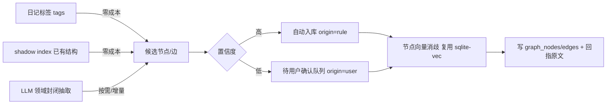

# 白守记忆图谱与知识库设计方案

> 版本：v0.7（草案，待评审；2026-07-16 从会话记录恢复落盘）
> 日期：2026-07-07
> 范围：记忆图谱、向量记忆的文件落盘为原始数据、跨端同步、逐文件实施开工清单（§十三）；知识库（笔记本）为**未来规划**，仅前瞻设计（§十）

---

## 一、背景与定位

白守已具备成熟的本地记忆能力：向量检索（`memory_embeddings` + sqlite-vec）、全文检索（FTS5）、层级化总结。本方案在此之上引入**记忆图谱**，并顺带厘清**向量记忆的跨端同步缺口**与**知识库的存储策略**。

### 1.1 图谱要解决什么（先钉死边界）

调研结论表明：图对"检索准确率"提升有限，甚至在单一事实检索、纯多跳整合上会拖累纯文本记忆。但图在**时序推理**上有明显优势，且能提供纯向量无法给出的**可视化**与**可解释性**。因此：

| 维度 | 决策 |
| --- | --- |
| 图**不做** | 提升单一事实检索；替代现有向量 / FTS；多跳问答整合 |
| 图**专攻** | ① 关系随时间的演变 ② 关系网络可视化 ③ 伙伴的可解释叙事 |
| 与现有记忆的关系 | **叠加层**，不替代。向量 / FTS 负责"找内容"，图负责"看关系" |

白守是日记 / 人生记录应用，数据天然带时间戳、天然以"人 / 地 / 事 / 情绪"为中心，这正是图能发光的少数场景。

---

## 二、核心架构原则（贯穿全文的主线）

> **向量与图都是"派生索引"：本地存储、可随时重建、不跨端同步。原始数据必须落成可同步的文件。**

### 2.1 派生层与原始数据层

白守已在部分模块贯彻此原则，但存在缺口。本方案将其拉直，统一到所有记忆数据：

- 派生层（各端本地、可重建、**不进**同步）：SQLite 中的向量、FTS、图索引。
- 原始数据层（可同步文件、跨端一致）：日记 Markdown、会话 JSON、图 JSONL、伙伴记忆 JSONL、知识库原始资料。

好处：换端可重建、无需同步庞大二进制向量、与既有三向合并同步栈零冲突。

**关键铁律：原始数据文件只存文本内容 + 元数据，绝不存向量二进制。** 三个理由：

1. 向量是二进制大块，同步它又慢又占空间；
2. 一旦更换 embedding 模型，旧向量全部作废；
3. 原始数据应是人类可读的内容，而非一串浮点数。

向量始终是"从原始数据文本重新算出来的派生物"。

### 2.2 重建与补齐机制（差集比对）

派生索引与原始数据文件的对齐，统一采用**差集比对**。此机制通用于伙伴记忆、日记向量、知识库向量，各处复用同一套思路：

```
待补齐 = 原始数据文件中的记录 id 集合  −  SQLite 索引中已存在的 id 集合   （需重新 embed / 重建）
待清理 = SQLite 索引中的 id 集合  −  原始数据文件中的记录 id 集合         （孤立索引，删除）
```

- **触发时机**（非实时，避免频繁扫描）：
  1. App 启动时比对一次；
  2. 同步拉取到新的原始数据文件之后；
  3. 用户手动「重建索引」。
- **性能**（这是本机制成立的核心）：
  - 日常写入：原始数据文件 append 写入（微秒级），日常查询照旧走 SQLite，与现状**零差异**；
  - 比对：读双方 id 列表做内存 Set 差集，数千~数万条为**毫秒级**；
  - 重建：**只对差集中缺失的记录**重新 embed（增量），且几乎只在换端 / 首次同步后发生（本地写入时已 embed）。
- **前提**：原始数据文件记录的 `id` 必须是**稳定 uuid**，并与 SQLite 索引记录的关联键（如 `sourceId`）绑定，差集比对才成立。
- **现成模板**：`ShadowIndexSyncService`（日记 MD5 脏检测 + 孤立清理）与 `SessionSyncService`（文件 ↔ DB 双向对齐）即此模式，新机制照搬即可。

---

## 三、现状盘点

### 3.1 各类记忆数据的原始数据与同步现状

| 数据 | 原始数据文件 | 跨端同步 | 向量嵌入 | 换端命运 |
| --- | --- | --- | --- | --- |
| 日记 | ✅ `Journals/*.md` | ✅ | ✅（从 md 重建） | 可重建（需重跑嵌入） |
| 会话消息 | ✅ `{sessionId}.json` | ✅ | ❌ 未嵌入，走 FTS | 内容不丢；FTS 可重建 |
| 伙伴主动存的记忆 | ❌ **无** | ❌ | ✅ | **彻底丢失且无法重建** |
| 层级总结 | ✅ 文件 | ✅ | 部分 | 可重建 |

### 3.2 关键事实（已在代码中核实）

- 所有 `.db` 文件被增量同步显式排除（`isSqliteRuntimeSyncPath`），即**向量本身完全不跨设备**。
- 会话消息的向量嵌入函数 `embedMessage` 无外部调用者——**会话消息现状不做向量嵌入**，检索由 `agent_messages_fts` 承担。
- 伙伴 `memory_store` 工具通过 `embedText` 直接写入 `memory_embeddings`（`sourceId = mem_<时间戳>`），**无任何文件落盘**，是当前唯一的原始数据缺口。

### 3.3 由此确定的两条修复项

1. **伙伴记忆文件原始数据化**（修复现存的换端丢失问题）——见第九章。
2. **知识库向量独立库**（新功能的前置设计）——见第十章。

---

## 四、图谱数据模型

新增 schema 文件 `packages/database/src/schema/graph.ts`，风格对齐现有 `agent-sessions.ts`。

### 4.1 节点表 `graph_nodes`

```typescript
export const graphNodesTable = sqliteTable('graph_nodes', {
  id: text('id').primaryKey(),
  vaultName: text('vault_name').notNull(),
  nodeType: text('node_type').notNull(),            // 领域封闭枚举
  name: text('name').notNull(),                     // 规范名
  aliases: text('aliases').notNull().default('[]'), // JSON 数组，消歧用
  summary: text('summary').notNull().default(''),   // 一句话画像，可由伙伴维护
  propsJson: text('props_json').notNull().default('{}'),
  embedding: blob('embedding'),                     // Float32 BLOB，复用 sqlite-vec
  dimension: integer('dimension'),
  modelId: text('model_id').notNull().default(''),
  mentionCount: integer('mention_count').notNull().default(0), // 热度，可视化权重
  firstSeenAt: integer('first_seen_at', { mode: 'timestamp' }),
  lastSeenAt: integer('last_seen_at', { mode: 'timestamp' }),
  createdAt: integer('created_at', { mode: 'timestamp' }).notNull().defaultNow(),
  updatedAt: integer('updated_at', { mode: 'timestamp' }).notNull().defaultNow(),
  deletedAt: integer('deleted_at', { mode: 'timestamp' })       // 软删除
})
```

### 4.2 边表 `graph_edges`

```typescript
export const graphEdgesTable = sqliteTable('graph_edges', {
  id: text('id').primaryKey(),
  vaultName: text('vault_name').notNull(),
  fromId: text('from_id').notNull(),
  toId: text('to_id').notNull(),
  edgeType: text('edge_type').notNull(),
  propsJson: text('props_json').notNull().default('{}'),
  // —— 时序牌：关系有效期，支撑「关系随时间演变」——
  validFrom: integer('valid_from', { mode: 'timestamp' }),
  validTo: integer('valid_to', { mode: 'timestamp' }),          // null = 至今有效
  isCurrent: integer('is_current', { mode: 'boolean' }).notNull().default(true),
  // —— 回指原文牌：规避多跳信息损失 ——
  sourceKind: text('source_kind').notNull().default('diary'),   // diary/session/manual
  sourceRef: text('source_ref'),                                // 日记相对路径或 sessionId
  sourceExcerpt: text('source_excerpt').notNull().default(''),  // 原文片段
  confidence: integer('confidence').notNull().default(100),     // 抽取置信 0-100
  origin: text('origin').notNull().default('rule'),             // rule/ai/user
  createdAt: integer('created_at', { mode: 'timestamp' }).notNull().defaultNow(),
  updatedAt: integer('updated_at', { mode: 'timestamp' }).notNull().defaultNow(),
  deletedAt: integer('deleted_at', { mode: 'timestamp' })
})
```

### 4.3 领域封闭枚举（抗抽取噪声的关键）

**这是什么**：图里每个节点带一个 `nodeType`（是 `person` 还是 `place`…），每条边带一个 `edgeType`（是 `located_at` 还是 `mentions`…）。「领域封闭枚举」= 预先规定 `nodeType` / `edgeType` **只能取这固定几类**，抽取时（无论规则派生还是 LLM）都被夹逼进这个集合，不允许自由发明新类型。节点类型再分两层：**内容实体**（有实际语义，如人 / 地 / 作品）与**结构锚点**（`entry`，即"一篇日记"这个来源节点，不是内容）。

**为什么手动定义、不让 AI 自由发挥**：

- **防碎裂**：开放抽取下 LLM 会把同一种关系抽成一堆近义标签（「提到 / 说到 / 谈及」其实都是 `mentions`；「在 / 位于 / 地点是」都是 `located_at`），类型一发散，图就碎成孤岛，查询、着色、时序全乱。封闭枚举用 function-calling 的 `enum` 把输出锁死，保证一致。
- **可查询、可着色**：可视化按 `nodeType` 着色、按 `edgeType` 过滤，查询「某人参与的所有事件」靠 `edgeType='participates_in'`——类型是稳定 schema，才写得出稳定的查询与 UI。
- **省成本、准确率高**：类型集有限 → 抽取 prompt 简单、token 省、命中率高。

白守是「人生记录」这一特定领域，其核心本体（ontology）= **10 类内容实体**（人 / 地 / 组织 / 事 / 情绪 / 主题 / 作品 / 活动 / 产品 / 饮食）**+ 1 类结构锚点** `entry`。这套集合**对齐业界通用 NER 本体**（PERSON / ORG / GPE / EVENT / PRODUCT / WORK_OF_ART…）并按日记场景裁剪，人工列定即可覆盖，比让 AI 现猜更稳、更贴产品意图。它**仍是封闭集**——抽取时用 function-calling 的 `enum` 夹逼，不自由发明；遇到枚举外的东西再迁移加类型（加一类只需一次 schema 迁移）。

```typescript
// —— 内容实体（有实际语义，10 类）——
export const GRAPH_ENTITY_TYPES = [
  'person', // 人物
  'place', // 地点
  'organization', // 公司 / 学校 / 团体
  'event', // 一次具体发生的事（婚礼、面试）
  'emotion', // 情绪
  'topic', // 主题 / 概念（柔性兜底：抽象话题都归此，靠 name + 向量消歧区分）
  'work', // 作品 / 媒体：书、影视、音乐、游戏、播客
  'activity', // 活动 / 爱好：跑步、旅行、健身、烹饪（区别 event：可反复进行）
  'product', // 产品 / 物件：品牌产品、工具、设备
  'food' // 饮食：菜品、餐厅
] as const

// —— 结构锚点（非内容实体，仅作"来源节点"：一篇日记 = 一个 entry）——
export const GRAPH_ANCHOR_TYPES = ['entry'] as const

// nodeType 全集：抽取时被夹逼进本集合
export const GRAPH_NODE_TYPES = [...GRAPH_ENTITY_TYPES, ...GRAPH_ANCHOR_TYPES] as const

export const GRAPH_EDGE_TYPES = [
  'mentions', // entry → 被提及实体（topic/work/product/food/person…）
  'participates_in', // 人 → 事件 / 活动
  'located_at', // entry / 事件 → 地点
  'evokes', // entry / 人 / 事 → 情绪
  'role_of', // 人对某组织/群体的角色（同学→同事→朋友，靠 validFrom/To 演变）
  'relates_to' // 泛关联兜底
] as const
```

类型集取舍：

- **加 `organization`**（公司 / 学校 / 团体）：「角色演变」叙事的锚点——「同学 → 同事」正是同一 `person` 对不同 `organization` 的 `role_of` 随时间变化，缺了组织锚点这条杀手锏立不住。
- **加 `work / activity / product / food`**：日记高频维度（阅读观影、运动旅行、消费、饮食），此前塞在 `topic` 里无法单独过滤 / 着色，独立成类更贴场景。
- **`topic` 是柔性兜底**：抽象话题、学科概念等无固定类型的都归 `topic`，靠 `name` + 向量消歧区分，开放语义不丢。
- **去掉 `object`**（泛物品，噪声高价值低）、**不建时间节点**（时序天然由日记日期处理）。
- **edge 维持 6 类**：新增节点复用 `mentions` / `participates_in` / `relates_to`；人物间关系用 `relates_to` + `role_of` + 时序表达，暂不细分亲缘 edge；细粒度关系语义留待未来自由 `label` 字段（P4 起才有 LLM 燃料填充）。

**各 nodeType 的填充来源（谁来抽、哪个阶段）**——这决定了扩类型的实际代价：

| nodeType | 主要来源 | 阶段 |
| --- | --- | --- |
| `entry` | 每篇日记建一个锚点（规则派生） | P2 |
| `emotion` | `mood` 字段（规则 + 情绪词表） | P2 |
| `place` | `location` 字段（规则 + 向量消歧） | P2 |
| `topic` | `tags` 字段（规则 + 向量消歧） | P2 |
| `person` / `organization` / `event` | LLM 读正文 | P4 |
| `work` / `activity` / `product` / `food` | LLM 读正文 | P4 |

> 关键：免费信号（frontmatter 结构化字段）只覆盖 `entry` / `emotion` / `place` / `topic` 四项；其余 6 类内容实体 frontmatter 无对应字段，**只能靠 P4 LLM 从正文抽取**。故扩充这些通用标签 = 主要给 P4 LLM 用，P2 阶段它们基本为空。加类型的真实代价也在此：需要时重跑 P4 LLM 抽取（规则派生部分重建几乎零成本）。

### 4.4 两张关键牌

- **`validFrom / validTo / isCurrent`**：同一对节点可存在多条不同时期的边，天然表达"关系变迁"，可视化成时间线。关系冲突时旧边设 `isCurrent=false` + `validTo`，**不物理删除**，保住时间线。
- **`sourceRef / sourceExcerpt`**：图给结构，需要细节时一键拉回原始日记，规避"把日记压成三元组、丢了上下文"导致的多跳退化。

### 4.5 索引（写进兜底建表 SQL）

```sql
CREATE INDEX IF NOT EXISTS graph_nodes_vault_type ON graph_nodes(vault_name, node_type);
CREATE INDEX IF NOT EXISTS graph_edges_from ON graph_edges(from_id);
CREATE INDEX IF NOT EXISTS graph_edges_to ON graph_edges(to_id);
CREATE INDEX IF NOT EXISTS graph_edges_vault_type_current ON graph_edges(vault_name, edge_type, is_current);
```

> `from_id` / `to_id` 索引是递归遍历性能的命门，缺失会导致每步全表扫描。

---

## 五、存储与跨端布局

### 5.1 各数据的库与原始数据归属

| 数据 | SQLite（派生，不同步） | 原始数据文件（同步） |
| --- | --- | --- |
| 图节点 / 边 | `baishou_agent.db`（`graph_nodes` / `graph_edges`，`vault_name` 隔离） | `<vault>/Graph/nodes.jsonl`、`edges.jsonl` |
| 伙伴记忆向量 | `baishou_agent.db`（`memory_embeddings`） | `<vault>/Memory/*.jsonl`（**新增**） |
| 会话 | `baishou_agent.db`（`agent_*`） | `{sessionId}.json`（已有） |
| 知识库向量 | 独立 `knowledge.db`（**新增**，`notebook_id` 分区） | 上传的原始资料文件 |

> **原始数据目录命名铁律（实施级约束）**：原始数据 JSONL 必须放在**非 `.` 开头**的目录（`Graph/`、`Memory/`、`Notebooks/`），与现有 `Journals/`、`Sessions/` 一致。原因：增量同步扫描 `shouldScanIncrementalSyncDirectory` / `shouldIncludeIncrementalSyncFile`（`packages/shared/src/utils/incremental-sync-scan.util.ts`）对所有 `.` 开头的目录与文件一律 `return false`（仅 `.baishou/settings/*.json` 例外）。若沿用早期草案的 `.graph/`、`.memory/`，原始数据文件将**永远不被扫描上传**，直接违背 §2.1「原始数据必须可同步」。

### 5.2 为什么图放 `baishou_agent.db`

- 该库已加载 sqlite-vec，节点向量消歧零额外成本；可与 `memory_embeddings` 同库协作。
- 复用现有 `MigrationService` 的兜底建表模式（新增 `_ensureGraphTables()`）。
- 跨端复用现有三驱动（better-sqlite3 / expo-sqlite / libsql），schema 一次定义两端通用。

> 备选：独立 `graph_index.db`（隔离更彻底，但要多管一套连接与迁移）。已决策用前者。

---

## 六、抽取管道（`packages/core/src/graph/`）

三个信号源，成本从低到高，**低成本优先**：



要点：

1. **先榨干免费信号（零 LLM、零 API 花费）**：`journals_index`（shadow index）已解析好的 frontmatter 结构化字段，直接连成图：

   **锚点先行**：每篇日记先建 / 复用一个 `entry` 节点（`name`=日记标题或日期，`sourceRef`=filePath），作为免费信号的挂载点；下列边都从该 `entry` 出发：

   | 现成字段                      | 生成节点                          | 生成边（从 entry 出发）    |
   | ----------------------------- | --------------------------------- | -------------------------- |
   | （每篇日记）                  | `entry`（锚点）                   | —（作为下列边的起点）      |
   | `tags`                        | `topic`                           | entry →(mentions)→ topic   |
   | `mood`                        | `emotion`                         | entry →(evokes)→ emotion   |
   | `location` / `locationDetail` | `place`                           | entry →(located_at)→ place |
   | `weather`                     | （作为边/节点属性，不单独建节点） | —                          |

   这些边天然带 `date`（→ `validFrom`，时序）与 `filePath`（→ `sourceRef`，回指原文）。白守已在 `journals_index` 存好这些字段，图谱只是「把现成结构连成网」，**抽取本身零 LLM**。

   > `entry` 是结构锚点：没有 LLM 时，孤立的 `mood` / `location` / `tags` 靠它挂成星型；到 P4，LLM 抽出的实体间关系（`person`↔`organization`…）直接互连、不再依赖 entry，entry 退为 `sourceRef`。可视化可开关隐藏 entry 只看实体网。

   > ⚠️ **免费信号不能裸连——必须过归一化，否则近义碎裂**：`mood` / `tags` / `location` 是用户自由填写的短文本，天然有异写与近义（「开心 / 高兴 / 愉快」「公司 / 单位 / 办公室」），逐字符串建点会炸出一堆近义孤岛。归一化分三档，**仍无需 LLM 抽取**：
   >
   > 1. **规范化**（零成本）：trim、大小写、全半角、去标点，消除异写。
   > 2. **`emotion` 走封闭情绪词表**（零成本）：人类情绪可枚举，把 `mood` 自由词映射到固定几十项情绪，彻底消除情绪近义。
   > 3. **`topic` / `place` 走向量消歧**（低成本 embedding，非 LLM）：规范化后复用 §4.3 的节点消歧（`name` + `aliases` + 向量相似度），近义归并到同一节点并追加 alias。
   >
   > 即「零 LLM 抽取」≠「零加工」——加工靠规范化 + 词表 + 向量消歧，成本远低于 LLM。LLM 仅在 P4 做人物 / 关系，以及可选的低频「近义主题合并建议」。

2. **LLM 只做增量（付费信号）**：仅对新增 / 修改的日记跑，用 function-calling 强约束到封闭枚举，输出 `(from, edgeType, to, validFrom?, excerpt)`。不做全量、不做开放抽取。
3. **消歧靠向量 + 精确名**：新节点先查同名 / 别名，再查向量相似度超阈值者，命中则复用并追加 alias。防止图碎裂的命门。
4. **冲突软处理**：新边与旧边冲突时旧边设 `isCurrent=false` + `validTo`，不物理删。

### 6.1 三源协同：日记数据 + AI 补充 + 用户校正

图谱同时接受三种来源，共存于同一张表，用 `origin` 区分。**命名按「手段」而非「是否自动」区分**，避免 `auto` 与 AI 都像"自动"造成误解：

| origin | 来源                   | 典型内容                            | 阶段 |
| ------ | ---------------------- | ----------------------------------- | ---- |
| `rule` | 日记结构化字段规则派生 | tags→主题、mood→情绪、location→地点 | P2   |
| `ai`   | LLM 读日记正文抽取     | 人物、人物关系、事件参与者          | P4   |
| `user` | 用户手动建 / 确认       | 手动连两个实体、纠正或删除 AI 结果  | P4   |

- **分工**：`rule` 打底（零 LLM、客观、覆盖广）→ `ai` 补深度（跨日记的人物关系、因果、演变）→ `user` 校正（最高可信）。
- **合并**：三方指向同一实体时，靠消歧（`name` + `aliases` + 向量相似度）合并到同一节点，不重复建点。
- **冲突**：同一对节点的矛盾关系，按 `origin` 优先级 **user > ai > rule**，再比 `confidence`；被覆盖的旧边设 `isCurrent=false` + `validTo` 保留（时序留痕）。

**AI 补充（`ai`）的触发方式**，三种可组合，默认取「手动 + 主动」，「被动」作为可选开关（默认关，因耗 token）：


1. **手动**（默认开）：用户点「让 AI 梳理这段时间 / 这篇日记的关系」——可控、用户主导。
2. **主动**（默认开）：伙伴对话中按需调用抽取工具，现场补图——省 token。
3. **被动**（默认关，高级选项）：日记保存后台自动增量抽取——无感但持续耗 token。

**AI 写入红线（`ai` / `user` 同样适用）**：任何进图的节点 / 边都必须能溯源到原始数据文件——`sourceRef` 指向日记，或未来 AI 主动记忆的 `Memory/*.jsonl`。**禁止无源写入**：图是「原始数据的可重建投影」，清空后重跑抽取须能一字不差重建，无源节点会破坏可重建性与跨端同步。故 AI 的主动洞察若要进图，路径是「先落盘为原始数据 → 再经抽取进图（`sourceKind='session'`）」，而非直接 `INSERT` 图节点。

---

## 七、检索与消费

### 7.1 GraphRAG 双路（`GraphRagService`）

```typescript
interface GraphRagResult {
  anchors: GraphNode[]  // 命中的锚点实体
  subgraph: GraphEdge[] // 1–2 跳邻居（含 sourceExcerpt）
  timeline?: GraphEdge[] // 按 validFrom 排序的关系演变
}
```

- **实体锚点路**：query 抽实体 → 向量定位锚点 → 递归 CTE 遍历 1–2 跳邻居（深度设上限）。
- **时序路**：命中人物 / 主题时，按 `validFrom` 拉出关系演变时间线——图的杀手锏。

### 7.2 伙伴工具

在 `DatabaseAdapter` 旁新增，走现有工具注册通道：

```typescript
recall_relations({ entity: string, mode: 'network' | 'timeline' }): GraphRagResult
```

伙伴用它做可解释叙事（"你和某人从同学变同事"），细节顺着 `sourceRef` 拉原文。

### 7.3 可视化：全局关系图谱 + 局部聚焦

采用「全局概览 + 局部聚焦」双层，全局图谱即目标形态（整库实体力导向网络，中心为高频枢纽、外围为未关联实体）：

- **全局图谱**：力导向布局展示整个 vault 的实体网络。节点按 `nodeType` 着色、大小按 `mentionCount`（热度）缩放；高频人物 / 主题自然成为中心枢纽。提供缩放、平移、搜索高亮、按类型过滤。价值在「一眼看见自己人生的关系网」的概览与情感体验。
- **局部聚焦**：点击任一节点进入 1–2 跳子图 / 时间线视图，这是「可用」的深入视图。

渲染与性能：

- Web 端力导向图 + Canvas / WebGL 渲染：数千节点流畅，上万节点需 WebGL + 降采样。
- 移动端按热度限制渲染节点数（如仅 top-N + 点击展开），避免卡顿。
- 全局图布局在后台 / 懒加载计算，避免阻塞主线程。

```typescript
// 局部聚焦
getGraphView(opts: {
  vaultName: string
  centerNodeId: string
  depth?: 1 | 2
  timeRange?: { from: number; to: number }
}): { nodes: GraphViewNode[]; edges: GraphViewEdge[] }

// 全局图谱（整库力导向网络）
getGlobalGraph(opts: {
  vaultName: string
  maxNodes?: number        // 移动端降级用
  minMentionCount?: number // 过滤低热度噪声
  nodeTypes?: (typeof GRAPH_NODE_TYPES)[number][]
}): { nodes: GraphViewNode[]; edges: GraphViewEdge[] }
```

> 提醒：全局图「好看 > 好用」，实用价值主要来自聚焦 + 搜索。两者都做，别只做全局图。

---

## 八、会话消息与嵌入策略

### 8.1 结论：会话消息不做全量向量嵌入（维持现状）

现状已是"选择性嵌入"，本方案确认并固化这一策略：

| 需求 | 方案 |
| --- | --- |
| "搜某次对话说过的话" | **FTS 全文检索**（`agent_messages_fts`，已有） |
| "长期记住的偏好 / 事实" | 伙伴 `memory_store` **抽取成精炼记忆**再嵌入（少而精） |

理由：全量嵌入会话消息会烧嵌入 API、混入大量无记忆价值的闲聊、污染向量库。原始对话交给 FTS，长期记忆交给抽取，成本与质量双赢。

### 8.2 会话消息落盘：无需改动

会话已有 `{sessionId}.json` 原始数据文件并跨端同步，FTS 索引可在换端后从会话 JSON 重建。此项**无需新增工作**。

---

## 九、伙伴记忆文件原始数据化（修复现存缺口）

### 9.1 问题

伙伴 `memory_store` 存的记忆仅在不同步的 `baishou_agent.db` 中，且无源文件，换端后彻底丢失且无法重建。

### 9.2 方案

引入 per-vault 记忆原始数据文件，向量退回为可重建的派生索引：

原始数据文件：`<vault>/Memory/memories.jsonl`，每行一条记忆记录（**只存文本不存向量，见 §2.1**）：

```jsonc
{
  "id": "uuid",           // 稳定 uuid，兼作向量记录关联键
  "content": "用户偏好：喜欢深色主题",
  "tags": ["preference", "UI"],
  "sourceSessionId": "xxx",
  "createdAt": 1730000000000,
  "updatedAt": 1730000000000,
  "deletedAt": null       // 软删除，账号体系的 tombstone
}
```

实现要点：

1. **写入流程**：`memory_store` 先写 JSONL（原始数据），再嵌入进 `memory_embeddings`（索引），embed 时以记忆的稳定 `id` 作为 `sourceId`。
2. **稳定 id 改造**（差集比对的前提，见 §2.2）：现状用 `mem_${Date.now()}` 作 `sourceId`，重建会漂移；改为写入时生成稳定 `uuid`，JSONL 与向量记录共用此 id。
3. **重建流程**：新增 `MemoryFileSyncService`（镜像 `SessionSyncService` 的 file → DB 模式），按 §2.2 差集比对——启动 / 换端时只补缺失向量、清理孤立索引。
4. **同步**：JSONL 天然纳入现有三向合并；`uuid` + `updatedAt` + `deletedAt` 为账号体系的 op-log / LWW 合并预留。

> 此项独立于图谱，可优先落地（P0），直接消除一个数据丢失 bug。

---

## 十、知识库 / 笔记本设计（未来规划，当前不做）

> **范围说明**：知识库 / 笔记本是**未来功能，本期不实现**。本章仅做**前瞻设计**，目的是让当前的架构决策（原始数据放非 `.` 目录、向量独立库、差集重建等）提前给它留好位置，避免将来做时返工。落地排期见 §十二（K1，未排期）。

### 10.1 定位

用户创建笔记本、上传资料、做向量、提供学习检索场景。本质是**文档 RAG**，与图谱正交，**不使用图**。

### 10.2 向量独立库

强烈建议独立 `knowledge.db`，按 `notebook_id` 分区：

| 维度 | 理由 |
| --- | --- |
| 生命周期 | 删笔记本 = 删整分区，干净利落 |
| 规模 | 上传资料向量量可能远超个人记忆，避免拖垮 `baishou_agent.db` |
| 隔离 | "学习资料" 与 "人生记录" 语义、权限均不应混 |
| 架构一致 | 契合既有双库分离哲学 |

### 10.3 原始数据与同步

- 原始数据层：上传的**原始资料文件**（放 `<vault>/Notebooks/<notebookId>/`）。
- 派生层：`knowledge.db` 向量，换端从原始资料按 §2.2 差集比对重建。
- 注意：知识库可独立配置嵌入模型 / 维度，不与个人记忆强绑定。

### 10.4 复用

嵌入生成、分块、sqlite-vec 检索均可复用现有 `EmbeddingService` 与 `SqliteHybridSearchRepository`，仅需切换目标库与分区字段。

---

## 十一、同步与账号演进

| 阶段 | 方案 |
| --- | --- |
| 现在 | 图 / 记忆 / 知识库原始数据均落 per-vault 文件，纳入现有三向合并；SQLite 全为可重建索引 |
| 账号体系 | JSONL 已是可合并格式（UUID + `updatedAt` + `deletedAt`），支持 op-log / LWW；可加密后上云；向量二进制不上传，云端按需重算或选择性同步 |

---

## 十二、分阶段路线图

| 阶段 | 内容 | 价值 |
| --- | --- | --- |
| P0 | 伙伴记忆文件原始数据化 + 稳定 uuid 改造 + `MemoryFileSyncService`（差集比对） | 修复换端丢失 bug（独立可先做） |
| P1 | 图两张表 + 迁移兜底 + `GraphRepository` + 消歧 | 能存能查 |
| P2 | 免费信号抽取 + 归一化（规范化 / 情绪词表 / 向量消歧） | 图有基础数据，零 LLM 抽取 |
| P3 | 可视化：全局关系图谱 + 局部聚焦 + 时间线 | 用户"看得见" |
| P4 | LLM 增量抽取（人物 / 关系）+ 用户确认队列 | 图变丰富 |
| P5 | `recall_relations` 接入伙伴 | 图"给 AI 用" |
| P6 | 图原始数据 JSONL 落盘 + 纳入同步 | 跨端一致 |
| K1 | 知识库独立库 + 笔记本 + 资料上传 + 检索 | 学习场景（**未来规划，当前不排期**） |

先做 P0（修 bug）与 P1–P3（验证"可视化 + 时序"两个最确定的价值），LLM 抽取这个最大变量放后面，风险可控。

---

## 十三、实施开工清单（逐文件 / 逐函数）

> 本章把 §一–§十二 的设计落到**具体文件、方法签名与改动点**，供直接开工。所列路径均已核对现有代码；「新建」为待创建文件，「改」为在既有文件内追加/修改。函数体为伪代码，示意签名与关键逻辑，非最终实现。

### 13.1 P0：伙伴记忆文件原始数据化

**关键校正（据现有代码核实，直接影响写法）**

- 生产写入实际走 `HybridSearchEmbeddingStore`（`packages/database/src/repositories/hybrid-search.repository.embedding.ts`），**非** `MemoryRepository`（后者仅测试引用，本期可不动）。
- 已有 `deleteEmbeddingsBySource(sourceType, sourceId)`；**缺**「列出全部 sourceId」的方法，差集比对需新增 `listSourceIdsByType`。
- `memory_embeddings` **无** `content` / `deletedAt` 列：文本在 `chunk_text`，软删标记与 `tags` 落 JSONL（+ 可选写 `metadata_json`）。
- `sourceType` 现主路径写 `'chat'`、去重合并路径写 `'memory'`，**不一致** → 统一常量 `MEMORY_SOURCE_TYPE = 'memory'`。
- `sourceId` 现为 `mem_${Date.now()}`（换端漂移，无法差集）→ 改为写入时生成稳定 `uuid`，JSONL 与向量记录共用此 id。

**改动文件清单**

| #   | 文件                                                                                             | 类型 | 动作                                             |
| --- | ------------------------------------------------------------------------------------------------ | ---- | ------------------------------------------------ |
| 1   | `packages/core/src/vault/storage-path.types.ts`                                                  | 改   | 接口加 `getMemoryBaseDirectory(): Promise<string>` |
| 2   | `apps/desktop/src/main/services/path.service.ts`                                                 | 改   | 实现 → `<vault>/Memory`                          |
| 3   | `apps/mobile/src/services/path.service.ts`                                                        | 改   | 实现 → `<vault>/Memory`                          |
| 4   | `apps/desktop/src/main/services/vault-scoped-path.service.ts`                                     | 改   | 实现（迁移写入固定 vault）                       |
| 5   | `packages/core/src/migration/migration-target-path.service.ts`                                    | 改   | 实现                                             |
| 6   | `packages/core/src/memory/memory-file.service.ts`                                                 | 新建 | JSONL 读 / append / tombstone / compact          |
| 7   | `packages/core/src/memory/memory-sync.service.ts`                                                 | 新建 | 差集补齐 / 孤立清理                              |
| 8   | `packages/shared/src/constants/memory.constants.ts`                                               | 新建 | `MEMORY_SOURCE_TYPE = 'memory'`                  |
| 9   | `packages/database/src/repositories/hybrid-search.repository.embedding.ts`                        | 改   | 加 `listSourceIdsByType(sourceType): Promise<string[]>` |
| 10  | `packages/ai/src/tools/agent.tool.ts`                                                             | 改   | `ToolContext` 加 `memoryWriter?: IMemoryWriter`  |
| 11  | `packages/ai/src/tools/memory-store.tool.ts`                                                       | 改   | uuid → 写 JSONL → embed（uuid + 统一 sourceType）|
| 12  | `packages/ai/src/tools/memory-delete.tool.ts`                                                      | 改   | 删向量 + JSONL tombstone                         |
| 13  | `packages/ai/src/rag/memory-deduplication.service.ts`                                             | 改   | 统一 sourceType；合并时同步 JSONL                |
| 14  | `apps/desktop/src/main/ipc/agent-helpers.ts` + `packages/ai/src/agent/agent-session.service.ts`  | 改   | 注入 desktop `IMemoryWriter`                     |
| 15  | `apps/mobile/src/providers/BaishouProvider.tsx`                                                   | 改   | 注入 mobile `IMemoryWriter`                      |
| 16  | `apps/desktop/src/main/services/bootstrapper.service.ts`                                          | 改   | 启动调 `memorySync.fullScan()`                   |
| 17  | `apps/mobile/src/services/mobile-bootstrapper.service.ts`                                          | 改   | 启动调 `memorySync.fullScan()`                   |

**MemoryFileService（新建，仿 `SessionFileService`）**

```ts
export interface MemoryRecord {
  id: string //  稳定 uuid，= 向量记录 sourceId
  content: string
  tags: string[]
  sourceSessionId?: string
  createdAt: number
  updatedAt: number
  deletedAt: number | null // 软删 tombstone
}

export class MemoryFileService {
  constructor(private fs: IFileSystem, private pathProvider: IStoragePathService) {}
  private async filePath(): Promise<string> // <vault>/Memory/memories.jsonl
  async append(record: MemoryRecord): Promise<void> // 追加一行（IFileSystem.appendFile）
  async readAll(): Promise<MemoryRecord[]> // 按 id 取 updatedAt 最大者（LWW），过滤 deletedAt
  async tombstone(id: string, updatedAt: number): Promise<void> // append 一条 deletedAt 记录
  async compact(): Promise<void> // 原子重写去历史版本（tmp+rename）
}
```

**JSONL 更新 / 删除策略（解决 JSONL 无法原地改）**

- 写：一律 `append` 新行（微秒级，无锁竞争）。
- 改 / 删：`append` 同 `id` 的新版本（更大 `updatedAt`；删则带 `deletedAt`）。
- 读：按 `id` 分组取 `updatedAt` 最大者（LWW），`deletedAt` 非空视为已删。
- compact：行数 / 冗余版本超阈值时原子重写（tmp + rename，仿 `packages/core/src/settings/settings-file.service.ts` 的 `writeJsonAtomic`），每 `id` 仅留最新一版。
- 收益：天然 op-log，直接兼容 §十一 账号体系的 LWW 合并；写入与现状查询零差异。

**MemorySyncService（新建，差集比对，仿 `SessionSyncService.fullScanArchives`）**

```ts
export class MemorySyncService {
  constructor(
    private file: MemoryFileService,
    private embedder: IMemoryEmbedder, //  embedText 封装（sourceId = record.id）
    private repo: { listSourceIdsByType(t: string): Promise<string[]>; deleteEmbeddingsBySource(t: string, id: string): Promise<void> }
  ) {}

  async fullScan(): Promise<void> {
    const records = (await this.file.readAll()) // 已过滤 deletedAt
    const fileIds = new Set(records.map((r) => r.id))
    const dbIds = new Set(await this.repo.listSourceIdsByType(MEMORY_SOURCE_TYPE))
    // 待补齐 = fileIds − dbIds（只 embed 缺失，增量）
    for (const r of records) if (!dbIds.has(r.id)) await this.embedder.embed(r)
    // 待清理 = dbIds − fileIds（孤立索引，删）
    for (const id of dbIds) if (!fileIds.has(id)) await this.repo.deleteEmbeddingsBySource(MEMORY_SOURCE_TYPE, id)
  }
}
```

**ToolContext 注入（`memory_store` 在 `packages/ai`，跨端、不能直接碰 fs）**

在 `packages/ai/src/tools/agent.tool.ts` 的 `ToolContext` 增加可注入的写入器，桌面 / 移动各自用本端 `MemoryFileService` 实现：

```ts
export interface IMemoryWriter {
  write(input: { content: string; tags: string[]; sourceSessionId?: string }): Promise<string> // 返回稳定 id
  remove(id: string): Promise<void> // tombstone
}
export interface ToolContext {
  /* ...现有... */
  memoryWriter?: IMemoryWriter
}
```

`memory-store.tool.ts` 执行改为「先原始数据后索引」：

```ts
const id = context.memoryWriter
  ? await context.memoryWriter.write({ content: fullContent, tags, sourceSessionId: context.sessionId })
  : `mem_${Date.now()}` // 回退（无 writer 时保持旧行为）
await embeddingService.embedText({ text: fullContent, sourceType: MEMORY_SOURCE_TYPE, sourceId: id, groupId: context.sessionId })
```

注入点：桌面 `apps/desktop/src/main/ipc/agent-helpers.ts`（构建 `ToolContext` / `buildMcpToolContext()`）与 `packages/ai/src/agent/agent-session.service.ts`；移动 `apps/mobile/src/providers/BaishouProvider.tsx`。

**触发时机（对齐 §2.2）**

- 冷启动：`bootstrapper.service.ts` / `mobile-bootstrapper.service.ts` 在 `sessionManager.fullResyncFromDisks()` 旁调 `memorySync.fullScan()`。
- 同步拉取后：sync 完成事件后再跑一次。
- 手动：设置页「重建记忆索引」入口（可选新增 `memory:rebuild` IPC）。

### 13.2 图谱 P1–P6（存查 → 免费信号 → LLM → 工具 → 同步）

**P1｜能存能查（schema + 迁移 + 兜底建表 + Repository）**

| #   | 文件 / 命令                                                                     | 类型 | 动作                                                                                                  |
| --- | ------------------------------------------------------------------------------- | ---- | ----------------------------------------------------------------------------------------------------- |
| 1   | `packages/database/src/schema/graph.ts`                                         | 新建 | `graphNodesTable` / `graphEdgesTable` + `GRAPH_NODE_TYPES` / `GRAPH_EDGE_TYPES`（见 §4）               |
| 2   | `packages/database/src/schema/agent-db.ts`                                      | 改   | `export * from './graph'`（**drizzle-kit 生成迁移入口，漏则移动端无迁移**）                            |
| 3   | `schema/index.ts` + `index.shared.ts` + `expo.ts`                               | 改   | 各 `export * from './graph'`（运行时类型 / 移动端 Drizzle 推导）                                       |
| 4   | 运行 `pnpm --filter @baishou/database db:generate`                              | 命令 | 生成 `apps/desktop/resources/database/drizzle/0001_*.sql`，自动同步 `embedded-agent-migrations.ts`，核对一致 |
| 5   | `packages/database/src/agent-schema-compat.ts`                                  | 改   | 加 `GRAPH_NODES_CREATE_SQL` / `GRAPH_EDGES_CREATE_SQL` + 四条 `*_INDEX_SQL`（DDL 与 `0001_*.sql` 对齐，见 §4.5） |
| 6   | `packages/database/src/migration.service.ts`                                    | 改   | 加 `_ensureGraphTables()`，挂到 `_ensureMemoryEmbeddingsTable` 同级的 **4 个调用点**                   |
| 7   | `packages/database/src/repositories/graph.repository.ts`                        | 新建 | 见下方方法清单                                                                                        |
| 8   | `packages/database/src/index.shared.ts`                                         | 改   | `export * from './repositories/graph.repository'`                                                     |
| 9   | `packages/database/src/__tests__/migration.service.test.ts`                     | 改   | 仿 `_ensureMemoryEmbeddingsTable` 用例                                                                 |

```ts
// graph.repository.ts —— 构造仿 AssistantRepository（withExpoAgentDatabaseLock），向量仿 MemoryRepository
export class GraphRepository {
  constructor(private readonly db: AppDatabase) {}
  private run<T>(fn: () => Promise<T>): Promise<T> // withExpoAgentDatabaseLock 包装
  private serializeVector(v: number[]): Buffer

  async upsertNode(input: UpsertNodeInput): Promise<string> // 返回 nodeId
  async findNodeByNameOrAlias(vaultName: string, name: string, type: GraphNodeType): Promise<GraphNodeRow | null>
  async searchNodesByVector(vaultName: string, vector: number[], topK: number): Promise<Array<GraphNodeRow & { distance: number }>>
  async upsertEdge(input: UpsertEdgeInput): Promise<string>
  async supersedeEdge(edgeId: string, validTo: number): Promise<void> // isCurrent=false + validTo（软处理，非删）
  async traverse(vaultName: string, centerId: string, depth: 1 | 2): Promise<{ nodes: GraphNodeRow[]; edges: GraphEdgeRow[] }> // 递归 CTE（附录骨架）
  async getGlobalGraph(opts: { vaultName: string; maxNodes?: number; minMentionCount?: number; nodeTypes?: GraphNodeType[] }): Promise<GraphView>
  async softDeleteNode(id: string): Promise<void> // deleted_at=now（全库无先例，本 repo 自建）
  async softDeleteEdge(id: string): Promise<void>
  async listNodeIds(vaultName: string): Promise<string[]> // P6 差集用
  async listEdgeIds(vaultName: string): Promise<string[]>
}
```

> 所有查询默认加 `WHERE deleted_at IS NULL`（软删自建，Drizzle `isNull(deletedAt)`）；遍历用附录骨架 SQL（`UNION` 去重防环 + 深度上限）。

**消歧算法（防图碎裂的命门，`upsertNode` 内部）**

1. 规范化 `name`（trim / 大小写 / 全半角）。
2. 精确匹配：`findNodeByNameOrAlias`（`name` 或 `aliases` 命中）→ 命中即复用。
3. 向量匹配：`searchNodesByVector` 取 top1，`vec_distance_cosine < 0.15`（≈ 相似度 > 0.85，可配）→ 命中复用并 append 到 `aliases`。
4. 未命中：新建节点，用 `EmbeddingAdapter` 对 `name + summary` 生成 embedding（**模型 / 维度对齐现有 `memory_embeddings` 所用模型**），`mentionCount=1`。
5. 命中复用：`mentionCount++`、更新 `lastSeenAt`。

**P2｜免费信号抽取（零 LLM 抽取；含归一化管道）**

| #   | 文件                                                                                     | 类型 | 动作                                                                                                  |
| --- | ---------------------------------------------------------------------------------------- | ---- | ----------------------------------------------------------------------------------------------------- |
| 1   | `packages/core/src/shadow-index/shadow-index-sync.types.ts`                              | 改   | 加 `IGraphExtractionCallback`（仿 `IEmbeddingCallback`）                                               |
| 2   | `packages/core/src/shadow-index/shadow-index-sync.service.ts`                            | 改   | 构造加可选 `graphExtractionCallback?`；加 `_triggerGraphExtractionAsync(payload)`，在 batchUpsert 成功、`isChanged` 后调用（与 `_triggerEmbeddingAsync` 同级） |
| 3   | `packages/core/src/graph/graph-extraction.service.ts`                                    | 新建 | **先建 / 复用 `entry` 锚点节点**（name=标题/日期，sourceRef=filePath）；再读 payload：`tags→entry.mentions→topic`、`mood→entry.evokes→emotion`、`location(+Detail)→entry.located_at→place`；`date→validFrom`；经归一化（规范化 + `emotion` 封闭词表 + 向量消歧）写库，`origin='rule'` |
| 4   | `apps/desktop/.../shadow-sync.registry.ts` + `apps/mobile/.../mobile-vault-runtime.service.ts` | 改 | 注入 graph callback（照 diary embedding callback 的注入方式）                                          |

> 触发链：`DiaryService.create/update` → `syncJournal` → MD5 变化 → `batchUpsert` → 异步 callback。与 RAG 嵌入解耦模式完全一致。

**P4｜LLM 增量抽取（付费信号）+ 待确认队列**

| #   | 文件                                                                | 类型 | 动作                                                                                                            |
| --- | ------------------------------------------------------------------- | ---- | --------------------------------------------------------------------------------------------------------------- |
| 1   | `packages/core/src/graph/graph-llm-extraction.service.ts`           | 新建 | function-calling 强约束到 `GRAPH_*_TYPES`，仅对 `isChanged` 日记正文；输出 `(fromName,fromType,edgeType,toName,toType,validFrom?,excerpt,confidence)` |
| 2   | `packages/database/src/schema/graph.ts`（`graph_edges`）            | 改   | 加 `reviewStatus: text('review_status').notNull().default('approved')`（`pending`/`approved`/`rejected`），承载待确认队列 |
| 3   | 抽取写入逻辑                                                        | —    | `origin='ai'`；`confidence < 阈值(如 70)` → `reviewStatus='pending'`，经消歧写库                              |
| 4   | 触发：手动 IPC + 主动（工具）+ 被动（默认关）                       | —    | 三种可组合，见 §6.1；被动挂 `graphExtractionCallback` 的 LLM 分支，由开关控制                                     |
| 5   | 前端「待确认队列」UI                                                | 新建 | 列出 `reviewStatus='pending'` 的边，用户 approve（`origin='user'` / `reviewStatus='approved'`）/ reject（软删）  |

**P5｜检索与伙伴工具（`recall_relations`）**

| #   | 文件                                                                | 类型 | 动作                                                                          |
| --- | ------------------------------------------------------------------- | ---- | ----------------------------------------------------------------------------- |
| 1   | `packages/core/src/graph/graph-rag.service.ts`                      | 新建 | `recallRelations(vaultName, entity, mode: 'network' | 'timeline'): Promise<GraphRagResult>`（§7.1） |
| 2   | `packages/ai/src/tools/recall-relations.tool.ts`                    | 新建 | `class RecallRelationsTool extends AgentTool`（`name='recall_relations'`）    |
| 3   | `packages/ai/src/tools/agent.tool.ts`                               | 改   | 加 `ToolGraphReader` 接口 + `ToolContext.graphReader?`                        |
| 4   | `packages/ai/src/tools/adapters/graph.adapter.ts`                   | 新建 | 封装 `GraphRepository` / `GraphRagService`，实现 `ToolGraphReader`            |
| 5   | `packages/ai/src/tools/tool-registry.ts`                            | 改   | `registerAll` 加 `new RecallRelationsTool()`；`isToolEnabledForContext` 加图谱开关 |
| 6   | `agent-session.service.ts` + `session-system-prompt.resolver.ts`    | 改   | 构建 `graphAdapter` 注入 `ToolContext`                                        |
| 7   | `packages/ai/src/index.shared.ts`                                   | 改   | export tool                                                                   |
| 8   | `packages/shared/src/constants/agent-tools-ui.constants.ts` + i18n  | 改   | `AGENT_TOOL_UI_DEFS` 加项（category `memory`）+ `agent.tools.recall_relations` 文案 |

**P6｜图原始数据 JSONL 落盘 + 纳入同步**

| #   | 文件                                                        | 类型 | 动作                                                                              |
| --- | ----------------------------------------------------------- | ---- | --------------------------------------------------------------------------------- |
| 1   | `path.service`（同 P0 的 5 处实现 + 接口）                  | 改   | 加 `getGraphBaseDirectory()` → `<vault>/Graph`                                    |
| 2   | `packages/core/src/graph/graph-file.service.ts`             | 新建 | 读写 `Graph/nodes.jsonl`、`Graph/edges.jsonl`（**只存结构不存 embedding**），策略同 §13.1 JSONL |
| 3   | `packages/core/src/graph/graph-sync.service.ts`             | 新建 | 差集比对（node/edge id 已是 uuid）：缺失重建入库、孤立软删；节点 embedding 经消歧 embed 重算 |
| 4   | `GraphRepository.upsertNode/upsertEdge`                     | 改   | 成功后 append JSONL（防抖 flush，仿 `SessionDiskPersistenceService`）              |
| 5   | bootstrapper（desktop / mobile）                            | 改   | 启动调 `graphSync.fullScan()`                                                     |

### 13.3 知识库 K1（独立 knowledge.db）

> **未来功能**：以下为预留设计，当前不开工；待知识库正式排期后再落地。

独立 `knowledge.db`，架构对齐现有 `shadow_index_v2.db`（独立物理文件 + 专用 ConnectionManager + 原生 SQL 建 FTS5，Drizzle 不管理 FTS5 虚拟表）。

**schema（新建 `packages/database/src/knowledge-schema.shared.ts`，原生 SQL，仿 `shadow-index-schema.shared.ts`）**

```sql
CREATE TABLE IF NOT EXISTS notebooks (
  id TEXT PRIMARY KEY, vault_name TEXT NOT NULL, name TEXT NOT NULL,
  description TEXT DEFAULT '', embedding_model TEXT DEFAULT '', dimension INTEGER,
  created_at INTEGER NOT NULL, updated_at INTEGER NOT NULL, deleted_at INTEGER
);
CREATE TABLE IF NOT EXISTS knowledge_documents (
  id TEXT PRIMARY KEY, notebook_id TEXT NOT NULL, title TEXT NOT NULL,
  file_path TEXT NOT NULL,          -- <vault>/Notebooks/<notebookId>/<file>
  content_hash TEXT NOT NULL, mime TEXT, size INTEGER,
  created_at INTEGER NOT NULL, updated_at INTEGER NOT NULL, deleted_at INTEGER
);
CREATE TABLE IF NOT EXISTS knowledge_embeddings (   -- 结构对齐 memory_embeddings
  id INTEGER PRIMARY KEY AUTOINCREMENT, embedding_id TEXT NOT NULL UNIQUE,
  notebook_id TEXT NOT NULL, document_id TEXT NOT NULL,
  chunk_index INTEGER NOT NULL DEFAULT 0, chunk_text TEXT NOT NULL,
  metadata_json TEXT NOT NULL DEFAULT '{}', embedding BLOB NOT NULL,
  dimension INTEGER NOT NULL, model_id TEXT NOT NULL DEFAULT '', created_at INTEGER NOT NULL
);
CREATE VIRTUAL TABLE IF NOT EXISTS knowledge_chunks_fts USING fts5(
  chunk_id UNINDEXED, notebook_id UNINDEXED, document_id UNINDEXED,
  chunk_text, tokenize='unicode61'
);
CREATE INDEX IF NOT EXISTS knowledge_emb_notebook ON knowledge_embeddings(notebook_id);
```

**连接管理与文件清单**

| #   | 文件                                                                                    | 类型 | 动作                                                                    |
| --- | --------------------------------------------------------------------------------------- | ---- | ----------------------------------------------------------------------- |
| 1   | `packages/database/src/knowledge-schema.shared.ts`                                      | 新建 | 上述 DDL + `ensureKnowledgeSchema(client)`                              |
| 2   | `packages/database/src/knowledge.connection.manager.ts`                                 | 新建 | 桌面 libsql：`connect(dir)/getDb/getClient/isConnected/disconnect`      |
| 3   | `packages/database/src/expo-knowledge.connection.manager.ts`                            | 新建 | 移动 expo-sqlite：同上（仿 `expo-shadow-index.connection.manager.ts`）  |
| 4   | `index.desktop.ts` / `index.native.ts` / `packages/database-desktop/src/index.ts`       | 改   | 导出上述连接管理器                                                      |
| 5   | `apps/desktop/.../path.service.ts` + `apps/mobile/.../path.service.ts`                   | 改   | 加 `getKnowledgeDbDirectory()` + `getNotebooksBaseDirectory()` → `<vault>/Notebooks` |
| 6   | `packages/database/src/repositories/knowledge.repository.ts`                            | 新建 | 笔记本 / 文档 / 分块 CRUD + 向量检索                                    |
| 7   | `apps/desktop/src/main/ipc/knowledge.ipc.ts` + `preload/knowledge.api.ts` + `preload/index.ts` + `main/index.ts` + `global.d.ts` | 新建/改 | 桌面 IPC（`knowledge:create-notebook`、`knowledge:upload`、`knowledge:search` 等），bootstrap 中 `connect()` |
| 8   | `apps/mobile/src/providers/BaishouProvider.tsx`                                          | 改   | `connect()` + 通过 `services.knowledgeService` 暴露（移动同进程，无 IPC）|

**向量检索**：现有 `SqliteHybridSearchRepository` 表名硬编码 `memory_embeddings` 且 FTS 走 `LIKE`。知识库建议**新建 `KnowledgeHybridSearchRepository`**（或参数化 `HYBRID_SEARCH_TABLE`），表名 `knowledge_embeddings` + 真 FTS5（`knowledge_chunks_fts MATCH`）。向量检索仍复用 `vec_distance_cosine` + `sqlite-vec`。

**分块**：复用 `packages/ai/src/rag/embedding-chunk.ts` 的 `splitTextIntoChunks`（token 级，`MAX_CHUNK_TOKENS=1024` / `overlap=128`）。

**上传流程**：选文件 → 复制到 `<vault>/Notebooks/<notebookId>/` → 按 mime 解析文本 → `splitTextIntoChunks` → 逐块 embed 写 `knowledge_embeddings` + `knowledge_chunks_fts` → 写 `knowledge_documents`（含 `content_hash`）。

**原始数据与重建**（§2.1 / §2.2）：`Notebooks/<notebookId>/` 原始资料为原始数据（**非 `.` 目录，随现有同步栈跨端**）；`knowledge.db` 为派生，换端按 `document_id` / `content_hash` 差集重建。删笔记本 = 删 `Notebooks/<id>/` + `knowledge.db` 该 `notebook_id` 分区（一刀切干净）。知识库可独立配置嵌入模型 / 维度（`notebooks.embedding_model` / `dimension`），不与个人记忆强绑定。

### 13.4 可视化前端（P3）

桌面 renderer 现状：React 19 + electron-vite + antd + CSS Modules，**无任何图可视化依赖**，需新引入。移动端已有 `react-native-svg` / `react-native-webview`，无 Skia。

**桌面**

| #   | 文件                                                                                       | 类型    | 动作                                                                                          |
| --- | ------------------------------------------------------------------------------------------ | ------- | --------------------------------------------------------------------------------------------- |
| 1   | `apps/desktop/package.json`                                                                 | 改      | 新增力导向图库（推荐 `d3-force` 自绘 Canvas，或 `react-force-graph-2d`；上万节点走 WebGL 方案）|
| 2   | `apps/desktop/src/main/ipc/graph.ipc.ts`                                                    | 新建    | `graph:get-global-graph`、`graph:get-view`、`graph:extract`（手动触发）handler，调 Repo / RagService |
| 3   | `apps/desktop/src/preload/graph.api.ts` + `preload/index.ts` + `global.d.ts`               | 新建/改 | 暴露 `window.api.graphGetGlobalGraph()` 等                                                    |
| 4   | `apps/desktop/src/renderer/src/features/graph/`（页面 + 力导向组件 + hooks）+ 路由         | 新建    | 全局图：`nodeType` 着色、`mentionCount` 定大小、搜索高亮、类型过滤；点击进 1–2 跳子图 / 时间线 |
| 5   | 性能                                                                                       | —       | 布局在 worker / 懒加载；`maxNodes` / `minMentionCount` 降采样；数千节点 Canvas，上万 WebGL     |

**移动**

| 路径                                             | 说明                                                                                                |
| ------------------------------------------------ | --------------------------------------------------------------------------------------------------- |
| A（推荐，有先例 `apps/mobile/diary-editor-web/`）| 新建 `apps/mobile/graph-web/`（Vite 打包 web 力导向 bundle）+ `GraphScreen` 用 `WebView` 承载，RN ↔ Web 用 `postMessage` 传数据 |
| B                                                | `react-native-svg` 自绘中小图（JS 内算力导向坐标），无额外原生依赖                                   |
| 通用                                             | 默认 top-N + 点击展开，避免卡顿                                                                      |

### 13.5 通用：依赖注入 / IPC / 并发 / 测试

**依赖注入汇总**（`memoryWriter` / `graphReader` / `knowledgeService` 均需跨端注入）

- 桌面：`apps/desktop/src/main/ipc/agent-helpers.ts`（`toolRegistry` 单例 + `buildMcpToolContext()`）+ `packages/ai/src/agent/agent-session.service.ts`（构建 `ToolContext`）。
- 移动：`apps/mobile/src/providers/BaishouProvider.tsx`（`services` 注入）。

**IPC 惯例**

- 命名 `domain:action`（`graph:get-view`、`knowledge:search`、`memory:rebuild`）。
- 桌面：`main/ipc/*.ipc.ts` 用 `ipcMain.handle` → `preload/*.api.ts` 聚合进 `window.api` → `renderer/src/global.d.ts` 补类型。
- 移动：与 core / database **同进程**，直接经 `BaishouProvider` 的 Context `services.*` 调用，**无 IPC**。

**错误与并发**

- 同步进行中触发重建：复用 `RecoveryAwareSync*` 包装 + `withExpoAgentDatabaseLock` 串行化，避免与 DB 恢复 / 迁移竞争。
- 文件写并发：防抖 flush（仿 `SessionDiskPersistenceService` 的 dirty set + 400ms）；`compact` / 原子重写用 tmp + rename（仿 `settings-file.service.ts`）。
- embed 失败语义：`EmbeddingService.embedText` 失败会 rethrow → 写入路径须 try/catch **不阻塞原始数据落盘**（原始数据已落 JSONL，向量留待下次 `fullScan` 补齐）；`embedMessage` 现状吞错打 log。

**测试**

- 迁移：仿 `migration.service.test.ts` 加 `_ensureGraphTables` / knowledge schema 兜底建表用例。
- Repository：`GraphRepository` 遍历 / 消歧 / 软删；`KnowledgeRepository` CRUD + 检索。
- Sync 差集：`MemorySyncService` / `GraphSyncService` 的补齐 + 清理（构造「文件多于 DB」「DB 多于文件」两种偏差）。
- 抽取：免费信号 `tags/mood/location` → 节点 / 边映射；LLM 抽取的枚举约束（mock LLM，断言输出锁定在 `GRAPH_*_TYPES`）。

---

## 十四、决策记录

已定：

1. ✅ 图表放 `baishou_agent.db`，与现有 agent 记忆能力放在一起（复用 sqlite-vec）。
2. ✅ 抽取起步走「免费信号」（`tags` / `mood` / `location`）但**必经归一化**（规范化 + 情绪封闭词表 + 向量消歧，非裸连），LLM 人物关系抽取后置到 P4。
3. ✅ 可视化做全局关系图谱（整库力导向网络）+ 局部聚焦双层。
4. ✅ 命名沿用功能前缀：`graph_nodes` / `graph_edges` / `GraphRepository`，与现有 `agent_*`、`memory_embeddings` 一致，不加 `baishou` 前缀。
5. ✅ 向量重建统一走「差集比对」增量补齐（见 §2.2）；原始数据只落文本不落向量（见 §2.1）。
6. ✅ 图 AI 补充默认「手动 + 主动」触发，「被动后台」为默认关闭的可选开关。
7. ✅ P0（伙伴记忆换端丢失修复）作为独立首批任务先行开工，先消除数据丢失 bug，与图谱解耦。
8. ✅ 原始数据文件一律放**非 `.` 开头**的可见目录（`Graph/`、`Memory/`、`Notebooks/`），避开增量同步对 `.` 目录的排除（见 §5.1）。
9. ✅ 领域枚举 = **10 类内容实体**（`person / place / organization / event / emotion / topic / work / activity / product / food`）**+ 1 类结构锚点** `entry`；对齐业界通用 NER 本体、按日记场景裁剪，仍为封闭集（function-calling `enum` 锁定）。去噪声高的 `object`、不建时间节点，可迁移扩展（见 §4.3）。
10. ✅ 免费信号必经**归一化**（规范化 + `emotion` 封闭词表 + `topic`/`place` 向量消歧），非裸连；「零 LLM 抽取」≠「零加工」（见 §六）。
11. ✅ `origin` 按「手段」命名为 `rule` / `ai` / `user`（取代易混的 `auto` / `agent`），消除"自动"歧义（见 §6.1）。
12. ✅ 术语统一：全文「原始数据 / 原始数据层 / 原始数据文件」改称「原始数据 / 原始数据层 / 原始数据文件」。
13. ✅ 知识库 / 笔记本为**未来功能，当前不实现**；文档保留其前瞻设计（§十、§13.3）仅为给架构预留位置，落地排期未定（K1）。
14. ✅ 每篇日记建一个 `entry` 锚点节点：免费信号阶段（P2）把 `mood` / `location` / `tags` 挂到 entry（否则孤立字段无处可连成图）；P4 起 LLM 抽出的实体互相直连，entry 退为 `sourceRef`。可视化可开关隐藏 entry 只看实体网（见 §4.3、§6）。
15. ✅ **AI 写入红线**：任何节点 / 边必须可溯源到原始数据文件（`sourceRef`），禁止无源 `INSERT`；AI 主动洞察须「先落盘 `Memory/*.jsonl` → 再抽取进图（`origin='ai'`）」，保图可重建、可跨端同步（见 §6.1）。

---

## 附录：SQLite 属性图查询要点（避坑清单）

业界实践表明，在 10 万节点以内、深度 2–3 跳的场景，SQLite 递归 CTE 遍历可达单位数毫秒，无需专用图库。白守个人数据规模（多年日记约数千至数万节点）远低于此。关键约束：

1. `from_id` / `to_id` **必须建索引**，否则每步递归退化为全表扫描。
2. 遍历用 `UNION`（非 `UNION ALL`）自动去重、防环。
3. 递归**必须设深度上限**，把复杂度锁在 `O(分支^深度)`。
4. 连接启用 `PRAGMA journal_mode=WAL`（已在用）并适当调大 `cache_size`。
5. 向量相似度用 sqlite-vec，避免全表暴力余弦扫描。

参考遍历骨架：

```sql
WITH RECURSIVE traversal(node_id, depth) AS (
  SELECT ?1, 0
  UNION
  SELECT
    CASE WHEN e.from_id = t.node_id THEN e.to_id ELSE e.from_id END,
    t.depth + 1
  FROM traversal t
  JOIN graph_edges e ON (e.from_id = t.node_id OR e.to_id = t.node_id)
  WHERE t.depth < ?2
    AND e.is_current = 1
    AND e.deleted_at IS NULL
)
SELECT * FROM traversal;
```

超过 10 万节点且需要深遍历 / 最短路径 / 亚毫秒响应时，才需评估专用图引擎——白守短期内不会触及该边界。
