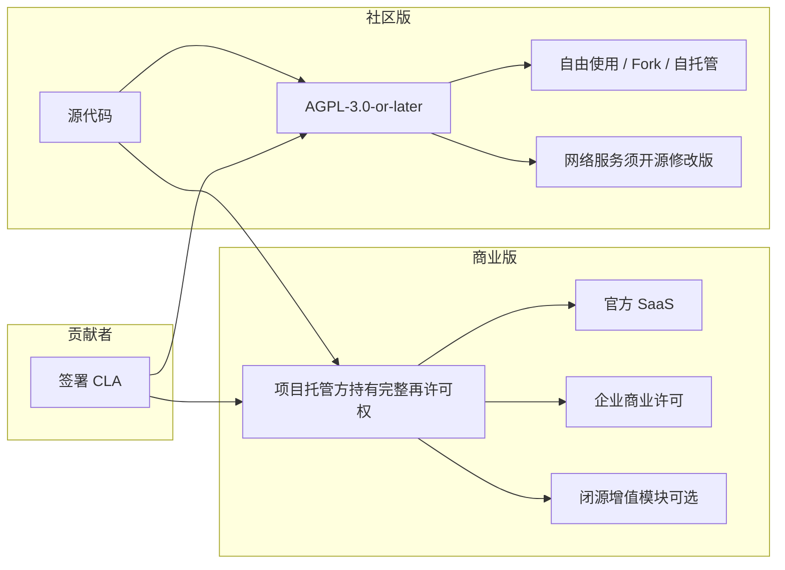

# 许可与商业化策略

本文说明 BaiShou-Next 的版权架构、开源许可与未来 SaaS 商业化的设计思路。
**本文不构成法律意见**；正式对外提供商业服务前，建议由执业律师审阅。

---

## 1. 当前状态

| 项目 | 说明 |
|------|------|
| 开源许可 | **AGPL-3.0-or-later**（见根目录 [LICENSE](../LICENSE)） |
| 版权归属 | **Anson-Trio / foxletters-hq**（白守项目当前托管组织）及经 CLA 授权的贡献者（见 [COPYRIGHT](./COPYRIGHT)） |
| 贡献者协议 | 代码类 PR 须签署 [组织级 CLA](./CLA-organization.md) 或 [企业 CLA](./CLA-corporate.md) |

### 为什么选择 AGPLv3？

白守是注重隐私的 AI 记忆产品，未来可能提供**网络端服务（SaaS）**。AGPLv3 在 GPL 基础上增加了「网络交互条款」（第 13 条）：

- 若第三方修改本软件并通过网络向用户提供交互式服务，须向用户提供对应修改版的完整源代码。
- 这有助于防止大型服务商在闭源修改后搭便车，与社区版本形成不公平竞争。
- 桌面端与移动端客户端代码保持完全开源，社区可自由 Fork、自托管与改进。

---

## 2. 双许可模型（Dual Licensing）

为支持项目方自身的商业化（如官方 SaaS、企业私有部署、增值服务等），我们采用**双许可**架构：

| 使用场景 | 适用许可 | 说明 |
|----------|----------|------|
| 个人学习、研究、非商业自托管 | AGPLv3 | 免费，须保留版权声明与许可条文 |
| Fork 后修改并**不**提供网络服务 | AGPLv3 | 向接收者提供源码即可 |
| Fork 后修改并**提供**网络服务（SaaS/API） | AGPLv3 | 须向终端用户提供修改版源码（第 13 条） |
| 使用官方托管的 SaaS | 服务条款（未来制定） | 用户协议约束，非源码许可 |
| 在 AGPL 义务之外闭源使用或再分发 | **商业许可** | 须向项目托管方购买授权 |
| 向本项目提交代码 PR | CLA + AGPLv3 | 贡献在 AGPL 下发布，同时授予托管方再许可权 |

**核心逻辑**：贡献者通过 CLA 将再许可权授予项目托管方；托管方因此可以：

1. 继续以 AGPL 向社区发布完整代码；
2. 在自有 SaaS 与商业产品中使用全部代码，**不受 AGPL 第 13 条约束**（因托管方拥有或已获授权的全部版权）；
3. 向企业客户签发独立的商业许可协议。

第三方竞争者若未获商业许可，仍受 AGPL 约束——修改后提供网络服务必须开源。

---

## 3. 贡献者许可协议（CLA）

### 3.1 为什么需要 CLA？

没有 CLA 时，每位贡献者各自保留其贡献的版权。项目方无法将「社区贡献」整体纳入闭源商业产品，除非逐一获得书面授权。

CLA 解决以下问题：

- **统一再许可权**：托管方可将贡献纳入官方 SaaS 与商业发行版。
- **专利授权**：降低未来专利纠纷风险。
- **版权清晰**：明确贡献者在 AGPL 下授权社区使用。

### 3.2 签署范围

| 贡献类型 | 是否需 CLA |
|----------|------------|
| 代码 PR（含测试、构建脚本） | **是** |
| 仅文档纠错（无代码变更） | 否 |
| Issue、讨论、复现步骤 | 否 |

### 3.3 签署方式

1. **贡献者**：在任一覆盖仓库的 PR 中点击 [CLA Assistant](https://cla-assistant.io/) 链接签署 [组织级 CLA](./CLA-organization.md)；**同一 GitHub 账号签署一次后**，对 foxletters-hq 下其他已 Link 仓库通常无需重复签署。
2. **维护者**：见 [CLA-GITHUB-SETUP.md](./CLA-GITHUB-SETUP.md)（每个仓库 Link 一次，共用同一 Gist）。

已签署记录由 CLA Assistant 保存在私有 Gist 中。

### 3.4 对贡献者的保障

- 您的贡献**始终**在 AGPLv3 下向社区开放，任何人（含您自己）可自由使用。
- CLA **不转移版权所有权**（除非另行约定），仅授予许可与再许可权。
- CLA 为**不可撤销**的授权；若不同意，请勿提交代码 PR。

---

## 4. 未来 SaaS 商业化路径

以下为建议路线图，具体以届时公布的服务条款为准：

### 阶段 A — 当前（开源客户端）

- 桌面端 / 移动端客户端 AGPL 开源。
- 用户自行配置 AI 服务商，数据存本地。
- 无官方云端服务。

### 阶段 B — 官方 SaaS（规划中）

- 项目托管方运营托管服务（同步、备份、多设备、可选云端推理等）。
- 客户端代码仍开源；**服务端增值模块**可能以商业许可或「Open Core」形式提供：
  - **开源核心**：同步协议、基础 API、客户端兼容层。
  - **商业增值**：企业 SSO、审计日志、SLA、专属部署、合规认证等。

### 阶段 C — 企业版（规划中）

- 私有部署许可（绕过 AGPL 网络条款的合规诉求）。
- 技术支持与定制开发合同。

---

## 5. Open Core 边界原则

若采用 Open Core，建议遵循：

1. **开源核心**：用户隐私相关的本地存储、导出、加密、基础同步协议。
2. **商业增值**：仅影响托管便利性、企业治理、合规、规模化运维的能力。
3. **避免「诱饵切换」**：不在开源版中故意削弱基础隐私或可用性以逼迫付费。
4. **协议透明**：在 CHANGELOG 与文档中标注各模块的许可类型。

---

## 6. 托管方变更公司实体时

若 Anson-Trio / foxletters-hq 将来注册为公司实体（如「白守科技有限公司」），须：

1. 更新 `legal/COPYRIGHT`、`CLA-organization.md`、`CLA-corporate.md` 中的 Project Steward 名称；
2. 签署权利转让协议（Assignment）或让新公司作为 CLA 中的新托管方；
3. 在 README 与 Release Note 中公告；
4. **无需**更改已有贡献的 AGPL 许可状态。

---

## 7. 常见问题

**Q：我 Fork 自用，以后官方出 SaaS 会影响我吗？**  
A：不会。您仍可按 AGPL 自由使用、修改和自托管。官方 SaaS 是托管方行使再许可权的商业产品，不限制您的 Fork。

**Q：我只改文档，要签 CLA 吗？**  
A：纯文档 PR 不需要。一旦 PR 包含代码变更，需要签署。

**Q：CLA 会把我的代码变成闭源吗？**  
A：不会。您的贡献在合并后仍以 AGPL 公开。CLA 仅允许托管方*额外*将代码用于其商业发行版，不撤销社区的 AGPL 权利。

**Q：第三方能用我们的代码做竞品 SaaS 吗？**  
A：可以，但必须遵守 AGPL——包括向用户提供其修改版的源码。若其不愿开源，须购买商业许可。

---

## 8. 相关文件

- [COPYRIGHT](./COPYRIGHT) — 版权声明与文件头规范
- [CLA-organization.md](./CLA-organization.md) — 组织级个人贡献者协议
- [CLA-corporate.md](./CLA-corporate.md) — 企业贡献者协议
- [TRADEMARK.md](./TRADEMARK.md) — 商标使用指引
- [../LICENSE](../LICENSE) — AGPLv3 全文
- [../CONTRIBUTING.md](../CONTRIBUTING.md) — 贡献流程
