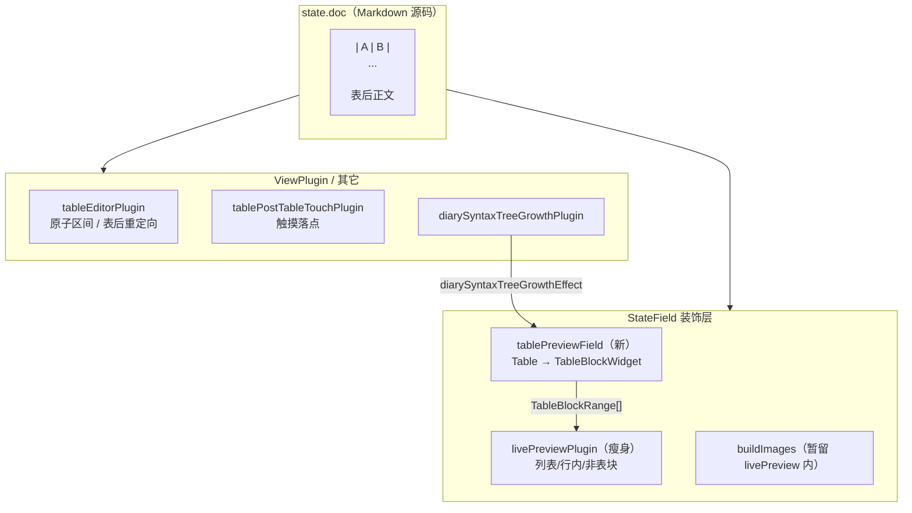

# 表格 Live Preview 独立 StateField 实施计划

> **状态**：待实施  
> **范围**：`packages/ui/src/shared/diary-codemirror/`（桌面 + 移动端 WebView 共用）  
> **数据影响**：无。用户磁盘仍为 Markdown；不迁移、不改 schema。

---

## 1. 背景

当前表格 WYSIWYG 与列表/图片/树节点语法隐藏共用一个 `livePreviewPlugin` StateField，经 `buildMarkerHidingDecorations()` 一次性重建全部装饰。

已完成的 P0（整表 `Decoration.replace`）解决了「首行 widget + 藏行 + gap」的架构问题，但表格仍绑在大杂烩装饰重建上，导致：

- 光标/选区变化易触发无关装饰全量重算；
- 大文档语法树未全覆盖时，后半段表可能长期以 raw `| col |` 显示；
- 表相关逻辑与 live preview 纠缠，表后触摸/落点问题难隔离修复。

参考 **Live Preview 整表 replace** 的成熟做法：表格应有**独立 StateField**，窄域更新 + 语法树推进后重建。

---

## 2. 核心不变量（必须守住）

| 不变量 | 说明 |
|--------|------|
| **Markdown 即源码** | `state.doc` 始终是纯 Markdown 字符串 |
| **装饰仅视图** | `Decoration.replace` / widget 不参与持久化 |
| **写入走 dispatch** | 单元格、表结构、表后正文均通过 `view.dispatch({ changes })` 改 doc |
| **保存即 toString** | RN / 桌面 `onChange` → `doc.toString()` 写库，格式不变 |
| **无用户数据迁移** | 打开旧日记 = 同一段字符串进 doc；未编辑则不脏写 |

---

## 3. 目标架构



### 与现状差异

| 维度 | 现状 | 目标 |
|------|------|------|
| 表 widget 归属 | `build.ts` → `collectTableBlockWidgets` | `tablePreviewField` 专属 |
| 重建触发 | 随 livePreview 大重建 | `changeAffectsTables` 窄域 + 专用 effect |
| 建装饰前解析 | 无强制 | `ensureSyntaxTree(docLen, 200ms)` |
| replace 范围 | `node.from .. node.to` | `startLine.from .. endLine.to` |
| widget 化区间供其它模块 | `collectTableBlockWidgets` 副作用 | `collectTableBlockRanges(state)` 纯函数 |

---

## 4. 实施阶段

### Phase A — 抽出 `tablePreviewField`（核心，约 1 PR）

**新增** `extensions/tablePreviewField.ts`：

```ts
// 职责概要
export function tablePreviewField(platform?: DiaryCmPlatform): Extension

function buildTablePreviewDecorations(state: EditorState): DecorationSet
function changeAffectsTables(tr: Transaction, existing: DecorationSet): boolean
```

行为对齐参考实现要点：

1. `create` → `buildTablePreviewDecorations(state)`
2. `update`：
   - `diarySyntaxTreeGrowthEffect` → 全量重建
   - `forceTableRefresh` / `setActiveTableCell` / `setTableChromeSelection` → 全量重建
   - `docChanged` → `changeAffectsTables` 为真才重建，否则 `deco.map(changes)`
   - 非 doc 变更且 selection 变了 → **不重建**（与参考一致；activeCell 靠 effect 触发）
3. `build` 内：
   - `ensureSyntaxTree(state, state.doc.length, 200) ?? syntaxTree(state)`
   - 遍历 `Table` 节点 → `parseTableFromDoc` → `Decoration.replace({ widget, block: true })`
   - 范围：`doc.lineAt(node.from).from` .. `doc.lineAt(node.to).to`

**修改** `extensions/buildTableChrome.ts`：

- 保留 `TableBlockRange` 类型与 `collectTableBlockRanges(state)`（只算区间，不 push marks）
- `collectTableBlockWidgets` 标记 `@deprecated`，迁至 `tablePreviewField` 后删除

**修改** `extensions/build.ts`：

- 删除 `collectTableBlockWidgets` 调用
- `buildMarkerHidingDecorations` 改为接收 `widgetizedTables: TableBlockRange[]` 参数，或内部调用 `collectTableBlockRanges(state)`

**修改** `extensions/livePreviewPlugin.ts`：

- `shouldRebuildDecorations` 不再因 `setActiveTableCell` 等表专用 effect 重建（交给 table field）
- 仍需在重建时传入 `collectTableBlockRanges(tr.state)` 给 `buildMarkerHidingDecorations`

**修改** `createDiaryCodeMirror.ts`：

```ts
tablePreviewField(platform),
livePreviewPlugin(platform),
diarySyntaxTreeGrowthPlugin,
```

注册顺序：表字段与 livePreview 均 `provide: EditorView.decorations`，CM 自动合并。

**验收（Phase A）**：

- [ ] 现有 `packages/ui` diary-codemirror 测试全绿
- [ ] 含表文档渲染 `.cm-table-block`
- [ ] 未编辑打开 `doc.toString()` 与初始 content 一致（允许尾随换行规范化）

---

### Phase B — 窄域更新与区间同步（约 0.5 PR）

1. 实现 `changeAffectsTables`（改动与已有表装饰重叠，或改动行含 `|`）
2. `buildTable.ts` / `buildTree.ts` 通过 `collectTableBlockRanges` 跳过已 widget 化表格的行内装饰
3. 确认 `tableAtomicRanges` / `findTableNodeBounds` 与行边界 replace 一致

**验收（Phase B）**：

- [ ] 改表后段落文字不触发表 widget 重建（可用 debug 日志或断点）
- [ ] 改表格单元格仍正确重建
- [ ] `tableSwallowedContent` / `table-bounds` 测试通过

---

### Phase C — 移动端表后编辑加固（约 0.5 PR）

与字段拆分并行或紧随其后的验证项（部分已实现，需在真机回归）：

1. `tableEditorTouchCaret.ts` — 触摸显式 `posAtCoords` 落点
2. `tablePostTableTouchPlugin` — 表外 `cm-content` touchend/click
3. `cm-table-block { pointer-events: none }` + 子元素 `auto`
4. `pnpm run build:diary-editor` 后重装 WebView bundle

**验收（Phase C）**：

- [ ] Android：点表下空白 → Metro 日志 `[tableTouch] place-at-coords`，可输入
- [ ] 表边界 Backspace → 先选中整表
- [ ] 单元格编辑中点表外 → blur + CM 接管

---

### Phase D — 测试与文档（约 0.5 PR）

**新增测试** `__tests__/tablePreviewField.test.ts`：

| 用例 | 断言 |
|------|------|
| round-trip 未编辑 | 打开含表 MD → `doc` 不变 |
| 改单元格 | dispatch 后管道符行更新 |
| 表后打字 | 文字不在 `\|...\|` 行内 |
| treeGrowth | 模拟 effect 后装饰含 TableBlockWidget |
| changeAffectsTables | 改正文不重建表装饰（spy / 计数） |

**更新** `mobile-diary-codemirror-webview.md`：补充 tablePreviewField 架构图一节（可选）。

---

## 5. 文件改动清单（预估）

| 操作 | 路径 |
|------|------|
| 新增 | `extensions/tablePreviewField.ts` |
| 新增 | `__tests__/tablePreviewField.test.ts` |
| 修改 | `extensions/buildTableChrome.ts` |
| 修改 | `extensions/build.ts` |
| 修改 | `extensions/livePreviewPlugin.ts` |
| 修改 | `createDiaryCodeMirror.ts` |
| 修改 | `index.ts`（导出 `tablePreviewField`） |
| 删除 | `collectTableBlockWidgets`（Phase A 末尾） |
| 重建 | `apps/mobile` → `pnpm run build:diary-editor` |

**不改动**：数据库、同步协议、`.md` 文件格式、`ParsedTable` 对外语义、RN 桥接消息类型。

---

## 6. 数据流（打开 → 编辑 → 保存）

```
打开
  磁盘 Markdown ──► EditorState.doc
                  ──► tablePreviewField 解析 Table 节点 ──► Widget 显示

编辑（表内）
  cell input ──► readTableModelFromBlock ──► serializeTable ──► dispatch(changes)
                  ──► doc 中管道符行更新 ──► tablePreviewField 重建 widget

编辑（表后）
  CM 主编辑区 input ──► 普通 docChanged
                  ──► tablePostGap 必要时补空行（写入时）

保存
  doc.toString() ──► onContentChange ──► 宿主存库（仍 Markdown）
```

**用户感知**：格式不变；仅编辑器行为更稳定。若历史笔记表后缺空行，首次编辑表附近时可能自动插入分隔空行（现有 `tablePostGap` 行为，属修复非迁移）。

---

## 7. 风险与缓解

| 风险 | 缓解 |
|------|------|
| 双 StateField 装饰顺序冲突 | 均用 `Decoration.set(..., true)`；表为 block replace，与 mark 不重叠 |
| activeCell 变更不重建表 widget | table field 显式监听 `setActiveTableCell` / `setTableChromeSelection` |
| livePreview 与 table 区间不一致 | 共用 `collectTableBlockRanges(state)` 单一来源 |
| WebView 旧 bundle | `build:diary-editor` + staging 指纹；Metro 日志 `hasFeatureMarker` |
| 回归桌面编辑器 | 同一套 `createDiaryCodeMirror`，桌面先过测试再上真机 |

**回滚**： revert `tablePreviewField` 注册，恢复 `collectTableBlockWidgets` 进 `build.ts`；无数据回滚。

---

## 8. 完成定义（Definition of Done）

- [ ] 表格装饰独立于 `livePreviewPlugin` StateField
- [ ] `changeAffectsTables` + `ensureSyntaxTree` 生效
- [ ] replace 使用行边界
- [ ] 单元测试 ≥ 115 且新增 tablePreviewField 用例通过
- [ ] `build:diary-editor` 已执行，移动端表下可输入（真机或记录已知限制）
- [ ] 代码库无外部编辑器项目名（合规）

---

## 9. 后续演进（本计划之外）

按同一模式可继续拆，**仍不需要块对象文档模型**：

| 模块 | 优先级 | 说明 |
|------|--------|------|
| `imagePreviewField` | P2 | 图片 block widget 独立字段 |
| `freezePointerPlugin` | P3 | 减少装饰切换时鼠标/触摸抖动 |
| 单元格内 Markdown | 产品 | 非架构项 |
| 块级拖拽排序 | 远期 | 需单独产品设计 |

---

## 10. 建议排期

| 阶段 | 工作量 | 依赖 |
|------|--------|------|
| Phase A | 4–6h | — |
| Phase B | 2–3h | A |
| Phase C | 2h（含真机） | A |
| Phase D | 2–3h | A+B |

合计约 **1–1.5 个工作日**，可分 2–3 个中文 commit（字段拆分 / 窄域更新 / 测试与 bundle）。

---

## 11. Commit 建议（中文）

1. `refactor(diary-cm): 表格预览拆为独立 tablePreviewField`
2. `perf(diary-cm): 表格装饰窄域重建与 ensureSyntaxTree`
3. `test(diary-cm): 表格预览字段往返与 treeGrowth 用例`

---

## 12. 实施状态（2026-07-02）

- [x] Phase A：`tablePreviewField.ts` + 从 `build.ts` 移除表 widget
- [x] Phase B：`changeAffectsTables` + `collectTableBlockRanges`
- [x] Phase C：触摸落点插件保留（`tableEditorTouchCaret`）
- [x] Phase D：`tablePreviewField.test.ts` + `buildTable.test.ts` 更新
- [x] WebView bundle：`apps/mobile` → `pnpm run build:diary-editor`
